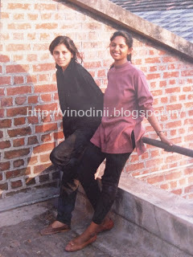
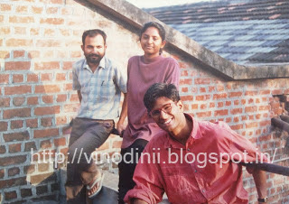
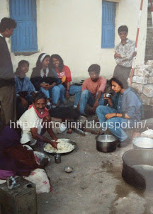
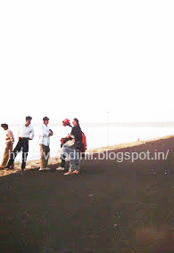
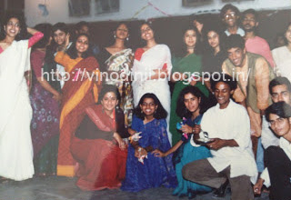
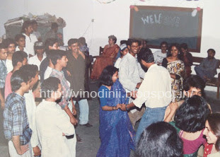

As my cell phone beeped notifying me of yet another random WhatsApp  message that lazy Sunday afternoon, I reached out to scan the contents of the message only to be rudely shaken out of my weekend snooze. It was a website link forwarded by a friend stating the news of the gruesome murder of an acclaimed artist. Well, an acclaimed artist for the world but a dear friend from college for me. We were hardly in touch but I would get regular updates on her because of the common circle of friends we belonged to, and also for the fact that she and her husband, were equally dear to us since we had shared some valuable moments of growing up with them. Each of them were doing extremely well for themselves in the art world in their own ways. But wait a minute, murder? This couldn't be happening to one of us...these things happened to other people, in the newspapers, on the television, on the streets....not to someone so close!

_Renowned artist Hema Upadhyay and her divorce lawyer Harish Bhambhani were found brutally murdered,their bodies packed in cardboard boxes, dumped in a drain in suburban Mumbai on 11th December, 2015.  Unfortunately, the fingers pointed accusingly at her estranged husband, Chintan Upadhyay, a celebrated artist himself._

It took a few disoriented moments for me to figure out whom to cross-check the authenticity of this unbelievable news with. I shook my college alumni WhatsApp group to attention, pulling them out of whatever they were doing, spread across different time-zones of the world, and soon we were on frantic phone calls, totally out of our heads as to how and what had gone wrong. The days that followed left us numb and blank still in shocked disbelief. But well, this post is not about what happened in the recent days. It is about what I knew of Hema and Chintan Upadhyay as individuals from back in the good old college days, at the Faculty of Fine Arts in the Maharaja Sayajirao University, Baroda, where we graduated as Bachelors of Painting.

We were close, not in a way best friends are. But in a way when a handful of twenty odd people are thrown together in a batch, sharing the same studio space for four years are. The kind of proximity which exposes you to what each of those twenty people think like, express like, eat like, sleep like, breathe like, sneeze like and react like. What each of them would love to eat, wear, watch, dream, listen, talk, sing and paint about. We were all different like chalk and cheese but there was a certain camaraderie that grew with time when you spent so much time with someone, over endless cups of  _chai_, discussing each stroke of their paint brush, light hearted leg-pulling, singing and warming up in front of the bonfire.

On the first day of nude study which was a part of the curriculum which required us to master sketching the human anatomy in its naked form, we were like a bunch of awkward teenagers trying not to look at each other while some of us stifled our giggles as the model stood unclothed in front of us. There were lazy afternoons where each of us stretched our personal _chatai_ mats in front our canvas mounted easels, staring at our creations in progress, sometimes taking a quick nap (yes, the studio was like home, because we spent our entire day there and went back to our homes and hostels only to sleep in the night). As we got busy mixing blobs of colours on our palette with turpentine soaked brushes, somewhere out of nowhere would start the infectious humming of songs that emanated from a corner which soon caught up on the other end of the studio and the hum would turn into a full blown chorus sometimes. On lucky days we would be attacking some poor guy's tiffin and hogging on it with our charcoal and paint stained hands. And again, those routine strolls to the tea stall outside the college gates, to sprawl on gunny bags spread on the footpath, sipping on  the famous _Vishnu_ the _chai-walla's_ trademark _elachi_ _chai_ as we brainstormed on the complexities of various aspects of our personal lives and the way it weaved into our respective arts. The tattered denims with messy paint dabs and dusty _hawai chappals_ that we donned had no idea what they were going to be replaced with in the near future. We barely had a currency note or two and on occasions just a few coins in our pockets to get us going, but that did not matter much back then. Wonder when and how it all changed? I wish it hadn't. I wish we could still live on the way we did back then, in a bubble of surreal thinking that kept us secure in the cosy nest of our homelike faculty.

 

<table class="tr-caption-container" style="margin-left: auto; margin-right: auto; text-align: center;" cellspacing="0" cellpadding="0" align="center"><tbody><tr><td style="text-align: center;"></td></tr><tr><td class="tr-caption" style="text-align: center;">With Hema, on the Painting department terrace in the faculty of FA, Baroda.</td></tr></tbody></table>

 

<table class="tr-caption-container" style="margin-left: auto; margin-right: auto; text-align: center;" cellspacing="0" cellpadding="0" align="center"><tbody><tr><td style="text-align: center;"></td></tr><tr><td class="tr-caption" style="text-align: center;">With Chintan on the right, on the Painting department terrace&nbsp;in the faculty of FA, Baroda.</td></tr></tbody></table>

The first time I had seen Hema during the first year of college, she came with this aura that a convent educated girl comes with. Especially, in a small place like Baroda, the perception of _The Convent of Jesus and Mary School_, where Hema had come from, was that the girls who passed out from that particular school had certain mannerisms and attitude that set them apart, that one could spot from a distance. A wavy lock of strands that drifted on one side of her face from her forehead was her distinct style throughout college days. We would teasingly call her by the name of _"Sindhi"_ and she would gladly play along. My favourite memory of her was getting a pair of puppies from her house. Her pet, a Lhasa Aphso had mated with a German Shepherd and the result was this comic mix of pups, some furry and some with shiny coats. I took one of each, a white furry one and a black coated pup in a wicker basket and gifted them to my mum on her birthday. My poor unsuspecting mum had no idea what to expect from this peculiar breed of pups. Within a few weeks, the tiny pups were the size of  full-grown lambs, frisking around from the sofa to the dining table to my dad's bald pate, making my mum wonder how much bigger they were going to grow. Soon we had to give away one of the pups to another friend, for the lack of space for such big and mischievous dogs but we kept one of them. _"Rummy"_ was the pup who stayed back with us and when I think of Hema today, I thank her for all the wonderful memories she had provided to us by giving us the very adorable _"Rummy."_

In the days to come we noticed a lot many layers getting added to Hema's convent bred persona, possibly a few of those were added by her involvement with art and her interactions with Chintan, whom we affectionately referred to as _"Chintu."_ Chintan, was this personality with a raw Rajasthani edge. He had strong views on every topic and a lot of it made enough sense for people to go seeking for his counsel time and again. My fondest memory of him is of him singing the song, _"Neela Aasman So Gaya,"_ from the Hindi film _Silsila_, sung by _Amitabh Bachchan._ Chintan's voice has this hoarse quality that would lend beautifully, just the right emotion of tranquillity to this song which I soaked in blissfully every time he rendered it soulfully. On many a evenings when the sun would be setting and the studio would be cast with orange shadows, I would request him to sing it for me and he would oblige. To this day, that song still reminds me of him. He was known for poking fun, making a drab environment lively with his antics and more importantly, for probing people he interacted with to think and provoked them to scratch the surface deeper. Provoking and rebellious he sure was, but only in a way that would help others.

<iframe class="YOUTUBE-iframe-video" src="https://www.youtube.com/embed/lNTtNRc32FA?feature=player_embedded" width="320" height="266" frameborder="0" allowfullscreen="allowfullscreen" data-thumbnail-src="https://i.ytimg.com/vi/lNTtNRc32FA/0.jpg"></iframe>

Waiting for the day I could hear this song sung by

Amitabh Bachchan from the Hindi film

_Silsila_ in Chintan's amazing voice yet again.

<table class="tr-caption-container" style="margin-left: auto; margin-right: auto; text-align: center;" cellspacing="0" cellpadding="0" align="center"><tbody><tr><td style="text-align: center;"></td></tr><tr><td class="tr-caption" style="text-align: center;">With Chintan seated on the right, on a study tour to Kutch</td></tr></tbody></table>

<table class="tr-caption-container" style="margin-left: auto; margin-right: auto; text-align: center;" cellspacing="0" cellpadding="0" align="center"><tbody><tr><td style="text-align: center;"></td></tr><tr><td class="tr-caption" style="text-align: center;">With Chintan, the second from left,&nbsp;at the India-Pakistan border&nbsp;in Kutch on a study tour, as he pays close attention to my discussion with another friend.</td></tr></tbody></table>

Well, so both Hema and Chintan were two very different identities for us until the final year of college, when we started to notice them getting into naughty giggling banters and funny arguments, almost childlike, but none of which we could make sense of, except for the fact that there was a chemistry. A chemistry that made us wonder, what was it that drew them to each other? The sophisticated Hema from a conservative _Sindhi_ family (Yes, her family seemed conservative because she was never allowed to come for any of the study tours or late night college get-togethers) and the brash, down-to-earth Chintan, who came from a small-town artistic background, his father being a renowned artist too. But then, during those days in college there were quite a few of such exceptional couples amongst us who didn't quite fit in together but yet were seen together in perfect tandem with each other. And, we accepted their union with a broader perspective, little expecting the sad outcome of it all in the coming years.

<table class="tr-caption-container" style="margin-left: auto; margin-right: auto; text-align: center;" cellspacing="0" cellpadding="0" align="center"><tbody><tr><td style="text-align: center;"></td></tr><tr><td class="tr-caption" style="text-align: center;">With Chintan in glasses on the top-right and Hema in the aqua blue saree on extreme lower-right. At one of the college galas.</td></tr></tbody></table>

 

<table class="tr-caption-container" style="margin-left: auto; margin-right: auto; text-align: center;" cellspacing="0" cellpadding="0" align="center"><tbody><tr><td style="text-align: center;"></td></tr><tr><td class="tr-caption" style="text-align: center;">With Chintan in centre-right.</td></tr></tbody></table>

A lot many years later when I landed in Mumbai with my first retail job, I bumped into Hema in one of the retail spaces I was working for. Her eyes popped out of disbelief on seeing me in Mumbai, that too on a job. We hugged, briefly exchanged updates and parted ways assuring each other that we would keep in touch. I ran into her a couple of more times mostly in malls and during _Navratri_ at our college campus. One of the occasions I chanced upon both Chintan and Hema at a multiplex about to catch a movie. It was with the same warm affability that we met, hugged and when Chintan suggested that I drop by their place sometime, I promised to do so. But well, as in the case of big cities like Mumbai, that never happened. They were engrossed in their Page 3 milieu, while I was busy juggling my corporate duties. Facebook was the only window now that updated us on what each of us was up to.

In the coming years, a lot of stories floated around about the trauma in the couple's personal life, none of which I chose to speculate on because I knew how people generally spiced up these stories to hike the entertainment value, and I definitely did not want to enjoy at the stake of somebody's misfortunes, especially when it was about people I shared a bond with. Little did we know that it was a misfortune that was to snowball to a greater magnitude. Knowing both of them, I would never dream of either of them doing anything as vicious and gruesome as what has happened. The naughty tussles in the corner of the studio had graduated to bitter alimony tiffs in the court but beyond the love they shared, each of them were bound by humanity. It is this humane streak that made Hema instruct her cook to prepare food for Chintan when he visited their home in Mumbai much after their divorce, and the same humanity which made Chintan ask people to shut up if they bad-mouthed his ex-wife Hema in front of him. It is this very grounded trust we have in both of them which has formed an invisible link that now connects all of us friends who were beginning to lose touch with each other, getting lost in their own big bad worlds. We woke up to remind each other, of those years of growing up together, when we had dreamt and shared with each other hazy future plans...most which we were beginning to forget, and of our precious lives which could snap short any moment.

They say love lives on in a lot many ways, much like the scent of turpentine on our fingers that left traces on our paintings from college days for much beyond eternity. I do hope Hema and Chintan's love for each other will live forever in the form of justice. A justice that should bring forth and punish the actual offenders who have brutally manipulated the misfortunes of this disturbed relationship and not the sordid junk that media decides to feed us with. Love and light to Hema and Chintan. We were, are and will be by your sides - always.

_Copyrights Reserved:_ _This post is an expression of my personal thoughts and a tribute to my friends Hema and Chintan Upadhyay, with no intention of hurting the sentiments of any individual/s. The content of this post and pictures used here are the personal property of this blog's owner. Commercial use of either part or entire content and pictures is strictly prohibited._
