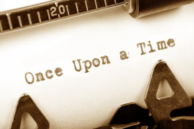

<table class="tr-caption-container" style="margin-left: auto; margin-right: auto; text-align: center;" cellspacing="0" cellpadding="0" align="center"><tbody><tr><td style="text-align: center;"></td></tr><tr><td class="tr-caption" style="text-align: center;">Source: Google Images</td></tr></tbody></table>

Once upon a time, long ago, Thoughts met Words. Actually, Thoughts was looking for the right Words to get his work through. They met, brainstormed, debated, broke apart, lost each other mid-way, rediscovered each other with a renewed perspective and mingled. Their love-hate relation led to the murders of a lot of pages. But in the end the reward was the birth of their union - Fiction.Fiction was unique, interesting and curious. Curious, because Fiction was looking for Facts. But the day Fiction met Facts, Fiction realised that all three of them, Thoughts, Words and Facts were stranger than Fiction because, though the three of them had amalgamated into the creation of Fiction, each of them were so different from each other, yet so dependent on each other. And that my dear friends, is the potpourri that went into the making of Fiction. Strange...isn't it?

This post was written for [BAR-A-THON.](https://blogarhythmblog.wordpress.com/) 

Day #1, Prompt - Stranger than fiction.

**I am with Team #CrimsonRush for the #BarAThon Challenge from 1st to 7th August 2016.**
