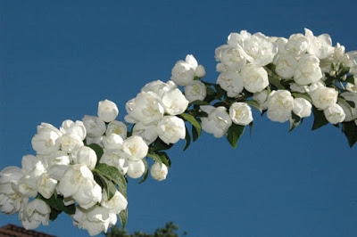

So, you're here to check out what I've posted today. What you don't know is that you are blessed to have come here to read this post. Because, I'm sending out good energy to one and all who are connected, detached, known, unknown/indifferent to me, my loved ones, my haters, all included. Not that I'm some great divine soul who could bring miracles to your life. I'm just a simple person like you.You may wonder why I'm being so benevolent. What you don't know is that I myself have been touched by such positive energies, by people who did it in their moments of benevolence. And, now is my turn to take it forward to do my bit. Just with the hope that the world becomes the heaven we often dream about but do little to make it into one. Where people don't only think about doing good things but actually 'do' the good things. It’s a far cry from the chaos around us right now with misguided souls shedding innocent blood in the name of religion.

But nevertheless, if this circle of passing good energy continues going forward, like a string of fresh jasmine flowers wrapping all living beings in a circle of miracles, who knows the evil energies might get dissolved, mingling in the goodness of the positive fragrance it exudes. Wishful thinking, but why not give it a chance? So, will you take this fragrance forward and pass it around?

Too much good on my blog today, isn’t it? Why? Because....what you don't know is that I'm now a certified pranic healer. The possibility of helping people in need with my newfound knowledge has changed my life ever since and I hope I am able to utilise my learnings effectively, if not to do good, at least think and intend good. Blessings be to all.

<table class="tr-caption-container" style="margin-left: auto; margin-right: auto; text-align: center;" cellspacing="0" cellpadding="0" align="center"><tbody><tr><td style="text-align: center;"></td></tr><tr><td class="tr-caption" style="text-align: center;"><a href="http://www.freeimages.com/photo/jasmine-1391735">Source: http://www.freeimages.com</a></td></tr></tbody></table>

 

This post was written for [BAR-A-THON.](https://blogarhythmblog.wordpress.com/) 

Day #2, Prompt - What you don't know.

 

 

**I am with Team #CrimsonRush for the #BarAThon Challenge from 1st to 7th August 2016.**
