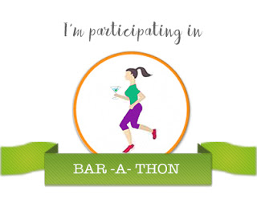

The pelting raindrops descended with force splashing in fury on the concrete pipe before sliding down in fervent streams. The rhythmic sound it created had put her infant baby to sleep after a torturous session of wailing. The raging winds, the crackling thunders and the moist surroundings had kept the panic stricken baby awake for a long time. Asha had held her baby close to her chest, covering her with the end of her half wet, tattered sari, patting her gently to sleep.Wearily, she was just about to doze off when her eyes wandered to the far end of the road. Something moved. She couldn't comprehend what it was since the play of showers made the vision hazy. She strained her eyes and saw a movement of fur. It was a tail moving around in circles. A mother was trying to shield her tiny pups from the slapping rains. The three pups must have been barely a few days old and must have slowly strayed out in the open. In a desperate attempt to cover her babies, the mother crouched protectively over them trying to create a roof above them with her lean malnourished body. She looked around helplessly and her pleading eyes caught Asha's gaze, The communication between them was wordless and effortless.

Asha gently lay her baby down on the soft bedding that she had made from an old shawl. She dragged a sheet of blue tarpaulin that hung on one end of the pipe to keep them dry and covered her head with it as she dashed towards the other end of the road in the madness of the rains to save the fragile lives. Cupping the  three puppies in her hands she led their mother to the safety of the pipe. They were all now within the dry secure confines of the concrete pipe that had been a shelter to Asha and her baby when they were thrown out of their hut after Asha's husband died of excessive alcohol consumption a few days back. He was deep in debts in his last days. The money lenders spared no time after his death to take over his hut. With no place to go to Asha had taken refuge inside the huge hollow concrete pipe on the road.

She gently caressed her baby who slept peacefully alongside the wet pups, while their mother licked them one at a time trying to warm their bodies the best she could. Both the mothers quietly exchanged a look of grateful contentment. Mothers and their ways, you see.

 

<table class="tr-caption-container" style="margin-left: auto; margin-right: auto; text-align: center;" cellspacing="0" cellpadding="0" align="center"><tbody><tr><td style="text-align: center;"></td></tr><tr><td class="tr-caption" style="text-align: center;">Source:&nbsp;<a href="http://www.freeimages.com/">http://www.freeimages.com</a></td></tr></tbody></table>

<table class="tr-caption-container" style="margin-left: auto; margin-right: auto; text-align: center;" cellspacing="0" cellpadding="0" align="center"><tbody><tr><td style="text-align: center;"></td></tr><tr><td class="tr-caption" style="text-align: center;">Source:&nbsp;<a style="font-size: 12.8px;" href="http://www.freeimages.com/">http://www.freeimages.com</a></td></tr></tbody></table>

This post was written for [BAR-A-THON.](https://blogarhythmblog.wordpress.com/) 

Day #3, Prompt - Fragile lives

 

 

**I am with Team #CrimsonRush for the #BarAThon Challenge from 1st to 7th August 2016.**
