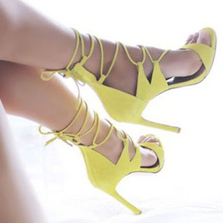

I have never had dainty feet. There was never a pair of tiny shoes I have fit in ever since I exited primary school. A shoe size - 40 is not really a very slender sight, you see, especially for a lady. To top it, my feet are broader than the ones you see on an average woman. And, the shape of my toes resemble distorted versions of bulbous ginger. To top it, I have duck feet. My feet always point slightly outwards when I walk. My mum had tried to correct it in my younger days, making me walk with a pile of books on my head pacing across the living room to balance it evenly in an attempt to make my feet point straight ahead, but alas!  Nothing worked. I bet, you have never paid attention to my feet that way, but well, everyone has their own demons stuffed in their closets. I'm bringing out one of mine in the open today for you looking for some empathy.

Throughout my teens I admired women with petite feet, their painted delicate toes peeping femininely from those nude peep-toes. Now, I don't have a thing for absolutely closed shoes and pumps, although I like them on others, but they are just not my style. Even if I do wear them, it is for a short duration. I crave for more freedom and hence my footwear needs to be well ventilated and oozing class. Every time I visit a shoe shop, I get tempted to try on thin strappy sandals, unusually delicate stilettos, only to find my feet jutting out haphazardly from the sleek straps that are supposed to hold it. Not a very flattering sight, I tell you. At times, I get bought into the over-enthusiastic salesman's theory that the straps would loosen up and take the shape of my feet after a few uses. So, when I pick up the particular pair on his insistence and wear them religiously for a few days to mould them to the shape of my feet I realise that, yes, the straps did loosen up but only to push my shoe soles backwards and bring my toes jutting out of the sandals in the front. The whole sight of it is similar to having two bundles of twigs strapped clumsily into those lovely sandals.

My eyes look longingly at pedicured pretty feet passing me by on the streets wearing the most elegant of tie-ups criss-crossing on the sylphlike pair of legs. The toes seem to mock me with the glorious pop of colour on them. I embarrassingly tuck my less fortunate ones under the drape of my ankle length skirt. "A pedicure might probably do something miraculous," I tell myself and set out to the beauty parlour. My attempt at getting the much needed boost of ego by getting them scrubbed, filed, pruned and primed in foamy heavenly aromas go wasted when the therapist shakes his head in the middle of the pedi-session every now and then, trying to figure out which breed I belong to. He had probably lost his wits when he tried to give a semblance of shape to my toe nails while filing them. I ignore him and try to concentrate on choosing the hottest nail colour to assemble my battered spirits. The therapist gives me a blank stare probably wondering what difference would the nail paint make to that horrendous pair he just dealt with. The optimist in me sees the bright side of my glossy toes as she steps out of the beauty parlour with renewed spirits. And, what does she see right across the aisle in the store window of Charles and Keith? The sleekest pair of canary yellow stilettos (Oh yeah, that's my colour these days. The brightest of yellow!). The gay yellow slivers of leather tease me from in there provoking me to walk in to check them. The salesman gives one discerning look, first at my feet and then at my face and flatly said, "We don't have your size, ma’am."  He sounded like I was guilty of making an unreasonable demand.

My foot! I don't lose hope so easily. This too shall pass. Someday when I shed my excess and reach my ideal weight (yes, yes, I will!) my feet might miraculously shrink into the svelte shape they deserve to be. I mean, look at the rest of me...they need to do the rest of my awesome self some justice, no? So let’s keep hoping that there will be a day soon when I put my best foot forward, clicking the tall heels of my sleekest tiny shoes, straps moulded elegantly on them, I shall leave that therapist at the parlour and the salesman at the shoe shop with their jaws dropped open in awe, wondering how the magic happened. Amen, to that!

<table class="tr-caption-container" style="margin-left: auto; margin-right: auto; text-align: center;" cellspacing="0" cellpadding="0" align="center"><tbody><tr><td style="text-align: center;"></td></tr><tr><td class="tr-caption" style="text-align: center;">Source: Google Images</td></tr></tbody></table>

 

This post was written for [BAR-A-THON.](https://blogarhythmblog.wordpress.com/) 

Day #5, Prompt - Tiny shoes.

 

 

**I am with Team #CrimsonRush for the #BarAThon Challenge from 1st to 7th August 2016.**
