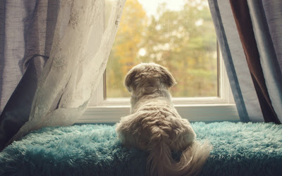

<table class="tr-caption-container" style="margin-left: auto; margin-right: auto; text-align: center;" cellspacing="0" cellpadding="0" align="center"><tbody><tr><td style="text-align: center;"></td></tr><tr><td class="tr-caption" style="text-align: center;">Source: Google Images</td></tr></tbody></table>

He leaned onto the window sill, desperately waiting for them to appear in his line of vision. Letting out a deep sigh, he'd have sworn his senses that he'd heard the gate to the fenced villa swing open. False alarm. It was Ramu Kaka, the housekeeper who walked in with a pile of freshly laundered clothes. Oh yes, why did he get these clothes today? His eyes twinkled with hope, as he followed Ramu Kaka around with the hope that he'd get a clue.

The gentle old house-help offered him a few cookies sensing his unrest. Cookies! Who wants cookies? He thought to himself. I want mum and dad! He didn't remember when he saw them last. They had just walked out of the house one fine day just as they did every morning with their office bags, patting his head lovingly as they would before casually saying bye. And, the evenings would see them walking in with a happy hi and a big cuddle to him. Mum would sometimes bring him his favourite sausages. He would get a whiff of the mouth-watering stuff from the moment she would enter the gate. He sniffed hard today, but like the last few days it was just his imagination. Perhaps, dad would zoom in with his spirits high and they might take a stroll to the park nearby. He heard a distant honk but no, it wasn't his car.

He threw the usual questioning glance at the old man. Ramu Kaka looked into his liquid brown desolate eyes and shook his head. The phone rang and was promptly answered. Looked like Ramu kaka was waiting for it. Yes! It was probably one of them.

"Hello. Haan ji Daadi ji, what time tomorrow?" Ramu Kaka inquired softly.

Oh, was Daadi ji coming over? He hadn't seen her in a while. Her genteel and affectionate presence would probably make him feel better. The last he had seen her and Dada ji was when they were leaving for America. He didn't know where America was, but from what dad told him on one of their strolls was that Daadi ji and Dada ji were going somewhere far from them. Dad sounded low then. He said he would miss them. Coming back to the present he wondered why dad did not miss him. He was away for so long leaving him alone.

Ramu Kaka paused and further murmured into the phone wiping a stray droplet from his cheek, "I'm here every single day since the crash, Daadi ji. Baba is alone. He has to be fed and looked after, na? I'm just waiting for you and Daadi ji to come."

As if they cared for Baba! He grunted in disgust. After Ramu Kaka disconnected the call he went about his new routine of lighting those overwhelmingly sweet smelling incense sticks and garlanding the large picture of mum and dad in the living room. Yikes...mum was allergic to that scent and smoke! She would have probably sneezed her heart out if she would have been here. Baba wasn't sure if his parents would like this ritual but he guessed that probably the old man did it with the hope of giving them a warm welcome in his own old world ways. After all, they deserved it since they were away for long. They smiled spiritedly from behind the tulips that framed them, their smiles reaching their eyes and catching his gaze on them. He swallowed the heavy lump in his throat and looked away. Yes, they should be coming home soon. Baba walked over to the window again, his mind buzzing with wishful thinking as he climbed onto the window. His silhouette highlighted his rested paws on the sill, his gleaming eyes flickered with a tinge of hope looking faraway into the melting horizon, as his bushy tail wagged slowly with renewed anticipation.

<table class="tr-caption-container" style="margin-left: auto; margin-right: auto; text-align: center;" cellspacing="0" cellpadding="0" align="center"><tbody><tr><td style="text-align: center;"></td></tr><tr><td class="tr-caption" style="text-align: center;">Source: Google Images</td></tr></tbody></table>

 

This post was written for [BAR-A-THON.](https://blogarhythmblog.wordpress.com/) 

Day #6, Prompt - Wishful thinking.

 

 

**I am with Team #CrimsonRush for the #BarAThon Challenge from 1st to 7th August 2016.**
