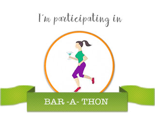

The recent few years have seen the dawn of a few realisations within me. Some came as rude shocks while some crept in slowly and steadily sinking in at a gradual pace. Death knocking down some close people much before their time, false criminal charges on a dear friend landing him into a whirlpool of troubles, falling out with loved ones who I was on better terms in the past but no longer relate to, and many more such instances pounded fresh jolts on my heart every time they occurred. Let’s leave out the details, though. Each of these incidents have hammered home just one fact, sharp and strong. Life is short. The best laid plans go for a toss, because, you never know what time has in-store for you.

The realization followed with a phase of blank numbness. And, a lot of soul searching later I made a promise to myself, that is, to live my life NOW. I wondered how I could ensure doing that. So, this is not something new to us. Every single one of us is aware of how life flies by in a blink, but yet we go about living it mechanically assuming that it would go on forever as it is, me being no exception. A lot of daily introspection led me to start incorporating a few changes in my lifestyle. I'm still in the process of adding more to these but a few that I have already starting living by are shared below, hoping it could also help you live in the moment if they strike a chord with you as you read them.

_1\. Before your kid grows up play that new game he wanted you to play with him, no matter how childish the game seems to you. Today you might put it off for the lack of time/interest, but tomorrow when you finally feel you're up for it he would have outgrown it sooner than you snapped your fingers._

_2\. Spend quality time with your parents. They did it for you when you were younger. Before you know, it would be time you would start craving for the same kind of time from your own kids._

_3\. Take care of your body but do not obsess over your weight and give up on your favourite foods completely. Remember, achieving perfection is only a mind-game.   Every time my taste buds crave for the occasional sinful cupcake or a tangy panipuri and I start fretting over the tilting weighing scales, I remind myself that these goodies are not available in heaven. It could be my last chance to savour them! Of course, goes without saying that a little bit of moderation would go a long way in keeping health issues at bay._ 

_4\. Remember that gorgeous outfit that you saved for a special day (and the special day never came since years)? Go right ahead, wear it and make today special, because, we only think we have the time._ 

_5\. Pick up the phone and chat up with that old friend you lost touch with but have shared some happy memories together. Who knows, that was what you were missing in your life all along._

_6\. Let bygones be bygones. After some years the small disagreements you held on to will not make much sense anymore. When you look back, you would recollect many such instances that just sucked your well-being by causing negative emotions within you. Totally not worth it. Declutter old stuff and make space for new. This applies to both material things and thought processes too._

_7\. Take that trip to your dream destination even if it means splurging a bit. After all, where do you plan to take all your hard earned money to? I feel, travel surely adds years to your life with all the enrichment infused by new explorations and experiences._

_8\. Let go off negative situations, people or habits that gnaw at your self-esteem or simply don’t give you a feel-good vibe. If you are in the middle of such situations, mentally distance yourself from the root cause and nourish yourself with an interest that adds value to your life in some way. It could be something as mundane as pulling out stray weeds from the garden._

_9\. And yes, last but not the least give some of your share of happiness to someone needy, not necessarily in a monetary form. It could be in form of your time and services to someone who needs it.  If you happen to take the elevator together, share a funny anecdote with that sad  old lonely neighbour whose kids flew out of the nest recently. Try to make him smile. Brighten up someone's day and it could makes yours doubly brighter._

_10\. Spend your time wisely. Do nothing sometimes. Slow down. Enjoy the view, read a book, smell the coffee, listen to music and cuddle up with your pet._ 

Today could be the last. And, my promise to myself is to make the most of it while it lasts. Do you have anything to add to the list above? Share it in the comments section below. I’d love to know what it is. Till then live it up the best you can!

<table class="tr-caption-container" style="margin-left: auto; margin-right: auto; text-align: center;" cellspacing="0" cellpadding="0" align="center"><tbody><tr><td style="text-align: center;"></td></tr><tr><td class="tr-caption" style="text-align: center;">*Copyrights reserved.</td></tr></tbody></table>

This post was written for [BAR-A-THON.](https://blogarhythmblog.wordpress.com/) 

Day #7, Prompt - Promise.

**I am with Team #CrimsonRush for the #BarAThon Challenge from 1st to 7th August 2016.**
