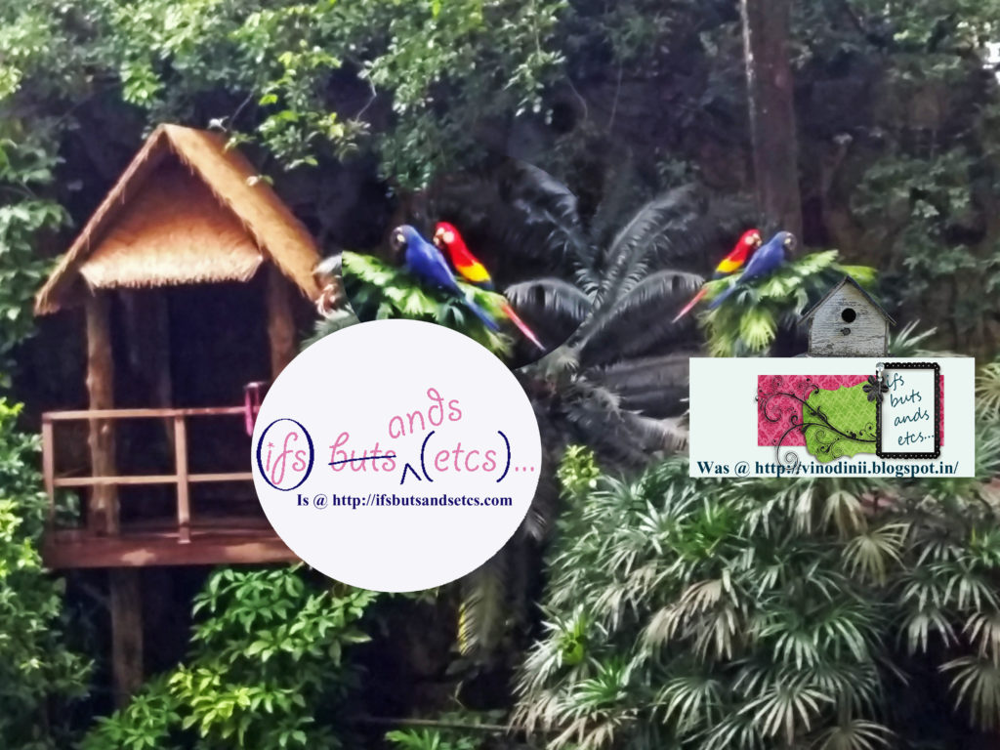

And, finally the time has come for my thoughts to move from [vinodinii@blogspot.in](http://vinodinii.blogspot.in/) to my very own personal domain. Just the way we Hindus wait for the best auspicious time and _mahurat_ to do good things, I waited to throw the doors open to my new blog space on _Dussehra_, which is seen as a day to express gratitude for success in life. I do hope that this space is blessed with divine energies through my words and your thoughts on the same.

Welcome to [ifsbutsandsetcs.com](http://ifsbutsandsetcs.com/)! I feel like a tenant who has moved from a rented accommodation to a house of her own that she has painstakingly put together with her efforts. The feeling of being in your own space is irreplaceable, which I'm sure many of you might agree with. The binding of brick and mortar into walls that make a dwelling of your dreams is what one often aspires for. And today, I finally see it happening. So what, if it is a blog? It is no less than a house where I have spent years comforting myself with an out-pour of words, spinning tales, introspecting, using it as a platform to share my thoughts aloud and last but not the least a place which has a big hand in evolving me as a person. I look back at some of my older posts and fondly smile to myself. Yes, I have evolved, indeed.

I wish I could throw a housewarming party to celebrate this milestone with you but nevertheless, do consider this one. Please help yourself to the goodies (if I may take the liberty of immodestly saying so!) served on the menu of my home page and settle down to browse through the new look and additions to this site, just the way you would inspect someone's new house the first time you visit it. Do share your observations and offer me your valuable feedback to help me make this blog interactive and interesting. I promise to try and be a lot regular and not go into bouts of procrastination that I often tend to slip into when life's other commitments come knocking. What you see here is just the beginning. This space is still work in progress. In the coming days, expect to see a lot of new things happening here.  I intend to dive into some new genres that I always was passionate about but never got around to trying them. Please wish me luck on that.

Over years I have scaled this journey from an amateur writer, to a persistent blogger leading to a major milestone of turning into a published author. Tiny achievements, but gently and gradually propelling me towards the promising miles ahead. I owe it all to you, my readers, for encouraging me, guiding me and believing in me. I sincerely hope that you continue showering this space with all your valued love and support. I'd love to have you visiting here often. Wishing you and your family a vibrant _Dussehra_! Thank you.
