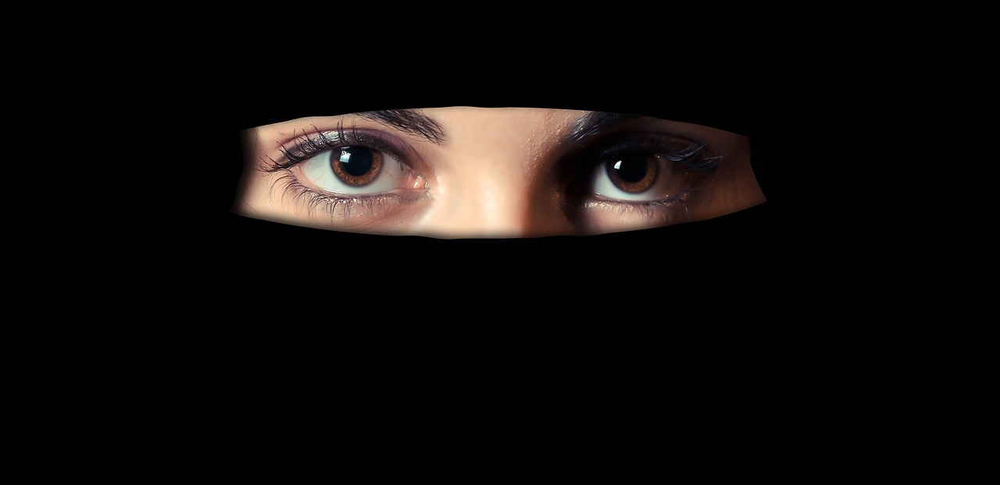

Meet Shakti. She is the new face of an enlightened lot of Indian women. She is a well-educated woman in her late twenties. Comes from a middle-class Indian family. She works for an MNC in a metro, taking home a decent pay-package. People respect her for the way she has carved a niche for herself in the corporate industry. She is social, open-minded, bold, with a mindset that swings between traditional values to evolving thought patterns in sync with the current generation. You will be seeing Shakti on and off on this blog in various thought-provoking situations that women these days encounter and how she deals with them.

It was a regular day at work. Shakti breezed into the office with her usual dazzling smile. She had worked hard over a presentation all night that she needed to present to some important clients today. She was sure that she would be able to crack the deal. To top it, she was wearing her favorite black pencil skirt with a well-fitted formal pin-stripped white shirt. The hemline of the skirt ended neatly over her knees, with a slit on the side defining her long slender legs. It was her feel-good attire. She felt confident and smart in these clothes. It was going to be her day after all.

As she walked down the aisle with the pointed heels of her shiny stilettos clicking on the floor she noticed a lot of people staring at her from behind their workstations. She smiled to herself. Some perks of dressing up! She quickly settled in her cubicle, fished out her laptop and walked towards her boss, Ashish's cabin. Ashish Tiwari, the vice-president of operations, was middle-aged, balding and had a bulging belly that spoke about his erratic lifestyle. Shakti knocked softly on his door and walked in wishing him a good morning. He nodded without looking up from the screen of his monitor. The cabin reeked of stale cigarette stench. She noted that he had skipped shaving this morning. Grey stubble dotted his double chin.

She fidgeted for a while before mumbling hesitantly to break the uncomfortable silence, _" Ashish, would you like to see the presentation before I present it?"_

He now looks up, first at her face and then down to the length of her attire, scanning her briefly before he quickly averts his gaze back to what he was working on pretending to be engrossed in some excel sheet. She smoothens her shirt a tad self-consciously. _"Mail the presentation to me, Shakti. I'll have a look when I can,"_ he says, dismissing her hastily.

What's wrong with him today? She wonders. Why is he acting awkward? She checks her reflection in the glass of the cabin as she walks out. Was there something amiss? Had one of her shirt buttons popped open by mistake? No. Everything seemed okay. She looked decent and ready for the presentation which was due to start in an hour.

The phone on her desk rang.  It was Snigdha, the HR manager on the line. _"Hey, Shakti! Morning. Can I see you for a minute?"_ Shakti walked into Snighda's cabin. Two mugs of steaming coffees awaited her. Snighda flashed her the warmest of smiles. _"I called for your coffee, just the way you like it,"_ she gushed as though she was expecting an old friend. After a friendly inquiry on how her weekend was, Snighda cleared her throat. _"Look Shakti, there's been a feedback from Ashish. Although I understand both the perspectives, I thought it would be better if I brought it to your notice."_

Shakti's eyes widen. What was it? Had it been a blunder that she had made in her recent projects? No, couldn't be. She was meticulous to the point of perfection. Was it the leave that she had requested for? But that was her long overdue leave and she had to take it since it was her cousin's wedding. As she tried to guess, Snighda went on to say, _"Hey, relax. He has no issues with your work. Rather he considers you an invaluable resource. But it is actually with regards to what you're wearing today."_  Shakti goes blank for a moment hoping that she heard it wrong. _"What I'm wearing? These are a pair of decent formal clothes that are specifically meant for office-wear. What's wrong with them?"_ Shakti looks down at her clothes, puzzled. _"Well, you knew you had a presentation today and the clients you are presenting to are old school in their thinking,"_ remarked Snighda. _"Showing skin might just distract the clients from the presentation. Ashish has expressed his disapproval to this kind of dressing. It would help if you could keep this in mind in future."_

Shakti eyed Snighda's exposed midriff from under the modest sari she was draped in. _"But Snighda, we are a progressive company. On one hand, we say we do not believe in hierarchies, encourage freedom of thought and open-mindedness. And, on the other hand, this. What double standards! Ridiculous,"_  fumed Shakti. Snighda was nodding away as her stylish short hair shook dramatically. _"I know where you're coming from, Shakti. But at times you need to be an adaptable team player, being open to feedback. It would just make working together so much easier for everyone."_  Shakti shakes her head. _"I'm sorry, I don't understand. As long as I am decently dressed in a manner that I wish to present myself in and my work is up to mark, how is it anybody's business to tell me what to wear? The presentation is of my work and not of me. The HR policy says that four days a week the dress code is formal wear and smart casuals on Fridays. Today is Tuesday and I am in formal wear which is not offensive in any way. So, where am I wrong?"_ Snighda opens her mouth to say something but Shakti has stood up. _"There's only so much I can change for a company, Snighda. Thank you very much,"_  On that note, she walks out.

The presentation begins. Shakti double-checks her clothes in the ladies room to reaffirm her belief that what she was wearing was perfect. The Guptas walk into the conference room. They are old valued clients of the company. Ashish greets them with handshakes and ushers them to their seats. Ashish does not bother to give time for Shakti to greet them properly and commands her to start the presentation. However, Anuraag Gupta and Abhishek Gupta smile politely at Shakti as she begins her presentation. They have briefly met in the past while working on other projects.

The presentation goes well. Shakti is sharp and to the point. She answers all the queries with professional tact. She notices Ashish checking her out from top to bottom from the corner of her eyes. After a moment of disgusted discomfort, she shifts her attention to her impressed audience of clients. They were all praises for her. _"Ashish, you sure have a bright young woman here! I mean, look at her ideas. So innovative yet so well researched on,"_  remarked Anuraag Gupta, the senior-most member of the Gupta clan. _"Well done, young lady!"_ Ashish squirmed a bit in his chair as he quickly added, _"Shakti sure takes inputs and feedback well. I also have a couple of other ideas that she will present at our next meeting."_ Shakti raised an eyebrow and looked away. Bloody credit hogger! Not one idea in the presentation was his. He had not even bothered to check the presentation that she had mailed him. After all, he was more concerned about her clothes than her work. And thankfully, despite being old school the Guptas did not once bother a glance at what she wore. They were genuinely interested in what she was presenting.

As she stepped out of the conference room, the younger one of the Guptas, Abhishek Gupta paced up to her. _"Hey, Shakti,"_ he called out as she stopped to let him join her. _"I want to ask you something. This is slightly unethical and wrongly timed at the wrong place too, but well, after this superb presentation I cannot resist asking you if you would be interested in joining our company?"_ he tossed the question at her throwing her off-guard. Sure, it was unethical to be poached by a client but not as unethical as forbidding someone to live by their choices. Shakti smiled at him. _"Sure, I would love to. But before this goes anywhere I have a question."_ Abhishek nodded indicating her to continue. What she asked him left him baffled.

_"Does your company have a dress code?"_

\[caption id="attachment\_1452" align="alignnone" width="1280"\] [Source](https://pixabay.com/)\[/caption\]
