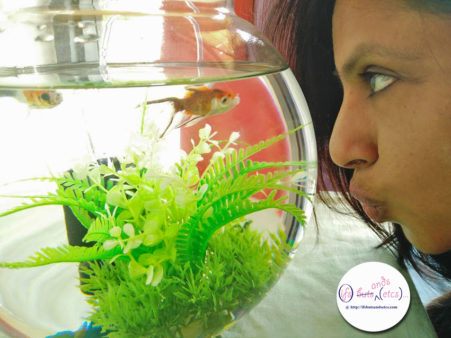

Two months back I was passing through a street where a vendor was selling some colorful fish in fish bowls on the roadside. In a moment of impulse I picked up a fish bowl with some fish in them. I had conveniently forgotten about my previous experience of maintaining them in a fish bowl. The fish never survived beyond a few weeks back then. However, this time I was confident that armed with Google to help me with all the know-how on fish care I would not go wrong.

I picked up two black Angel fish and two Koi fish (which I had mistaken for goldfish for their orange color but was informed by an aquarium store I visited later that they were actually Koi). Soon enough I was browsing through sites trying to ensure that I was going right with the maintenance of the fish. Quite late in the day I realised that keeping fish in a fish bowl does not provide a healthy habitat for the fish to grow due to the space constraints and also the swirling direction they swim in is faulty as per Feng shui. While I was still figuring out if I should get a bigger tank for them, I found one of the black Angel fish lying flat on the floor of the fish bowl one morning. I wasn't surprised, since I had been witnessing some seriously fishy politics in that tiny globule of water. The two Angel fish seemed much docile in comparison to the Koi fish. These two orange Koi fish, one with white spots and another with black ones were clearly more proactive and dominating than the Angel fish. By the time the Angel fish would open its mouth to eat the fish food fed to them, the Koi guys would have swiftly pushed the poor guys and gobbled up all the food greedily. No wonder this Angel fish died of starvation. Apparently as per Feng shui, normally a fish that dies in your house (especially a black fish) is supposed to have absorbed the bad energies in your life and had saved you from the negative impacts of the same, taking it all on itself. I feel a tad selfish in admitting that this piece of info did sound a bit pacifying.

I was determined to save the other three. There was barely any space for me to have a large aquarium for them in my living room. Apparently, they are not to be kept in the kitchen or bedroom. While I'm not much of a Feng shui or Vaastu shastra person, I do try to avoid doing things that would suggest a negative outcome, just to be safe. Better safe than sorry. Whether I believe it or don't, I wouldn't want to take a chance. So well, meanwhile I kept doing what most sites suggested, changing the water in the fish bowl every week. Some more sites suggested offering them veggies and fruits. I tried feeding them bits of carrots, cabbage, banana, apple and spinach and was amused to discover that they loved fruits. Meanwhile I surfed for aquarium tanks online, visited some local aquarium shops, got them a filter and also brainstormed with the idea of having a small pond in the little terrace that connects to our living room, but wasn't sure of how I would keep cats, birds and rodents from attacking them. Koi fish are supposed to bring in immense luck. It is originally a pond fish and it could grow as long as 3-4 inches if given the right habitat. I was pleasantly surprised to notice such sizes in Koi fish recently at the Mumbai international airport in an indoor pond. I was particularly fond of the pair of Koi fish coz they seemed to recognise and respond to my presence. Every time I would tap the glass or they would see me approaching they would inch closer to the glass with their pouting mouths and wag their tails like how dogs lovingly do when someone they adore enters the house after a long day! I would like to believe that they were fond of me contrary to what people suggested, that they were plain excited with the hopes of being treated to food!

This morning when I walked into the living room and stopped by to greet them I saw one of the Koi fish floating flat on top of the water on his side. It was the one with black spots. As badly as I wanted them to survive, there was no escape from reality. While my attempt to save the other two fish continues I am more at ease with the fact that somethings are beyond one's control. There are various ways one can handle situations but ultimately each one of us is rendered with our own sensibilities that drive us to act accordingly. This is life. Uncertain and abrupt. People can only care for you, help you, save you to the best of their capabilities. The rest depends on how strong you are and how well you fight your circumstances. The single alive Koi fish seems to be lonely without its partner or am I imagining it? Although, I notice both the survivors, the single Angel fish and Koi fish, fighting each other more often now.  I hope they learn to live in peace given the situation. I quietly fished out the dead fish with a spoon and buried him under a plant in a planter. It was the same planter where the first Angel fish was buried. Till the time I find a solution for this, I prefer to soak the learnings from of this experience.
