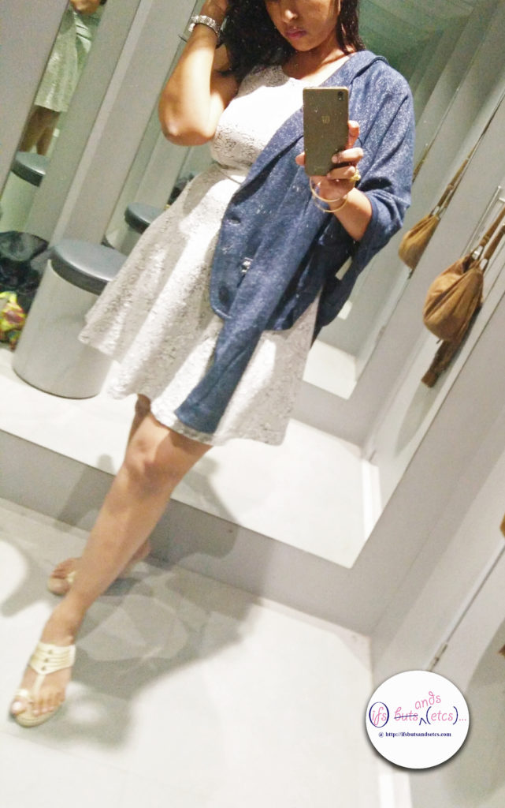

So well, here I am with the next post for the series of 'From the Trial Room.' This series is dedicated to my passion and experience in fashion which I would be translating into posts that talk about a certain collection, brand or style which has caught my interest. And, this, I would be doing from the trial room of the particular brand by means of selfies taken in the trial room with me trying on those garment options and suggesting my views on the same. My first [post](http://ifsbutsandsetcs.com/2016/10/from-the-trial-room/) on this series was received well by my readers and has encouraged me in going for more of it. With winter setting in pleasantly and the party season around the corner, this time I chose to hit on one of my all time favorite shopping destination - [Westside](http://www.mywestside.com/Home.aspx), by Trent, the retail arm of the Tata group in India.  From the array of versatile brands housed in Westside, I chose the brand [Nuon](http://www.mywestside.com/WebPages/Women/Nuon_women.aspx), which has some really awesome street-wear styles and edgy club-wear.

I've never been much of a party person, except for the occasional letting-down-the-hair rendezvous with friends, family and work mates. But well, that doesn't stop me from dressing and experimenting with different looks. I decided on styles that could be worn as casual day-wear or maybe some subtle office-wear and could easily double up for an evening out with interesting accessorizing and makeup. Just to give you a heads-up - on both the occassions that I decided to shoot for this series, they were completely unplanned sessions and happened at the spur of the moment. These were generally in the middle of those quick window shopping expeditions that I indulged in between a day packed with chores.  Almost like reaching out for the cookie jar in the middle of a workout session! The decision to head to the trial room gets triggered by an instant liking to certain collection of garments. So, generally the selfie session doesn't last more than half an hour coz I've got to rush back to the chore I was actually supposed to be doing! And, obviously since it would be so unplanned, I wouldn't have been prepared with the right accessories or makeup to match the ensembles for added effect. Also, notice the bag and the mess around. Talk about challenges of clicking in a restricted trial room!

Over the last few weeks the after-effects of Diwali bingeing had started showing on me in the form of extra pounds at the wrong places. Hence I went safe on the silhouettes I selected. I am a big fan of skater dresses, since they gently clinch the waist and fall around the curves gracefully, hiding the less flattering aspects of the figure without much effort as the fabric flares into an A-line from the waist down ending above the knees. I picked up two skater dresses. And to layer the dresses I found these really versatile jackets that could go well with either of the dresses.

This textured white skater dress is a classic piece and can be styled in numerous ways. In spite of the color white, I felt it did not make me look as broad as one would expect of it. It seemed elegant enough for an evening do.

One of the first pieces of clothing that caught my eye was this biker jacket which has muted tones of gold on beige. The metallic sheen doesn't come through in the pictures coz of the lights in the trial room. This time the lux levels of the lighting in the trial room was a bit of a challenge for getting the details through in the pics (the visual merchandiser in me couldn't help noticing this bit). This combination could work for a semi-casual daywear despite the dull shimmer of gold.

The jacket seemed to be just the right kind of coordinate that could be thrown over the shoulder as the day progressed and could be done with when the night called for a slightly formal styling.

The beige _Kolhapuri_ wedges that I wore coincidently went well with all the looks. I normally wear this footwear with Indian/fusion-wear, but this look made me realise that they could be teamed with western outfits with equal aplomb.

Next, I tried the dress with this chic blue jacket that gave it a kind of smart edge that would go well in office settings.

From formal to casual doesn't take much of an effort, right?

The other dress I picked was a blue one with white floral pattern on it. A dark color is always welcome when you refuse to look down at the weighing scales.

Next, I slipped on the blue jacket. I have a thing for tone on tone looks. There's an air of no-nonsense regality that makes for a perfect impression in the board room, of course, oozing oodles of feminine charm.

This one makes for the end-of-the-day look. Work wrapped up. Time to unwind!

One last one with the white biker jacket. And, I am not disappointed. After all, life is all about contrasts!

A few of you commented on my previous post in this series, saying that these were styles that I could carry well but were sceptical on trying them for yourself. While I understand that the way one dresses varies from individual to individual depending on personal tastes/preferences, personalities, appearance, lifestyles and cultures, if you like what you see here, I would urge you to think on the lines of specific elements that you could pick up from these styles that relate to your sensibilities. Think color, texture, fabric, silhouette and styling. My attempt here is to bring to you what I come across as interesting dressing options and give simple suggestions based on my experience in fashion through these selfies on how best they could be adapted in your own lifestyle if you happen to find them appealing.

Do let me know what you think about these looks in the comment section below. Come on, try something new today!

[Follow my blog with Bloglovin](https://www.bloglovin.com/blog/18310519/?claim=cpnj8xvpaej)
