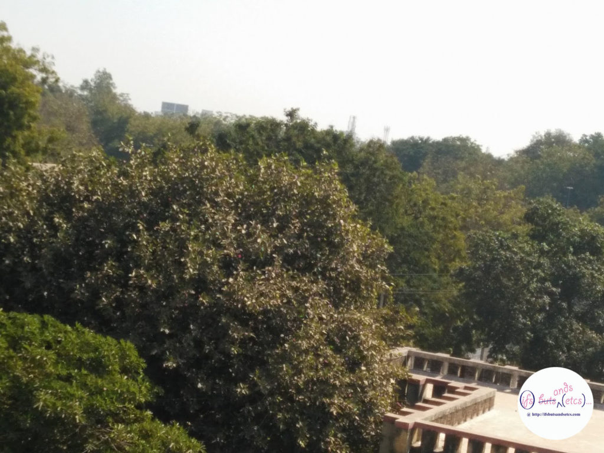
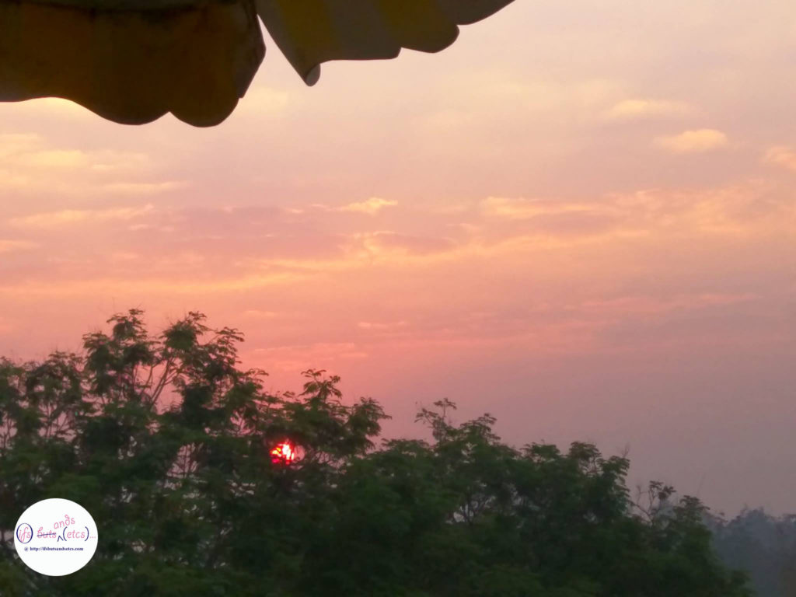
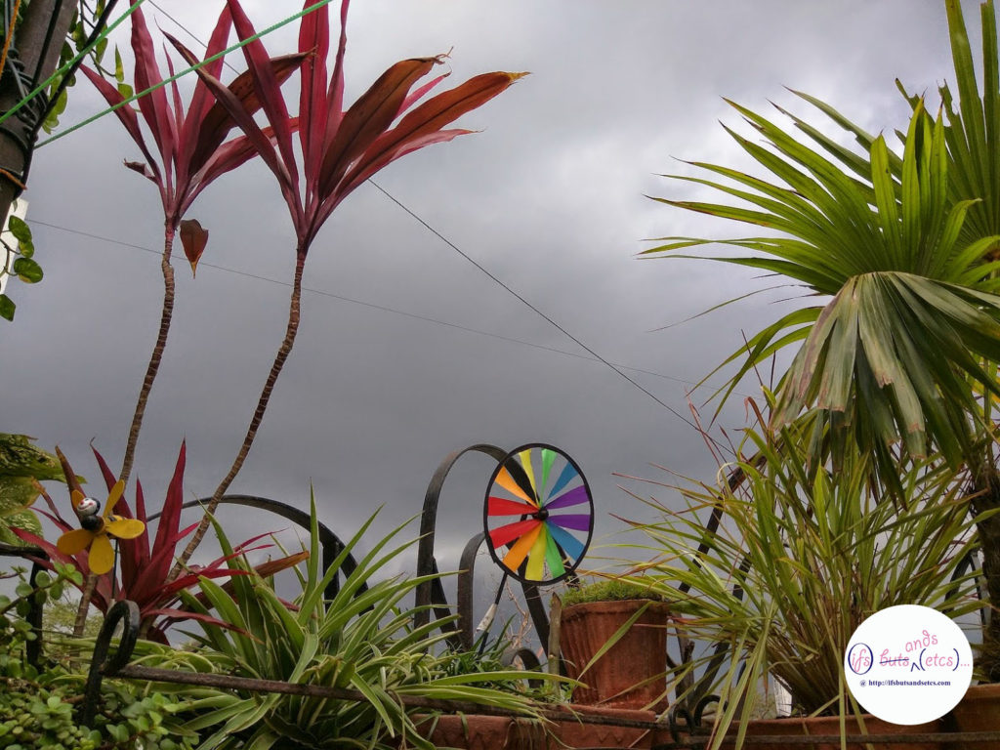
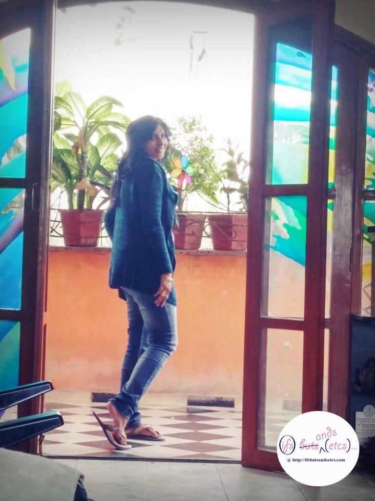
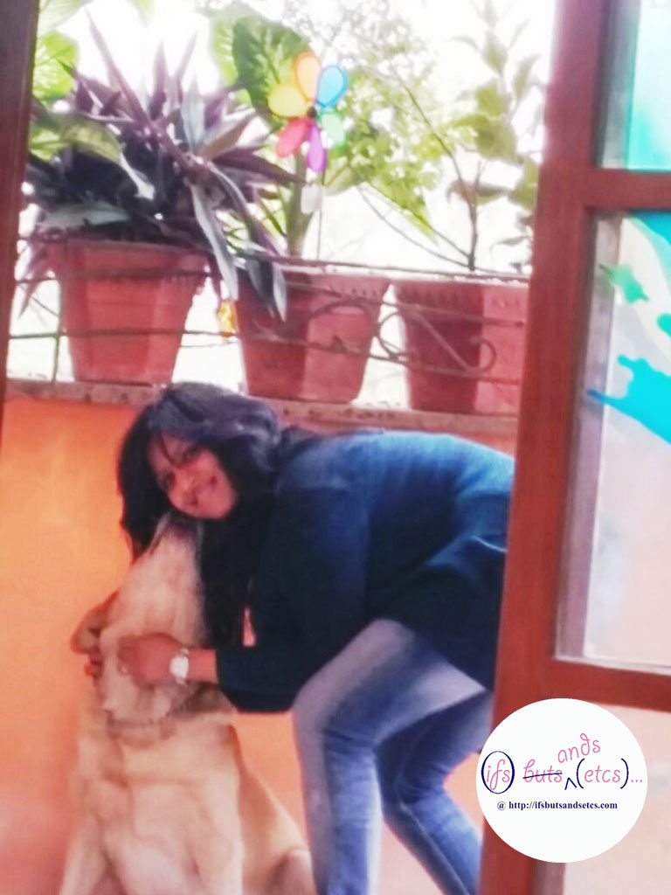
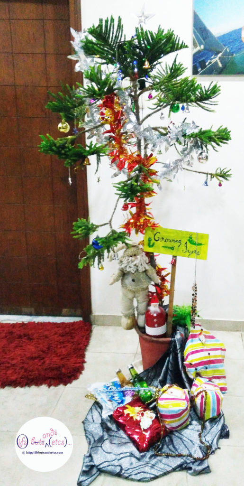
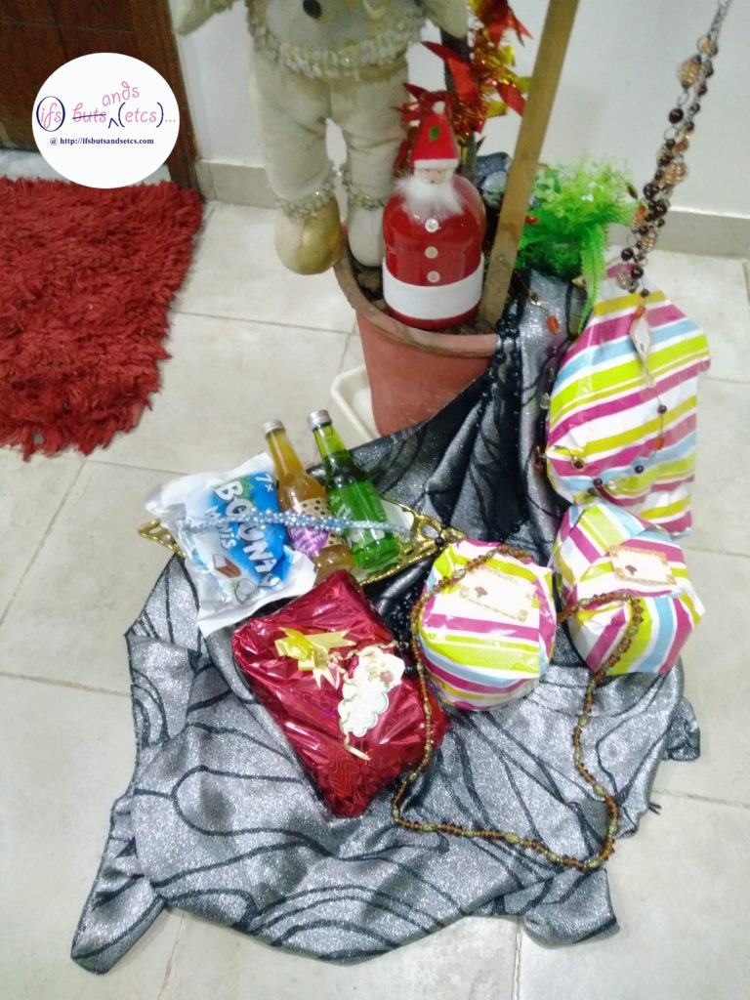
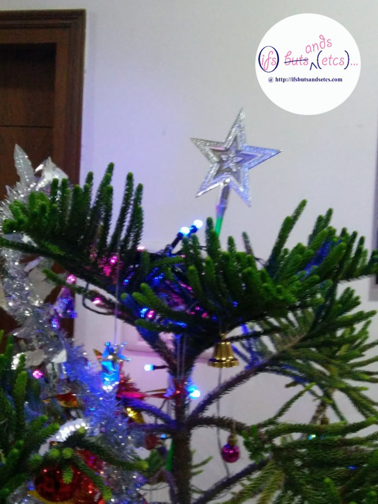
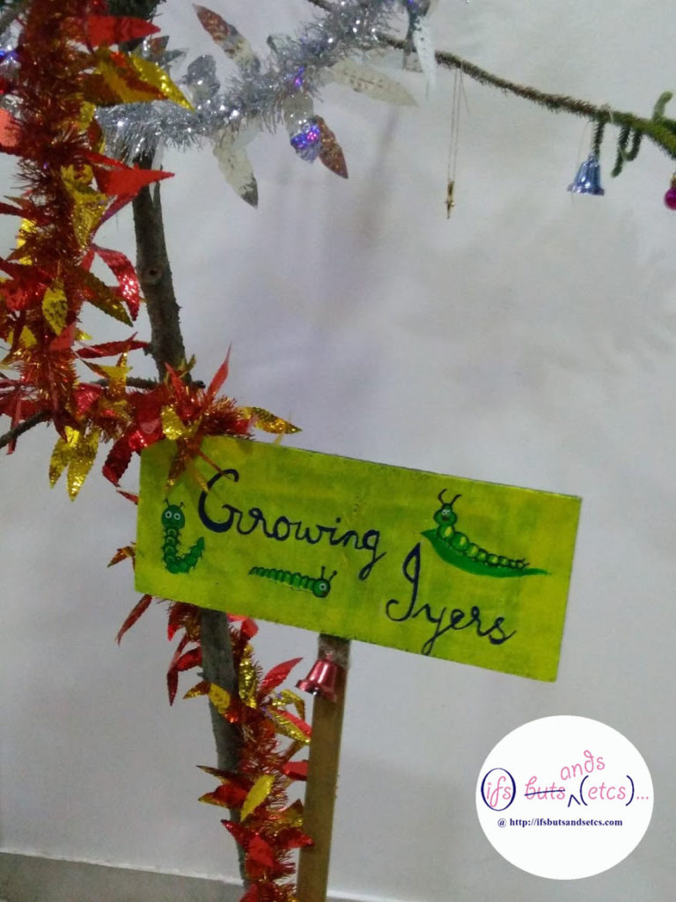

As the year comes to an end, and the coming year heralds new beginnings, I slip into a retrospective mode. Looking back, I wonder what it is that I consistently felt gratitude for in the years gone by. Overall, the gratitude pours in for all the good things in life that I am blessed with, a bunch of loving and supportive family and friends, experiences that have enriched my life and the ability to find something positive amidst the worst of the situations. However, I've been mulling on that one thing that keeps my gratitude juices flowing through ups and downs. A bit of conscious thinking led me to realise that every morning when I wake up and draw the curtains of my bedroom windows open to the new sunrise I thank inwardly for the house I live in, our home. This sounds a little materialistic as to why out of all the divine blessings should one be thankful for a four-walled shelter. I'd often have these conversations with myself debating on why this house is so important to me. And, out came a Pandora of memories which try to explain a whole lot of sense to my affliction.

\[caption id="attachment\_1626" align="aligncenter" width="680"\] The tree-house view from my window\[/caption\]

This house that we live in makes me feel like I live in a tree-house. It takes me back to the childhood memories of Phantom comics. The fantasy of the tree-house that the 'Ghost who walks' lived in is almost as real as our own house which is surrounded by thickets of greenery. Every window, every parapet overlooks something green, thanks to the beautiful city I live in and also to the location of our building. The divine sunrises are as gorgeous as the mellow sunsets. And the best part is that we are still in the middle of civilisation and not in some suburban end of the city. We live right in the middle of the city, making it the most accessible place. Flanked by the Maharaja Sayaji Rao University and the Sayaji Gardens on one side and the military campus and a romantic church on the other side, we live right in the middle of the Vadodara city's rich cultural heritage mixed with the right amount of cosmopolitan student life, due to the university's proximity.

\[caption id="attachment\_1638" align="aligncenter" width="680"\] This is what my mornings look like\[/caption\]

\[caption id="attachment\_1640" align="aligncenter" width="680"\] A cloudy monsoon evening on my terrace\[/caption\]

Way back during my school days I used to cross this lane on my bicycle to go to school. This is the same area where I used to catch up with my then would-be spouse early in the morning when he would get his pet dog out for a walk. I guess that's when I had unconsciously made up my mind and put it on my mental wishlist that whenever I would have a house of my own, it would be in this area. Years later, after we were blessed with a son, one fine day when I was crossing this lane on my moped, I noticed a bungalow getting mowed down. A sign announced an apartment project coming up on that very site. This sounded too good to be true. We soon finalised on the top most floor of the building. Unfortunately, we were shown an apartment that was closed from both sides blocked by other buildings, which was really a pity since I love having a lot of light and breeze in my house. Though, the best part was that the building was in construction mode. I had all the freedom to make the changes I wanted in the layout of the apartment. So, down went a lot of walls that gave way to open spaces, french windows and a huge arched door with stained glass effect on it in the living room that opened into the tiny terrace that gave the apartment the title of a penthouse. The overall effect was lots of happy sunshine streaming in and cross ventilation, facilitating pleasant breeze. As for the aesthetics, we had curious people walking into the flat asking us if we wanted to sell it at a tempting price already without us inhabiting it! Each tile, color, fitting, design element in the decor was meticulously sourced and carefully executed. It was like a canvas that I could experiment with all my passion slowly coming to life.

\[caption id="attachment\_1639" align="aligncenter" width="480"\] A glimpse of me on the terrace\[/caption\]

More than twelve years in this house and we've seen our son toddle his way to adolescence and now it is time for him to explore the world as he prepares to leave for college. It is still a few months away for him to go but I already get pangs of the empty nest syndrome. Most of his friends from the neighbourhood have already left for college, but the wonderful memories of this bunch of kids crusading in and out of the house playfully is going to be with me forever. It is here that we got our first pet, a golden labrador named Roger who taught us how short life is when he abruptly passed away two years back. He's still remembered fondly for his comforting presence during those years. At times we find his stray odd fur settled in some obscure corner of the house and it makes us smile. It is in this house that we have bonded over a lot of people and lost out on quite a few of them over years but nevertheless, the heartwarming memories live on. I have been in and out of the house for professional reasons for long durations. I have lived in various houses outside the city during these stints but the kind of peaceful sleep I get when I sleep in this house is incomparable. Over a period of time, people around us started favouring the luxurious developing posh suburbs. We've long outgrown this apartment and sonny boy would love us to move out of our humble neighbourhood to a bigger place, however, as of now I cannot imagine living elsewhere. They say when you leave your body, the soul lingers around in the place that it has believed to be its home. This seems to be the abode that pulls the strings of my soul.

\[caption id="attachment\_1636" align="aligncenter" width="480"\] That's Roger!\[/caption\]

And, you may wonder what all of this has got to do with Santa. Every Christmas, when he still wasn't old enough to understand we would make sonny boy hang up his sock or the red Christmas stocking that he had acquired from somewhere especially for this purpose stuffed with a note for Santa near the kitchen chimney, not the traditional type of chimney though. The note would have his wishlist for the Christmas gifts from Santa. Of course, Santa had a nerve-racking time trying to guess what this time's wishlist would be all about. Santa would casually try to fish for information a few days before Christmas so that he could figure out how to go about it. Sometimes the demands would be exorbitant and Santa would have to get into mum-mode and trick him into choosing something else! The glee on his face was a sight to behold when he would discover the gifts of his choice left behind by his dear Santa Claus. A few years later he knew who Santa was but he pretended to play along with the hope of getting the goodies. On one fine Christmas eve he told me that I should stop treating him like a kid and that he knew that there was no Santa. I digested it with a sinking feeling, but well some things are inevitable, aren't they? I guess I had enjoyed his joy of receiving the gifts mysteriously from his Santa as much as him.  So this year, although the child has grown into a fine young man and its a tad bit late to do this, I decided to do up a Christmas tree in our house for the very first time. Last night before he went to bed sonny boy teasingly asked me, 'So, any gifts from Santa this time?' To which I replied that Santa doesn't leave gifts if there was no wishlist left for him in the stocking by the chimney. We laughed about it and went to sleep. Somewhere in the middle of the night I slipped out of my bed.

We have a potted version of the Christmas tree, a slightly less bushy one than required. I tried my best to dress it with tinsel. These are gifts that I have picked for him hoping he would like them since I kind of know now what he wants. Well, I guess I always knew but the joy of letting him write his wish-list in the note for Santa was something else. While the son was blissfully asleep, Santa tried his best to arrange the gifts around the Christmas tree this time and not the chimney. I must say it was a hasty attempt to dress up the gifts since I did not want him to stir from his sleep, therefore I wasn't able to make it look as good as I would want it to be. The placard that says 'Growing Iyers' was made by my super-talented mum for our terrace garden, and also the Santa bottle art for our Christmas tree.  Of course, we Iyers are forever growing, no matter what age! The youngest of us has shot up above my shoulder and will soon have to bend under doorways to pass through. Santa was back in action, probably for the last time since next year on sonny boy would technically be an adult.

The whole decade of being promoted from a starry-eyed kid who had her own wishlist of building this home, to becoming a new mother, to turning into Santa, and retiring to being a mother of a growing adult, has been both, fulfilling and gratifying. The brick and mortar that witnessed me through this whole journey has kept me cosy through the night till the break of dawn like that warm fuzzy blanket that you refuse to part with even when the morning comes. As I drink it all in, while I sip on my green tea seated on the swing on my terrace, the black and white checkered tiles under my feet play chess with my thoughts. The church bell chimes merrily in the background and I still wonder. So, is it the house or the memories?
