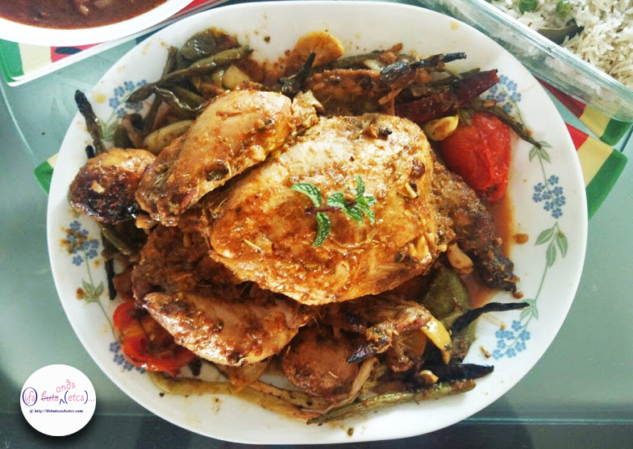
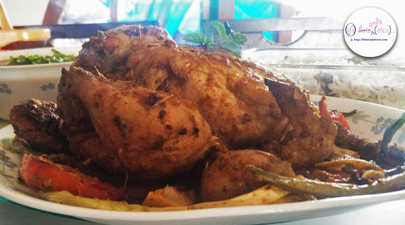
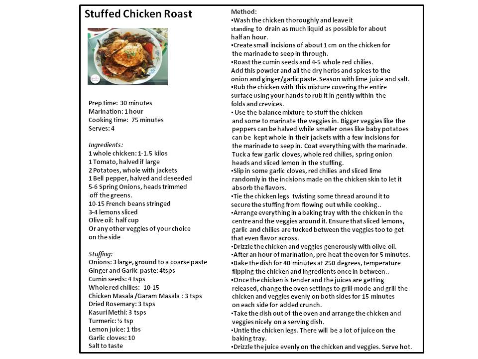

So, here's my first post for 2017. Firstly, wish you a happy new year, 2017! I hope you all had a good beginning to the year. I had a quiet time with my family making plans for the days to come. Some silent resolutions made to the mental checklist, but as with most new year resolutions, making them are easier than sticking to them in the long run! One of my new year resolutions has been to eat well, without guilt. What eating well means to me is eating everything that I love or crave for, but in moderation. That would also mean I enjoy it and take complete ownership for it sans the guilt and balance it with a proper mindset and lifestyle. After all, we only live once!

On that note, the first day of the new year I rolled up my sleeves to dish out a plump roast chicken stuffed with heavenly flavors. I have always watched Nigella Lawson in awe, roasting her chicken dishes with such infectious passion that it had been on my to-do list for a long time. Although, I did not follow her recipe this time around. Instead, I came up with a version that would tantalise the Indian taste-buds instantly. And, I must proudly pat myself on the back and admit that the result was amazing! The profusion of flavors and juices that this mighty dish packs in itself cannot be described in words. Not to mention that it is easily one of the healthiest of the dishes.

I've used rosemary, Kasuri Methi (dried fenugreek leaves), garam masala and some extra cumin to add that added punch. I threw in a few veggies on the side which add to the crunch and flavor. In fact, one could put in practically any veggie in there and it would absorb all the goodness of the juices right in. I chose a bed of whole spring onions, bell pepper, french beans, jacket potatoes, tomatoes (cherry tomatoes and baby potatoes would have been great but I used the regular ones) for the chicken. The garlic cloves, whole red chillies and lime wedges tucked in the bird just melted in the mouth. A drizzle of olive oil adds the special glaze to it. The chicken tends to let out a lot of juice when cooked and can tend to be a bit soggy, hence I chose to grill it in the end to give a slight crunch to the dish. The veggies also get a bit charred in the process but I didn't mind it at all. Okay, I've raved enough about this one! Now for the recipe.

Prep time: 30 minutes

Marination: 1 hour

Cooking time: 75 minutes

Serves: 4

**Ingredients:**

1 whole chicken: 1-1.5 kilos 1 Tomato, halved if large 2 Potatoes, whole with jackets 1 Bell pepper, halved and deseeded 5-6 Spring Onions, heads trimmed off the greens. 10-15 French beans stringed 3-4 lemons sliced Olive oil: half cup Or any other veggies of your choice on the side

**Stuffing:**

Onions: 3 large, ground to a coarse paste Ginger and Garlic paste: 4tsps Cumin seeds: 4 tsps Whole red chilies: 10-15 Chicken Masala /Garam Masala : 3 tsps Dried Rosemary: 3 tsps Kasuri Methi: 3 tsps Turmeric: ½ tsp Lemon juice: 1 tbs Garlic cloves: 10 Salt to taste

**Method:**

- Wash the chicken thoroughly and leave it standing to drain as much liquid as possible for about half an hour.
- Create small incisions of about 1 cm on the chicken for the marinade to seep in through.
- Roast the cumin seeds and 4-5 whole red chilies.Grind it coarsely. Add this powder and all the dry herbs and spices to the onion and ginger/garlic paste. Season with lime juice and salt.
- Rub the chicken with this mixture covering the entire surface using your hands to rub it in gently within the folds and crevices.
- Use the balance mixture to stuff the chicken and some to marinate the veggies in. Bigger veggies like the peppers can be halved while smaller ones like baby potatoes can be kept whole in their jackets with a few incisions for the marinade to seep in. Coat everything with the marinade.
- Tuck a few garlic cloves, whole red chilies, spring onion heads and sliced lemon in the stuffing.
- Slip in some garlic cloves, red chilies and sliced lime randomly in the incisions made on the chicken skin to let it absorb the flavors.
- Tie the chicken legs twisting some thread around it to secure the stuffing from flowing out while cooking.
- Arrange everything in a baking tray with the chicken in the centre and the veggies around it. Ensure that sliced lemons, garlic and chilies are tucked between the veggies too to get that even flavor across.
- Drizzle the chicken and veggies generously with olive oil. After an hour of marination, pre-heat the oven for 5 minutes. Bake the dish for 40 minutes at 250 degrees, temperature flipping the chicken and ingredients once in between.
- Once the chicken is tender and the juices are getting released, change the oven settings to grill-mode and grill the chicken and veggies evenly on both sides for 15 minutes on each side for added crunch.
- Take the dish out of the oven and arrange the chicken and veggies nicely on a serving dish.
- Untie the chicken legs. There will be a lot of juice on the baking tray.
- Drizzle the juice evenly on the chicken and veggies. Serve hot.

This dish calls for a bit of time but I'm sure you will not regret the outcome of all the labour! Till, then eat well, stay healthy and do it with people you love. That would be a sure-fire recipe for a splendid year ahead!
