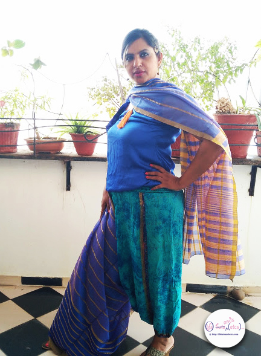

I rarely wear sarees. It takes a special wedding or function in the family for me to take the time out to drape myself into one. But whenever I do, I go all out to make that extra effort to enjoy the experience coz I feel no other garment gives the kind of joy that dressing up in a saree does. Notice how girls and women of all ages become extra poised and constantly keep checking out their saree pleats when they don one.

When I received this saree from Triveni Ethnics for writing a review, there was a wide variety of colors and fabrics to choose from like cotton sarees, chiffon sarees, georgette sarees, art silk sarees, and silk sarees. Triveni is an Indian wear brand based out of the silk city of India - Surat, since 1985. In 2011, they set up [TriveniSarees.com](https://www.triveniethnics.com/) to reach out to a larger audience across the world through their online presence. The brand offering comprises of the finest collections of sarees, salwar-kameez, lehenga-cholis, and fusion/ethnic wear. Triveni also offers other categories of ethnics comprising of ethnic wear for men, ethnic wear for kids, authentic Indian accessories, and footwear. All of these can be conveniently shopped at [triveniethnics.com](https://www.triveniethnics.com/).

Of all the beautiful assortment of sarees that were provided, I chose this violet art silk saree for its versatile color and simplicity. The golden stripes and border add just the right amount of delicate charm to it. Buying a pure silk saree frequently can be an expensive affair. Art silk or artificial silk saree is a synthetically manufactured saree which resembles silk. Just like pure silk sarees, art silk sarees are airy, super light, and really comfortable which makes them an ideal choice during the hot months of summer, the weather that our country is consistently famous for.

Valentine's day is around the corner. While most people end up wearing their finest reds and pinks on Valentine's, the violet hues of this saree had me going all violet. I have a thing for everything in the shades of violets and purples. Not that I detest reds and pinks. I love them for the rest of the days. But around this time of the year, the overdose of these colors make my eyes go sore looking at the madness of reds and pinks around me. It ensures that I stay miles away from them especially on Valentine's day! I'm often seen wearing white on this day to give people some respite from the red-pink overload on their eyes. But this year I plan to have a violet Valentine's day. So, off I went experimenting with various looks with this one saree.

Nothing beats the elegance of the traditional style of draping a saree. So, my first choice was to wear it in a conventional way. Tried and tested, it never goes wrong. I generally prefer a bit of fluidity in the sarees I choose just so that it falls well. I expected this saree to fall a bit stiff considering the kind of fabric it was, but it turned out to be relatively smooth after wearing it.

\[caption id="attachment\_1732" align="aligncenter" width="402"\] A pair of traditional studded jhumkas and bangles complete the look.\[/caption\]

\[caption id="attachment\_1733" align="aligncenter" width="442"\] The classic style will remain a personal favorite forever.\[/caption\]

A saree can beat the best of the cocktail dresses if worn well. Sometimes adding an interesting twist to the regular is what gives the ensemble that extra oomph. Seen here is a brocade choli that I had designed long back from the _zari_ borders of my mum's old _Kanjeevaram_ sarees that I paired with netted Palazzo pants. The pallav of the saree complemented beautifully with the brocade choli. The net Palazzo pants might raise a few eyebrows, but well, grabbing a few shocked eyeballs never hurt anyone!

\[caption id="attachment\_1737" align="aligncenter" width="439"\] A little twist to the usual.\[/caption\]

While at it, I chanced upon this pair of sea-green batik silk harem pants in the closet that I had picked up at Goa's flea market some decades ago. I decided to show it some light. So here I am, wearing the harem pants with a cobalt blue satin blouson top. The saree drape is roughly inspired by the nine yards dhoti-style saree draping that certain Brahmin communities from Maharashtra, Karnataka, Andhra Pradesh, and Tamil Nadu traditionally wear. However, the pallav has been thrown casually across the shoulders to step away from conventionality.

\[caption id="attachment\_1741" align="aligncenter" width="416"\] A little quirk here and there.\[/caption\]

\[caption id="attachment\_1740" align="aligncenter" width="432"\] Accessorized with a tasseled neckpiece, a traditional bracelet, chunky hoops in the ears, and a jhumar passa in the hair.\[/caption\]

I had a lot of fun experimenting and clicking these pictures. Overall, this violet piece of beauty has proved to be a versatile addition to my wardrobe that can be curated and styled in many creative ways. Cupid tells me that I need more such violets in my wardrobe. Guess I should head to [triveniethnics.com](https://www.triveniethnics.com/) and gift myself a few more violet Valentine's day gifts. Till then, Happy Valentine's Day, y'all!
