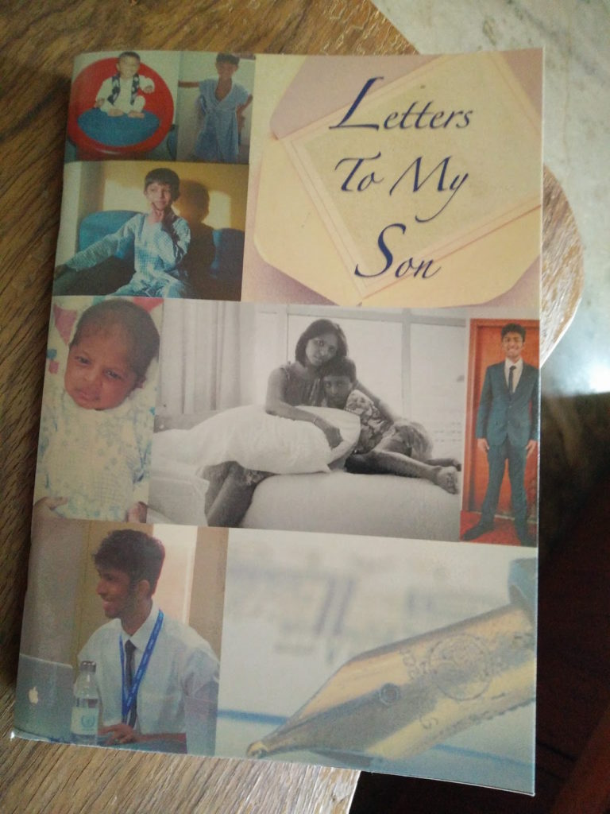

The whole of April saw me doling out bits of advice on my blog sprinkled with my own experiences while handling certain emotions and situations, which I wrote in the letters to my son who is about to step out on his own into the vicious cycle of adulthood. I wouldn't have thought of doing something like this had it not been for my participation in the [Blogging from A to Z Challenge 2017](http://www.a-to-zchallenge.com/). This was my third participation in the challenge. After having skipped it last year due to work and personal commitments I had willed myself to take up the challenge this year at all costs.

I had initially planned on a theme of writing fictional pieces which I have done in the past and enjoyed it immensely since my favorite genre for writing is fiction. However, beyond a few drafts, I realized that my mind was really not into writing stories this time around. I was preoccupied with thoughts of my recently turned eighteen-year-old son's foray into the world outside in a few months from now when he would be getting his first taste of independence. As I struggled with trying to write fiction for the challenge, one fine day I had an idea. I thought about writing a series of [letters to my son](http://ifsbutsandsetcs.com/2017/03/theme-reveal-atozchallenge-2017-letters-to-my-son/) on various emotions and situations that I anticipated him to face in his future. I wasn't sure if he would be happy to receive these open letters. But when I spoke to him about it, he loved the idea and that's how it started rolling.

I poured my heart out in all 26 letters with stuff that I might not have been able to elaborate to him verbally. The letters resonated with everyone, even if they were not parents or children themselves since these letters were about handling basic emotions and situations that most of us go through at some point or the other. Needless to say, my son enjoyed each of the letters. It became a guessing game for him to figure which topic I would be writing to him on the next day, in tandem with the series of alphabets (since the series had to follow the A to Z order). At the end of the challenge, on the 30th of April, my son celebrated his 18th birthday. I gifted him a personalized book with the entire series of letters printed in it along with a few cherished pictorial memories from his eighteen years of growing up. I hope these letters help him in his journey ahead. Each letter has some memory or significance that is close to my heart and therefore it is difficult to choose my favorite letters out of all of them. It would be like asking a mother to choose a favorite from her 26 children! However, a few of the topics did give me challenges in writing about them in a neutral light which made me analyze them in-depth, and therefore they are significant to me in terms of the nature of the subject. Here are some of them:

[Taming Anger](http://ifsbutsandsetcs.com/2017/04/taming-anger-atozchallenge/) - It was challenging for me to write on this topic since I myself am short-tempered. But I feel I have done proper justice to the subject by stating real life experiences to illustrate my point.

[Coping with Betrayal](http://ifsbutsandsetcs.com/2017/04/coping-with-betrayal-atozchallenge/) - This, I feel, is an important weapon all parents must equip their children with before they venture out on their own in the big bad world. However, while talking about some harsh realities, it also was important to keep the child's faith alive in the good things around him.

[Accepting Jealousy](http://ifsbutsandsetcs.com/2017/04/accepting-jealousy-atozchallenge/) - This again is a difficult emotion to deal with. Giving tips without getting personal on the issue requires quite a bit of maturity which I am happy that I possess.

[Cycling Towards Independence](http://ifsbutsandsetcs.com/2017/04/the-flight-to-independence-atozchallenge/) and [To Be A Man](http://ifsbutsandsetcs.com/2017/04/to-be-a-man-atozchallenge/) - Both of these posts were addressed with my own views on what my idea of an independent man is all about as opposed to the stereotyped standards that our society has chalked out for men. These letters spoke about issues close to my heart on how a man should be, which I hope my son and other responsible young men from the coming generations would adapt to do their bit to bring in gender equality.

What I learned from this whole exercise was that there were so many emotions and situations that start with each of these alphabets than the ones I chose to write about. Of course, I couldn't write on all of them but yes, I did have a challenging time deciding which ones to choose and which ones to let go.

Overall, all these posts made me reflect on my own shortcomings and strengths, making it a refreshingly cathartic process for me. I am glad I could record them all in the written form, thanks to the challenge. I am thankful to all my readers and friends from the blogging world who came back to me with their own perspective on the topics and supported me in different ways. April was indeed an enriching month.

\[caption id="attachment\_2237" align="aligncenter" width="680"\] Here's a glimpse of the personalized book that I gifted my son with on his 18th birthday. I think this was an ideal gift for him on his milestone birthday. What do you think?\[/caption\]

Find the links to all the letters written for the challenge in my Z post by clicking [here](http://ifsbutsandsetcs.com/2017/04/the-zeal-to-live-life-to-the-fullest-atozchallenge/).
