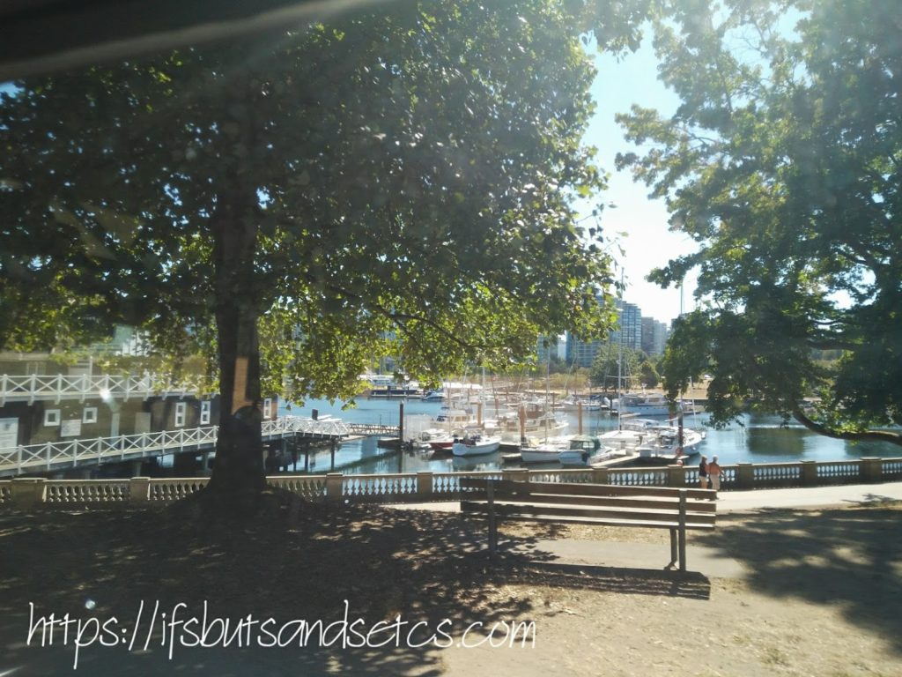

I had not ventured out to explore the city for almost the first ten days of my reaching Vancouver. Suddenly one day I realized that there was so much to see and do that time would run out if I did not start right away. So off I went exploring the best options for covering the important highlights of the city. A visit to downtown Vancouver gave me the option of going for a Hop-on, Hop-off tour that would take people around the city giving them the convenience of hopping off and exploring places of their interest at their pace and hopping on to the next available bus to continue the tour. The tour entitles you to a day pass that is valid for 48 hours that you could redeem in the said duration. It seemed to suit us fine since we were strapped for time. We could choose between an open bus with a clear roof or a trolley to take the tour in. I'd have preferred to ride on the rather interesting looking red trolley with its old world charm but we only had buses available at the time. There were about 20 stops that the tour included. However, we got to decide how many stops we really wanted to stop at and for how long.

We took off on the bus from the waterfront. The buses have a recorded commentary running as you venture into the fascinating lanes of downtown Vancouver towards scenic locations and parks. If you were lucky enough to have a friendly bus driver he would add some personal touch to the taped commentary by chipping in with his bit of local knowledge about the places. He could even urge you to try the gelato at a certain stop, not because he was friends with the store owner but because he personally loved the gelato they sold there! We decided at the start itself that we would get down only at places that looked most interesting to us so that we could maximise on the tour.

**Canada Place** Our first stop was at Canada Place. The magnificent view of the ocean with the convention center standing by in all its glory simply compelled us to get off the bus. _Canada Place is a building situated on the Burrard Inlet waterfront of Vancouver, British Columbia. It is the home of the Vancouver Convention Centre, the Pan Pacific Vancouver Hotel, Vancouver's World Trade Centre, and the virtual flight ride FlyOver Canada. The building's exterior is covered by fabric roofs resembling sails. It is also the main cruise ship terminal for the region, where Vancouver's famous cruises to Alaska originate. [Source.](https://en.wikipedia.org/wiki/Canada_Place)_ The alluring blue waters rippling lazily with mountains reflecting along its edges was a sight to behold. The quietude would randomly get interrupted by the faint drone of a sea bus in the distance. One could spend hours just gazing into the far away horizon. We strolled around a bit along the waterfront, clicked pictures, shopped for some souvenirs which included a lot of maple products to take back home and licked happily on ice-cream cones soaking in the fresh ocean air.

Soon we were headed towards Robson street and Chinatown which are popular hubs for shopping. We preferred to stay on the bus since we did not want to shop. Chinatown, as the name suggests has the look and feel of China, with dragons adorning red lamp posts along the lanes. I did not get the chance to click pictures since I could not do so from the bus. We stopped for a leisurely lunch at Earl's Kitchen on Hornby street, which was recommended by a local friend for its delicious wild salmon (review coming up in a separate post) before heading to our next stop.

**Stanley Park** Our next stop, Stanley Park, was spread onto to various stops due to the sheer size and number of things one could see there. Right from the beautiful rose garden, forest trails, beaches, monuments, children's play areas and the famous Vancouver Aquarium, the entire park needs at least one whole day to enjoy all that it has to offer. There are horse-drawn carriages that take you around the park for an hour-long ride. I had to curb the temptation of getting on the carriage to enjoy the sights of the park to the sound of the horse hoofs strutting along](http://ifsbutsandsetcs.com/wp-content/uploads/2017/09/b4.jpg)

_Stanley Park is a 405-hectare public park that borders the downtown of Vancouver in British Columbia, Canada and is almost entirely surrounded by waters of Vancouver Harbour and English Bay. The park has a long history and was one of the first areas to be explored in the city.Unlike other large urban parks, Stanley Park is not the creation of a landscape architect, but rather the evolution of a forest and urban space over many years. [Source.](https://en.wikipedia.org/wiki/Stanley_Park)_ The park is also known for its monuments and breathtakingly gorgeous landmarks. I could not click pictures of the rose garden since getting off at all the stops would mean that we would have to extend our tour to the next day which we could not afford to for a number of reasons. But I did manage to click a few shots of the landmarks and monuments.

\[caption id="attachment\_2300" align="aligncenter" width="580"\] Sculpture of Harry Jerome, the famed Vancouver runner, at Stanley Park\[/caption\]

\[caption id="attachment\_2301" align="aligncenter" width="455"\] Prospect Point offers excellent views of the Lions Gate Bridge, North Shore Mountains, and Burrard Inlet.\[/caption\]

After the never-ending stretch of the picturesque Stanley park unfolding before us page after page, we finally took off to our next stop, The Vancouver Public Library.

**The Vancouver Public Library** Located on West Georgia Street in downtown Vancouver is a paradise for book-lovers! It is the kind of place one could spend hours buried in books without a care in the world. I have yet to see a library as large and romantic as this one. It is said that 1.3 million books, periodicals, and other reference materials are moved through the building by vertical and horizontal conveyors, and the sitting capacity of the library is more than 1200 people at a time.

_Centred on the block, the library is a nine-story rectangular box containing book stacks and services, surrounded by a free-standing, elliptical, colonnaded wall featuring reading and study areas that are accessed by bridges spanning skylit light wells. [Source.](https://en.wikipedia.org/wiki/Vancouver_Public_Library)_ 

After browsing through the endless rows of the shelves of this charming library, heady with the aroma of old books we were in a mood to wrap up. We hopped onto the next bus, crossed the iconic Gastown and decided to hop off the bus and call it day. It was a day well spent. The Hop-on, Hop-off tour was an absolute value for money since we were sure that we would have been unable to see so many things at a time in such an effective way. Vancouver has so much more to explore that I wouldn't be able to do justice to all of it in one post. I hope to touch on other places that I visited in Vancouver in my coming posts.

Before I leave here's an interesting picture that I clicked from the bus on that day on my way back to my homestay. This mural stands in the happening Kitsilano area of Vancouver known for its varied attractions for tourists and locals alike, including one of the best beaches in Vancouver, parks and a host of other activities to participate in. _I am taking part in [The Write Tribe Problogger October 2017 Blogging Challenge](http://writetribe.com/write-tribe-problogger-october-2017-challenge/) at [Write Tribe](http://writetribe.com/) and today's prompt happens to be 'Pattern.'  While I would not be opting to write on the prompts for this challenge, I'd still like to share this picture since I particularly loved the patterns seen here._

