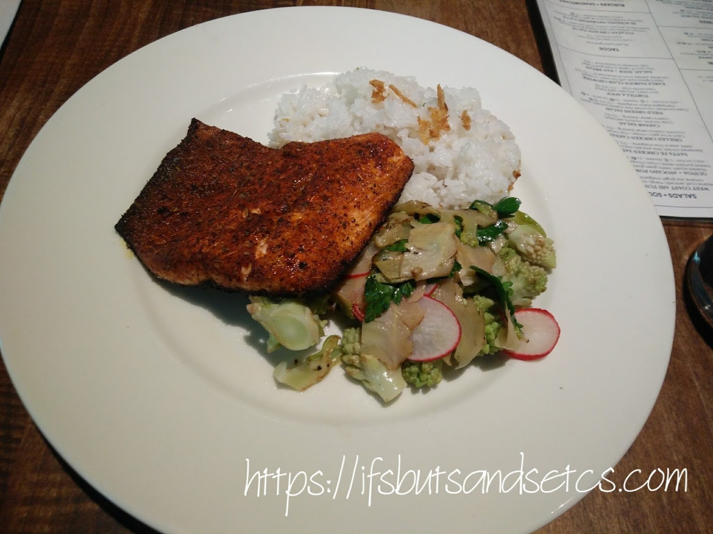
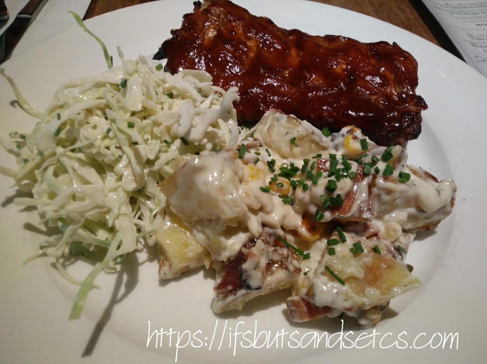
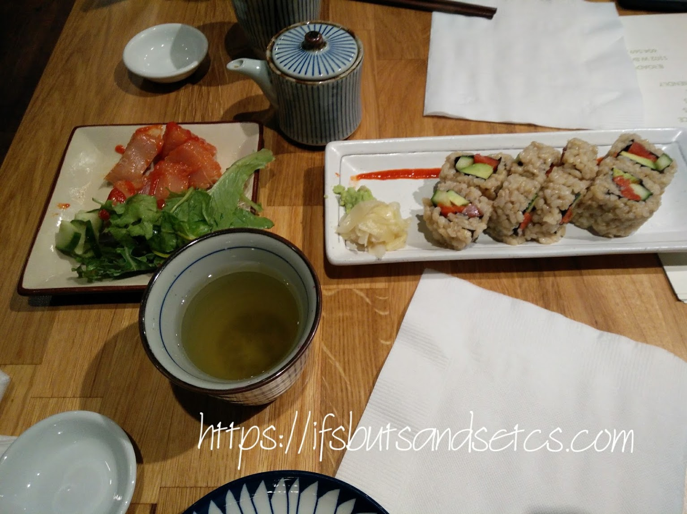
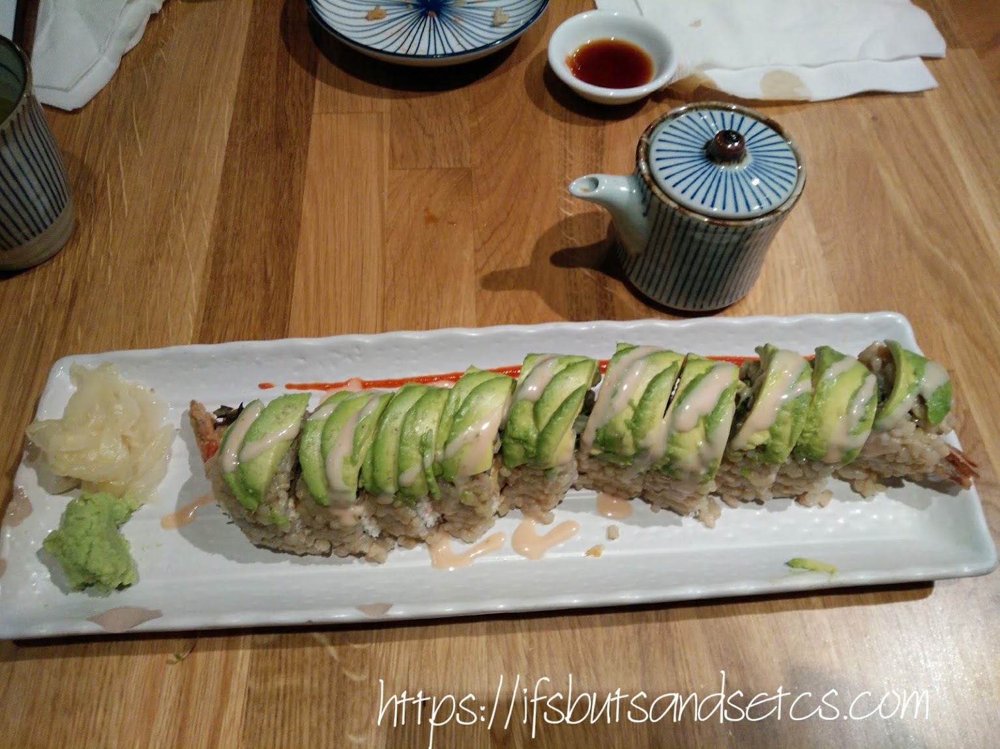
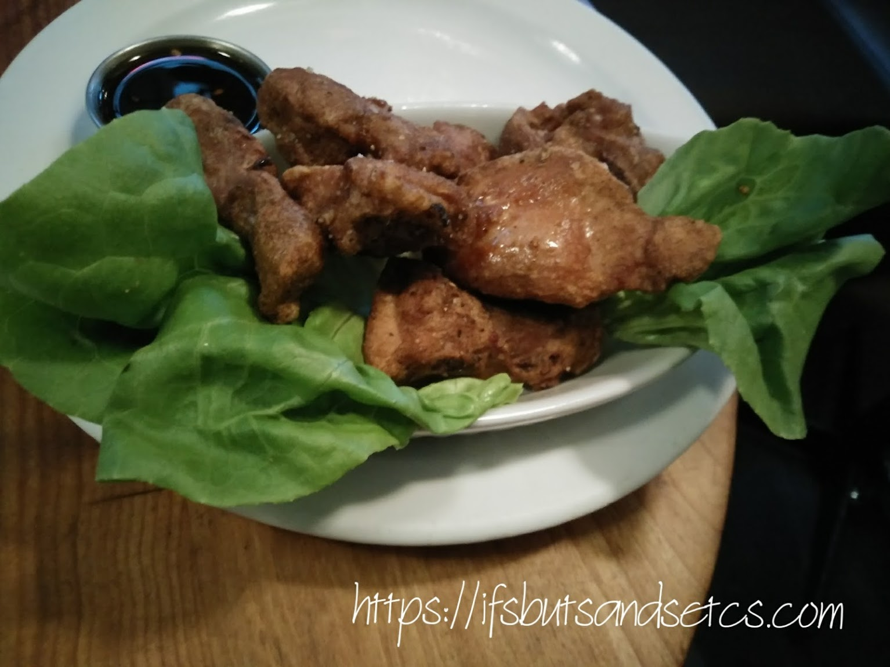
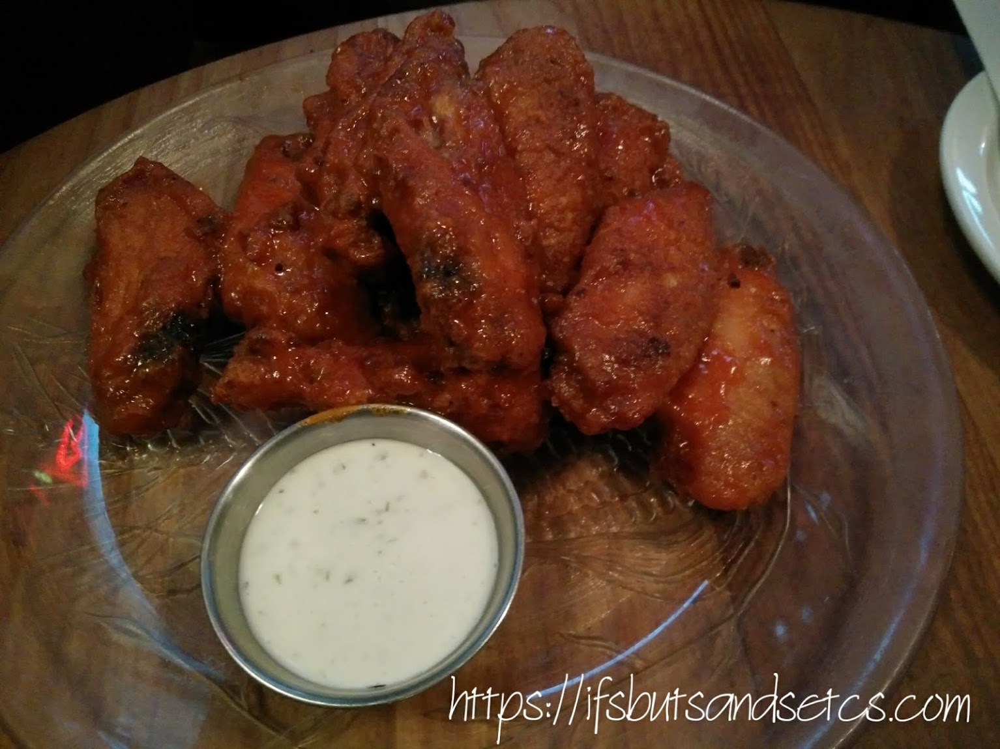
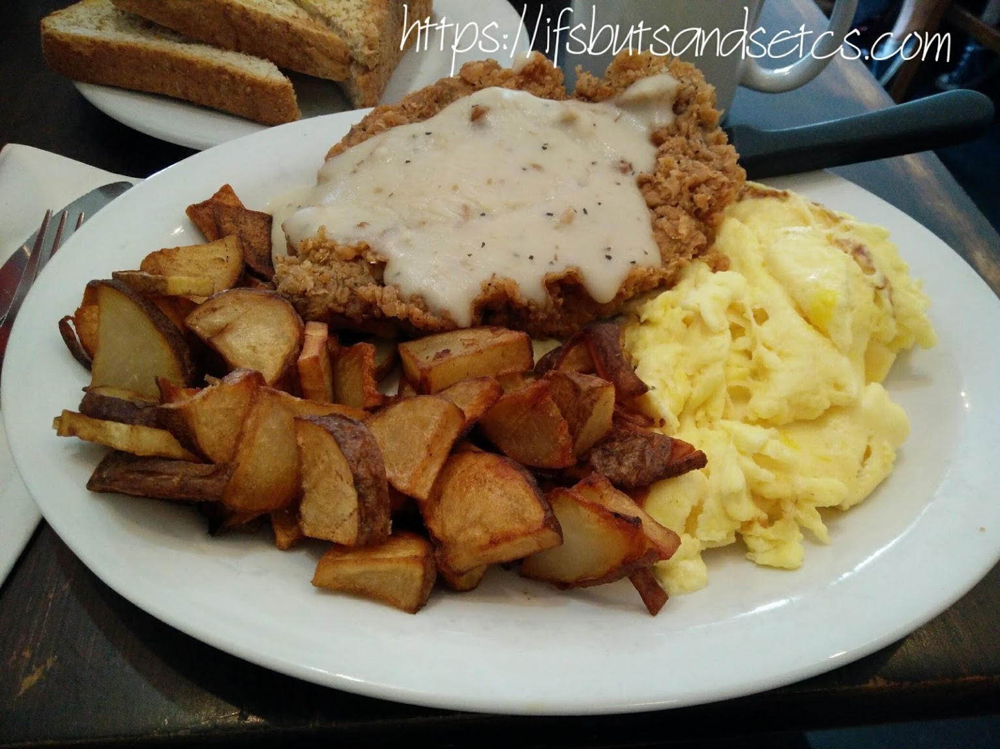
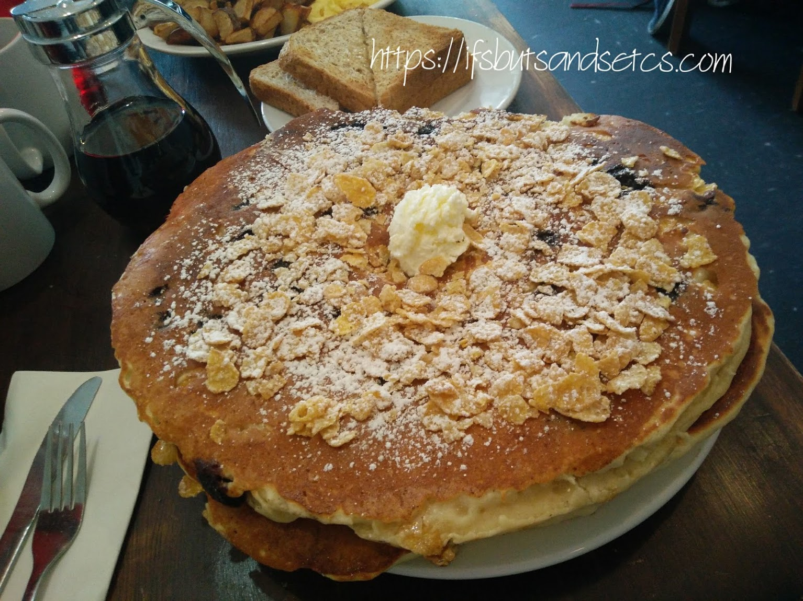

Some of my best memories from Canada involve food. I'm a sucker for trying out different cuisines. Just the perfect thing to do in a place like Vancouver that is a melting pot of diverse ethnicities and cultures. You are spoilt for choice when it comes to choosing the best on offer from an array of global cuisine. From roadside food trucks that are sprinkled generously across the city to the best of the fine dining places, this is one food heaven where world cuisine has seamlessly adapted itself to the local culture. The best part of the entire eating experience is that Vancouverites are really particular about where their food has come from which ensures the freshest produce to land up on your plate.

I consulted, Elly, a dear friend whom I met through the world of blogging and who lives in Vancouver for recommendations on the local dishes that I should sample. She suggested that the one thing I should not miss eating before leaving Vancouver would be the local Wild Salmon. With its proximity to the sea, the abundance of fresh seafood is not surprising. She recommended a few places where I could enjoy the most authentic of Wild Salmon dishes. One of them was Earl's Test Kitchen at Hornby street. On our tour around the city in the Hop-on, hop-off bus that I wrote about in my previous post [here](https://ifsbutsandsetcs.com/2017/10/hopping-off-vancouver/), we spotted this restaurant just around lunchtime.

**Earls Test Kitchen** As the name suggests Earls Test Kitchen is all about being innovative and offering its customers a unique dining experience. We decided to try the Cajun Oven Roasted Salmon. It was served with confit garlic butter, jasmine rice, and seasonal vegetables. The salmon was absolutely fresh, succulent and was crisply spiced to perfection. My Indian taste buds were not disappointed with the heat and flavors of this dish. It was indeed one of the best things I had tasted in Vancouver. I ordered for some rose wine to go with it.

\[caption id="attachment\_2343" align="aligncenter" width="1534"\] Cajun Oven Roasted Salmon at Earl's Test Kitchen\[/caption\]

We also tried the BBQ ribs. Tender pork that was slowly braised, was served with a warm potato salad, some smoky bacon, and coleslaw on the side. We were a bit disappointed with the portions after being served generously sized ribs in Toronto (a separate post coming up on our Toronto food experiences). However, I wouldn't say it tasted bad. I just wished I had more meat on my plate!

\[caption id="attachment\_2344" align="aligncenter" width="1534"\] BBQ Ribs at Earl's Test Kitchen\[/caption\]

**Shizen Ya** Vancouver is known to serve some of the best sushi after Japan. So this one was on our bucket-list. A quick online search for popular sushi destinations led us to this quaint place in downtown Vancouver called Shizen Ya. After a round of Japanese tea, we settled for Dragon Magic Roll, Natural Bomber and some Wild Salmon on the side.

\[caption id="attachment\_2346" align="aligncenter" width="1534"\] Dragon Magic Roll at Shizen Ya\[/caption\]

The Dragon magic roll came with sockeye salmon, cream cheese, cucumber, organic brown sushi rice, grilled saltwater eel (Anago) and organic avocado. It was served with homemade Anago sauce. Again, the freshness of the ingredients is what hits you when you bite into it.

\[caption id="attachment\_2350" align="aligncenter" width="1534"\] Natural Bomber at Shizen Ya\[/caption\]

This one is for Avocado lovers like me. It was served with tiger prawn, whole wheat tempura, fresh crab with mayonnaise, cucumber, organic spring mix lettuce, organic brown sushi rice, organic avocado on top served with creamy bomber sauce (mayonnaise base). It was too much goodness on one plate. The prawn was crisp and flavorful. The wasabi added just the right amount of sharp kick to the mild flavor of creamy avocado, as also the red hot sauce that went with it. We struggled with using the chopsticks decently and finally asked for forks!

**Las Margaritas** Since we were on a world cuisine trip we couldn't go without eating Mexican food, could we? Our wishes were answered by our local friends who took us to this popular Mexican resto called Las Margaritas in the evergreen area of Kitsilano. I simply had to try crabs in one of my meals while I was on the shores of this glorious beach destination hence I decided to go with Crab Enchiladas. The portions were generous. It comprised of two soft corn tortillas filled with a mixture of rock crab, sautéed mushrooms, onions, cilantro and white wine. Covered with a cilantro, pesto cream sauce and a sprinkling of cheese. Served with rice and house salad which was amazingly creamy and delicious, this was one of the most authentic Mexican meal that I have sampled so far.

\[caption id="attachment\_2351" align="aligncenter" width="1534"\] Crab Enchiladas at Las Margaritas\[/caption\]

In the last few days of my stay, we experienced the famous Vancouver rains. The temperature dipped to a chilling 13 degrees. Before you guys from the freezing corners of the world roll your eyes, let me tell you that I belong to a place in India which touches a boiling 50 degrees of temperature in peak summers! So well, at 13 degrees my teeth were clattering! We decided to try out an eatery close to where I lived.

**Cheshire Cheese Inn** A stroll around the neighborhood brought us to this place called Cheshire Cheese Inn which served British fare. While we would have loved to try out their authentic English treats, given the kind of weather we were exposed to, we yearned for some warm comfort food. In North America, an all-time comfort food seems to be crispy Chicken Wings and juicy Ribs dripping of rich sauces. We huddled into a warm corner and decided to order appetizers, instead of a large meal. We settled on Salt and Pepper Dry Ribs with Hot and Spicy Chicken Wings.

\[caption id="attachment\_2352" align="aligncenter" width="1534"\] Salt & Pepper Dry Ribs at Cheshire Cheese Inn\[/caption\]

We loved the Chicken Wings more than the Ribs, but honestly, this was more than we could have asked for on a cold dreary day. Both were served with delicious dips. The hot and spicy sauce dripped down the corners of our mouths as we dug into the juiciness of the chicken licking our fingers shamelessly.

\[caption id="attachment\_2353" align="aligncenter" width="1534"\] Frank’s Hot & Spicy Chicken Wings at Cheshire Cheese Inn\[/caption\]

**Jethro's Fine Grub** We made the mistake of going to this place on a weekend and turning away disappointed after a long wait. However, we wouldn't have given up so easily after reading the reviews of the place. The next time we went there was just a day before I was leaving Vancouver. We were pleased to be seated without waiting for long in the warm and cozy confines with the owners bustling around themselves, cooking and serving coffee. It is owned by a couple who give a personalized touch to the place by mingling with customers. This eatery is known for its amazing savory and sweet brunch items.

We had already made up our minds with our choices, albeit after a lot of confusion due to the tempting number of things on the menu. We started our brunch with hot chocolate topped with a generous dollop of whipped cream - sinful to the last drop!

\[caption id="attachment\_2354" align="aligncenter" width="680"\] Hot Chocolate with whipped cream at Jethro's Fine Grub\[/caption\]

Next came the Chicken Fried Steak and eggs. It was a top sirloin beef steak, beaten, battered & fried, topped with country gravy. Served with hash browns and toast. We had opted for scrambled eggs to go with it. The steak was juicy and perfect, the hashbrowns crisp and the scrambled eggs were smoother than butter. I wish I had borrowed their recipe for the scrambled eggs.

\[caption id="attachment\_2348" align="aligncenter" width="1534"\] Chicken Fried Steak and eggs at Jethro's Fine Grub\[/caption\]

Last but not the least, was this humungous surprise that popped on our table leaving us wondering if we ordered the right thing. This pancake, (yes you read it right, PANCAKE!) was about 12" of diameter with two thick stacks one on top of another oozing with berries, maple syrup, topped with frosted flakes and whipped cream. It was almost the size of medium/large pizza. We stared at it in awe and wonder at this delectable mound for a few minutes figuring out where to start with it. It was decadent without doubt, but we couldn't even finish a fraction of it. We had it packed and had some more of it for dinner but we still couldn't finish it.

\[caption id="attachment\_2349" align="aligncenter" width="1534"\] Grrrreat Cakes Frosted Flakes and berries cooked into our buttermilk batter. Topped with whipped butter at Jethro's Fine Grub\[/caption\]

After this huge unusual treat, and the whole galore of enjoying so many cuisines at one place in the span of one month, I am convinced that there are a lot of other culinary surprises waiting to be discovered in Vancouver. I look forward to unearthing them on my next visit there. Till then, my friends, eat well and make merry!

_I am taking part in [The Write Tribe Problogger October 2017 Blogging Challenge](http://writetribe.com/write-tribe-problogger-october-2017-challenge/) at [Write Tribe](http://writetribe.com/) and today's prompt happens to be 'Nostalgic.' I hope you enjoyed the big chunk of my nostalgia that I served you from my platter of food memories._
