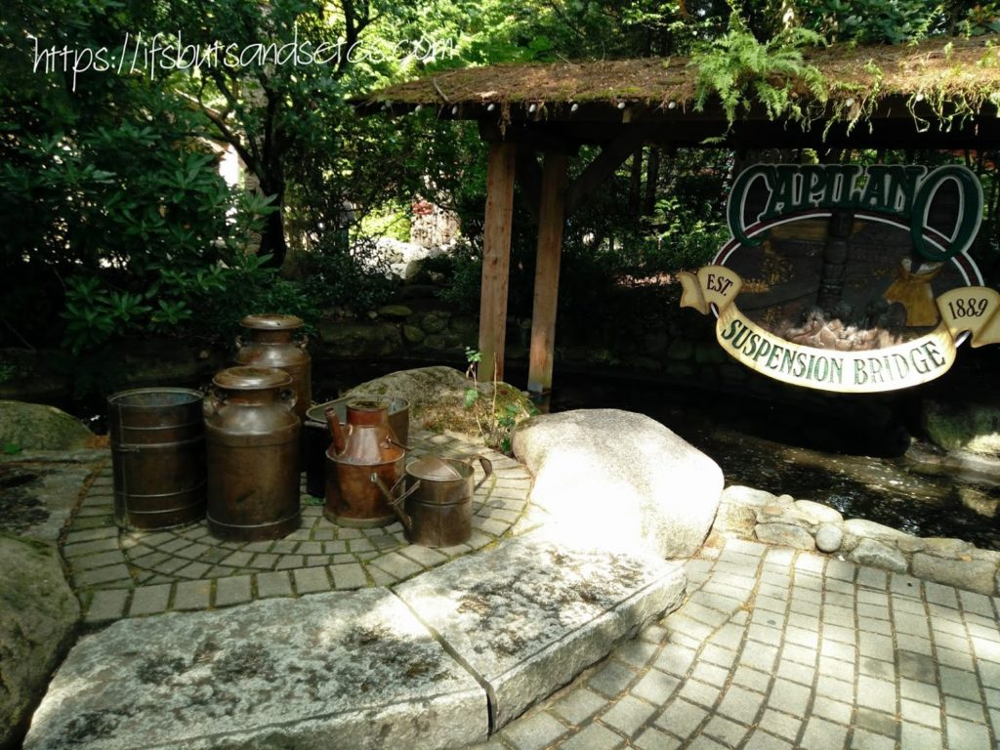
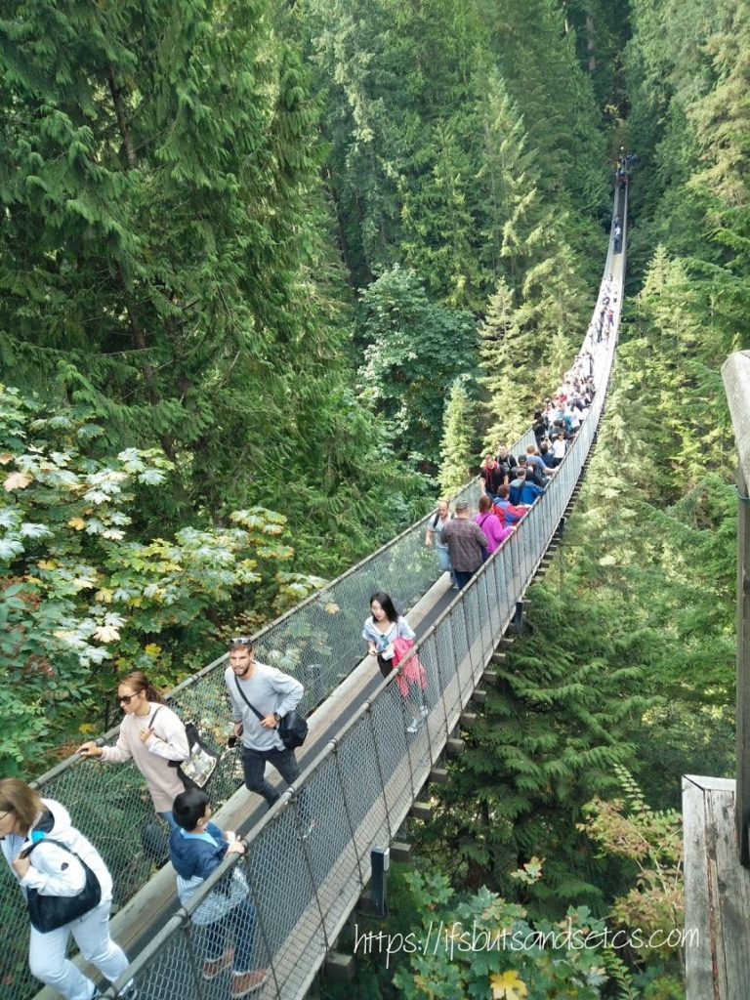
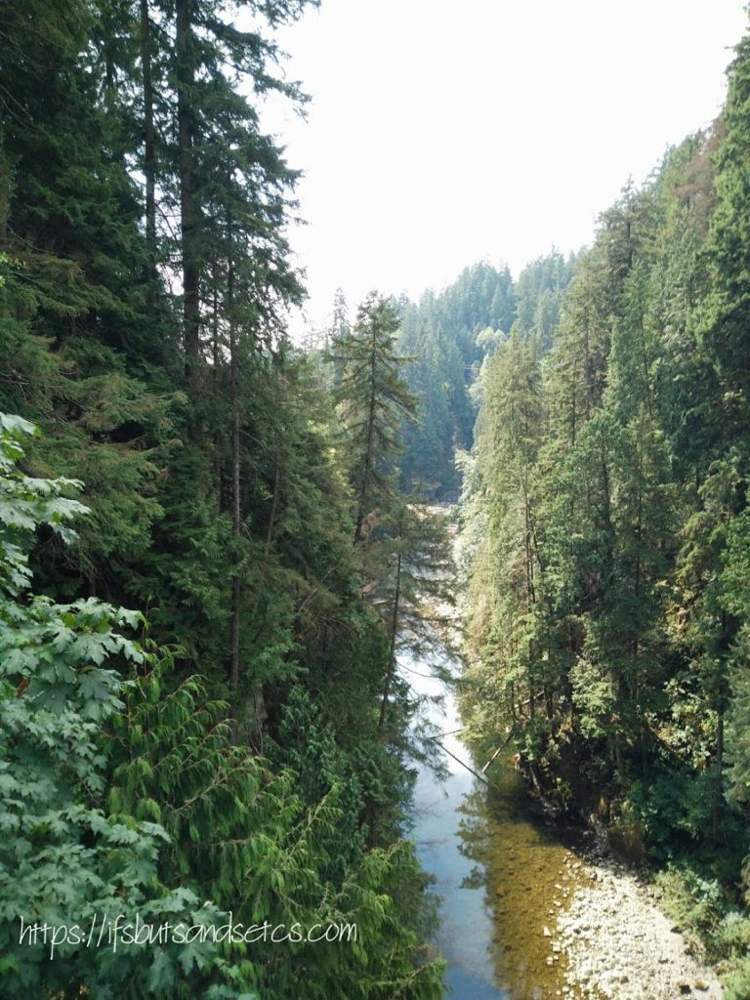
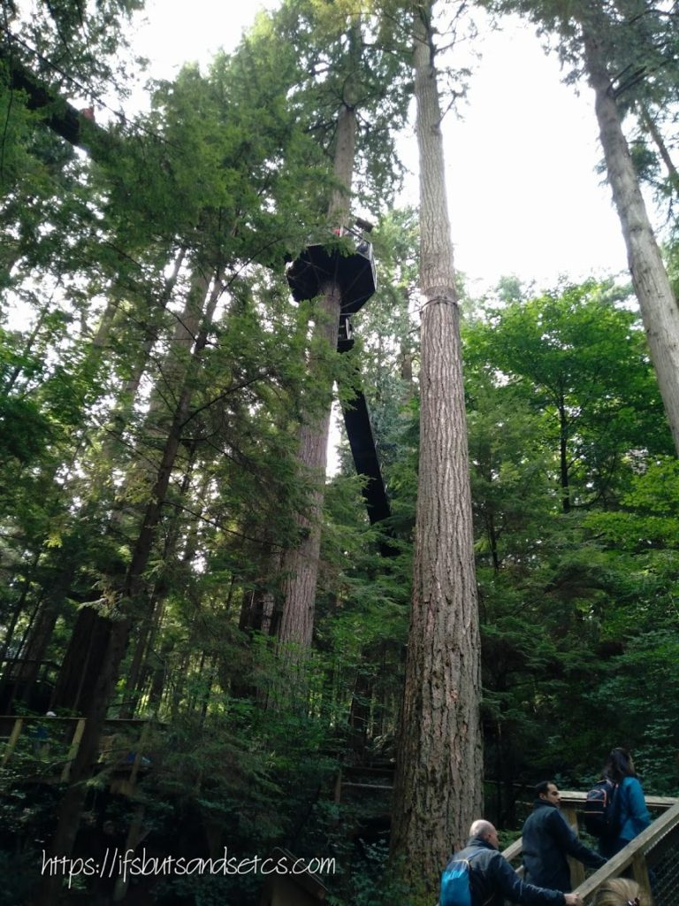
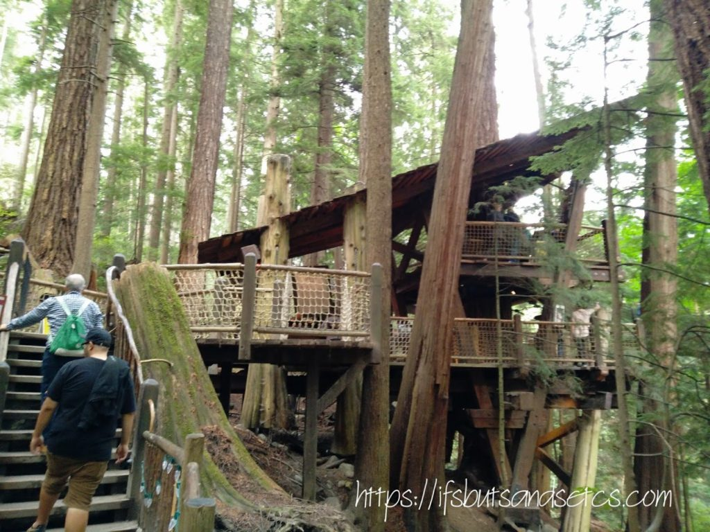
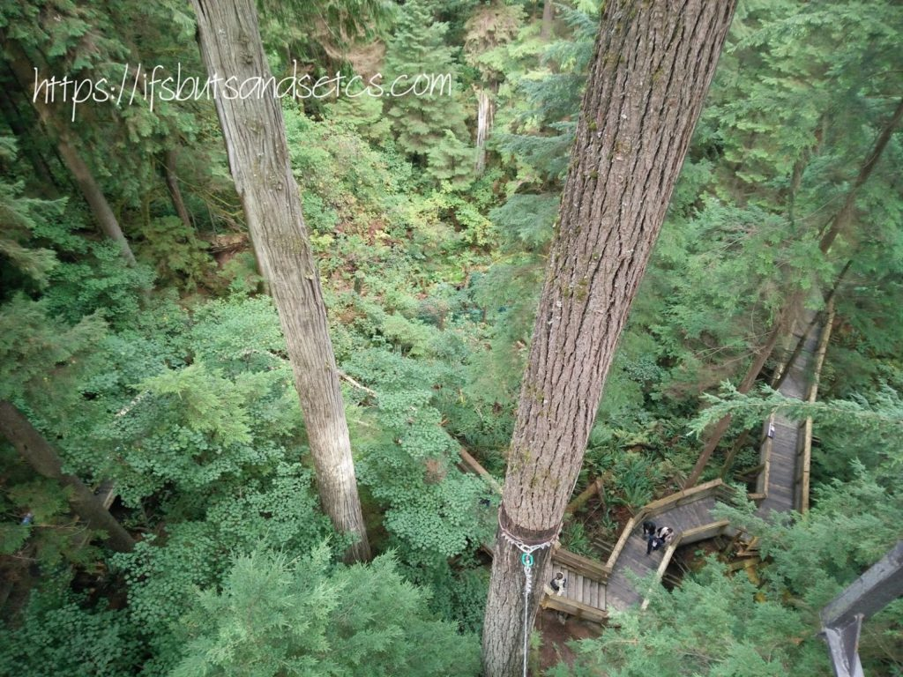
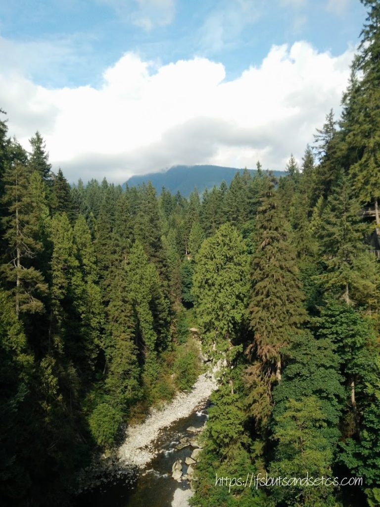
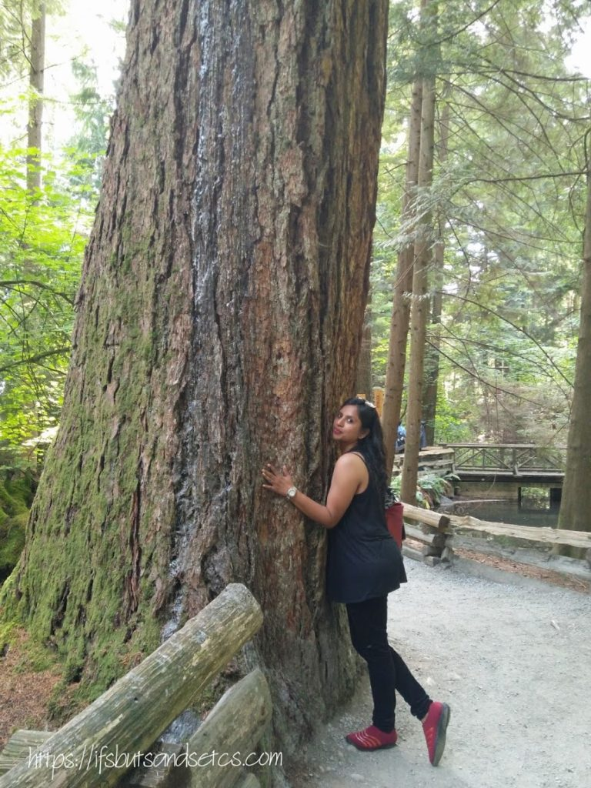

One of Vancouver’s most iconic sites Capilano Suspension Bridge Park is also one of the most exciting experiences the city has to offer! As mentioned in my previous posts Vancouver is a nature lover's dream come true. This adventurous must-see place is a haven for eyes that feast on lush greenery.

Just as you enter the park towering Totem poles greet you from a distance. Totem poles are representations of Aboriginal heritage, beliefs, history, and current art expression. Most totem poles are hand carved from western red cedar trees. A totem pole is often seen as a freestanding, tall slender pole, carved out to depict multiple animals or humans, painted usually in bright colors. The totem pole generally narrates tales of events, folklore, legends, and family lineages.

Stretching at a 140 meters length, The Capilano Suspension Bridge hangs suspended 70 meters above the Capilano River. Engineered to be completely safe, the bridge, however, sways from side to side when walked on, giving visitors a thrilling experience. Despite the goose-bumps raising walk down the wobbly bridge, the breathtaking view of the surrounding valley from the Capilano Suspension Bridge captures your senses with its natural beauty. This stunning walkway, made partly of glass, hugs the granite cliffside as it offers a panoramic view of the rainforest and canyon far below. The bridge takes you to the rainforest and the seven suspension bridges of Treetops Adventure, a unique, tree-friendly encounter high in the forest.

I read somewhere that this bridge is also called the laughing bridge due to the funny noises the wobbly bridge makes as it swings in the breeze.

The Capilano river winding through the valley gurgling below our feet as we looked down at it in wonder from several feet above, suspended at the mercy of the shaky bridge.

Notice the balcony perched atop the trees. Walking along the bridges leading to those balconies was almost akin to a storybook scene coming live. It reminded me of the Phantom comic series. Legends of 'The Ghost Who Walks' living in his magnificent tree house and a lot of other jungle stories that we have grown up reading came to my mind as we walked through these seemingly fictional tracks.

After climbing a few fleets of stairs that led us through the lushest of foliage, the view of the snaking trails below was a sight to behold. Tall trees stand around you generously shielding the unexplored mysteries of this wildlife haven. This park is an abode to several wild animals, birds, and mammals.

View of the mountains from the Capilano bridge. The sense of tranquil and mystery that this amazing wilderness evokes is indescribable. The tall trees whistled eerily through the breeze. I thought I heard an owl hoot in the distance. A squirrel scampered by. Oops...or was it the bridge cracking under my weight? Thankfully, no, the bridge survived me and I lived to describe this beautiful adventure and also a chance to relive it through this post](http://ifsbutsandsetcs.com/wp-content/uploads/2017/10/cc.jpg)

_I am taking part in [The Write Tribe Problogger October 2017 Blogging Challenge](http://writetribe.com/write-tribe-problogger-october-2017-challenge/) at [Write Tribe.](http://writetribe.com/)_
