After exploring the spectacular parks and sights of downtown Vancouver, I decided to check out the Museum of Anthropology, that stands on the campus of The University of British Columbia. UBC is a global center for research and teaching, consistently ranked among the 40 best universities in the world. The museum is known to boast of world's finest displays of Northwest Coast First Nation arts.

The university campus itself is a visual delight with an abundance of natural beauty. The Museum of Anthropology overlooks mountains and sea. I walked through the gorgeous rose garden in the campus to get to the museum. Had I been studying in such a stunning campus I'd have ended up enjoying the outdoors more than attending the lectures indoors!

\[caption id="attachment\_2454" align="aligncenter" width="325"\] View of the sea and mountains from the campus\[/caption\]

\[caption id="attachment\_2455" align="aligncenter" width="400"\][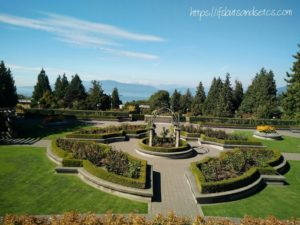](http://ifsbutsandsetcs.com/wp-content/uploads/2017/10/u2.jpg) The rose garden at UBC\[/caption\]

\[caption id="attachment\_2456" align="aligncenter" width="325"\][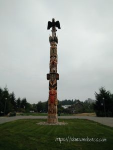](http://ifsbutsandsetcs.com/wp-content/uploads/2017/10/u20.jpg) Totem pole in the campus.\[/caption\]

_The Museum of Anthropology at the University of British Columbia (UBC) campus in Vancouver, British Columbia, Canada is renowned for its displays of world arts and cultures, in particular, works by First Nation band governments of the Pacific Northwest. As well as being a major tourist destination, MOA is a research and teaching museum, where UBC courses in art, anthropology, archaeology, conservation, and museum studies are given. MOA houses 38,000 ethnographic objects, as well as 535,000 archaeological objects in its building alone. [Source](https://en.wikipedia.org/wiki/Museum_of_Anthropology_at_UBC)_

The Museum of Anthropology houses carvings, weavings and contemporary artwork and more than 16,000 objects from around the world are displayed in it. As you enter the building the museum opens up to a large gallery with high ceilings and skylights displaying several gigantic wood carved native Indian mythical figures.

[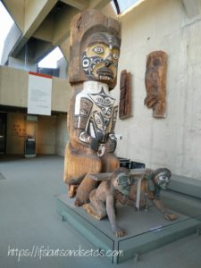](http://ifsbutsandsetcs.com/wp-content/uploads/2017/10/u17.jpg)

A little ahead of this area stands this thought-provoking famous cedar sculpture, The Raven and the First Men, by artist, Bill Reid. It forced me to stop in awe as I tried to fathom the story behind it. And here's what I discovered:

_In Haida culture, the Raven is the most powerful of mythical creatures. His appetites include lust, curiosity, and an irrepressible desire to interfere and change things and to play tricks on the world and its creatures. The sculpture of The Raven and the First Men depicts the story of human creation. According to Haida legend, the Raven found himself alone one day on Rose Spit beach in Haida Gwaii (also known as the Queen Charlotte Islands). He saw an extraordinary clamshell and protruding from it were a number of small human beings. The Raven coaxed them to leave the shell to join him in his wonderful world. Some of the humans were hesitant at first, but they were overcome by curiosity and eventually emerged from the partly open giant clamshell to become the first Haida. [Source](http://www.billreidfoundation.ca/banknote/raven.htm)_

[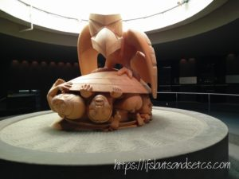](http://ifsbutsandsetcs.com/wp-content/uploads/2017/10/u5-1.jpg)

Aboriginal art of various shapes, sizes and colors adorn the museum. One could browse through them for hours in awe at the imagination of the craftsmen who created them.

[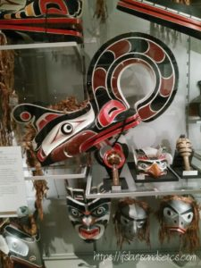](http://ifsbutsandsetcs.com/wp-content/uploads/2017/10/u11.jpg)

[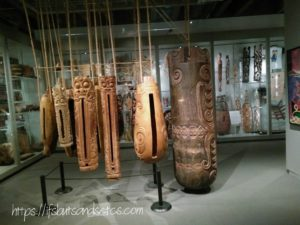](http://ifsbutsandsetcs.com/wp-content/uploads/2017/10/u14.jpg)

Mixed media glass ceramic tile sculpture, by artist Sally Michener.

The award-winning Koerner Ceramics Gallery displaying a collection of European ceramics unique to North America was a treat to the eyes.

[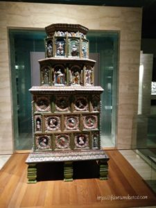](http://ifsbutsandsetcs.com/wp-content/uploads/2017/10/u7.jpg)

The Tiled stove dates to c.1560 and is made of lead-glazed earthenware. It originates from either Germany or Central Europe.

[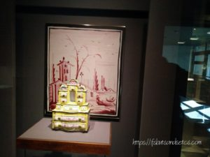](http://ifsbutsandsetcs.com/wp-content/uploads/2017/10/u6.jpg)

This so-named Tata is a tin-glazed earthenware, faience, jewel case which was made in a factory founded by Count Josef Esterhazy in the 18th century. This object dates to 1786. The painting seen behind is a blown-up reproduction of the painting seen on the side of the jewel case.

The Porcelain plates display was one of the most interesting displays that captured my attention. [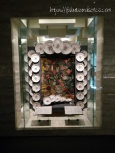](http://ifsbutsandsetcs.com/wp-content/uploads/2017/10/u8.jpg)

The display seen below comes with audio effects. A concept that makes the entire audio-visual experience memorable. [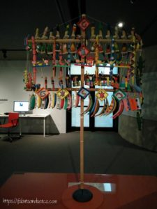](http://ifsbutsandsetcs.com/wp-content/uploads/2017/10/u15.jpg)

These series of colorful hammocks welcome visitors to grab some lazy moments. It sure was a tempting proposal!

[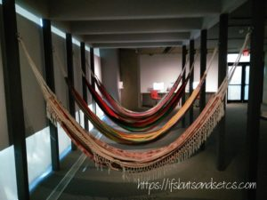](http://ifsbutsandsetcs.com/wp-content/uploads/2017/10/u16.jpg)

This post cannot do justice to the entire collection of rich heritage and art seen in the museum. I haven't even mentioned the exhibition of paintings seen there. I came out with a lingering aftertaste of the huge slice of Canadian art and culture that I had just savored. An art connoisseur's delight for sure!

_I am taking part in [The Write Tribe Problogger October 2017 Blogging Challenge](http://writetribe.com/write-tribe-problogger-october-2017-challenge/) at [Write Tribe.](http://writetribe.com/)_
