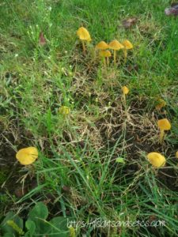
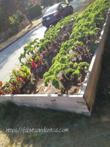
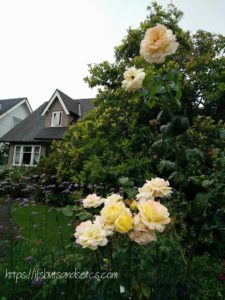
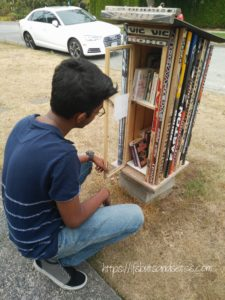
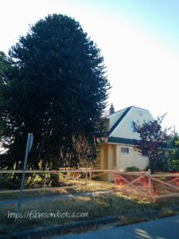

It's that time of the year when I revel in the festive mood in my own sweet way by doing things that give me pleasure. Diwali, the festival of lights fills me with warmth and makes me sit back to reminisce on all the good things that life offers to me. Some of these joys come from noticing small things that are seemingly inconsequential but nevertheless add the required zest to the mundanity of life.

I have been writing about my trip to Vancouver in my last few posts. After writing about spectacular places of interest that Vancouver has to offer like the scenic parks, thrilling adventures, the gastronomic pleasures along with a bit of art and culture, today I'm in no mood to write about other significant places that I've been to. I'd like to keep it simple and share my experiences about a few unusual things that captured my interest on a day-to-day basis during my stay there which left me intrigued.

I lived in a cozy lane in Vancouver that had quaint little villas flanked by rows of huge trees on either side of the road providing ample shade to the path leading to the homestay cottage where I was put up. I'd walk down this enchanting path while sunshine played peekaboo through the multi-hued leaves on the branches overhead. A lot of dried leaves lay strewn across carpeting the ground crunching under my feet as I walked. On these walks, I would find something that would capture my interest to make me stop in my tracks to observe, admire and click a picture to keep it as a memory for future. I do that quite a lot even when I'm not traveling. My cell phone has an array of pictures and videos that I shoot every time I come across something interesting or when I wish to capture a random moment on impulse.

It had rained the previous evening when I stepped out that morning. It wasn't exactly sunny but the skies had cleared up a bit. As usual, I strolled down the path, humming along the music plugged into my ears, absorbing the freshness of the new day with everything washed clean and green. The grass blades glistened as stray raindrops lazily trickled down them. Something yellow peeked from somewhere in the middle of the green stalks. For a second I thought they were stray flowers but on a closer look, I discovered that they were actually mushrooms popping out of the lush grass - bright canary yellow mushrooms. I'd never seen mushrooms of that color. I wasn't sure if they were non-poisonous so I did not want to touch them. They had thin longish stalks. Aren't they amazing to look at? Do you have an idea about this variety of mushrooms? Are they edible? Do let me know in the comments below if you have any idea about them. 

At the end of the lane was a patch of kitchen garden with a bed of fresh Kale sprouting right there out in the open without any fencing around it. I always wondered how it was left untouched by people passing by. Back in India, this wouldn't have lasted even for a day if it was left without being enclosed or unattended. Neighbors and people passing by would have happily helped themselves to it if they came upon an opportunity like this in my country. Worse still, the stray monkeys, cattle, and birds would have feasted on them even before they grew this tall.  And here was this generous produce that was being lovingly tended to by someone who lived there with complete faith that nothing would happen to it. I wish we had that kind of trust and understanding amongst our people in India.

Most houses in the vicinity had some really beautiful gardens. The neighbors seemed to be fond of exotic flowering bushes and manicured lawns. I'd pass by yards with sprinklers merrily doing their job of keeping them the lushest of greens. One particular house had a bewitching collection of roses. This bush of white-yellow roses left me mesmerized at the sheer size and gorgeousness of the blooms. Again, there are no fences around the house's lawns that this plant stood in. Something like this would never be left untouched in India if it was not guarded. In our country, the bush would have been left bald and flowerless much before the buds would have bloomed to this size. They would have surely got plucked to be offered to a god's idol (while the god sighed yet again and shook his head in disapproval at the sight of the plucked flowers in pity!) or would have adorned some vain lady's braid withering away in disgust at the strong smell of her hair oil. Or it would have been more likely to be handed over by a mushy someone to their romantic interest as a gesture of their undying love, killing the poor flower in the process. I hate it when people randomly pluck flowers. Why can't we let them grow and admire them from a distance to give us prolonged joy? It was an absolute delight to see these bunches of roses flowering so freely that people like me who passed by could enjoy gazing at them in wonder for hours and days together.

A few days before I left Vancouver, I was introduced to the concept of a free library outside someone's house in the lane. I had noticed this box-like structure earlier but had never taken a closer look because I had never imagined the existence of something as helpful as this. My friend Elly, noticed it when she visited me and pointed it out to me. Standing on the corner of the lane was this tiny cupboard with two shelves which held a couple of books. Not a large collection, but nevertheless an interesting one. A sign on its door announced that people were free to borrow, take and leave books there as a gesture of generosity for book-lovers. How thoughtful is that?! 

During my first few days in Vancouver, I'd often get lost in this lane, unable to find the house where I stayed. The thing is that the numbering of these cottages was not in order and most of the houses look somewhat the same from outside to people who are new to the place. I tried using the maps app on my phone and surprisingly it ended up leaving me stranded at some other doorstep that wasn't supposed to be mine in spite of providing the exact details of my residence. It was rather amusing and frustrating later to note that I had been walking round and round around my house without realizing that I was passing it yet again blissfully unaware. Many times I got to know that I was closer home when the Wifi signal would catch up and my phone would start beeping with notifications! I would scratch my weary head trying to figure out where I was. After a few failed attempts to reach my house at one go, I decided on zeroing on a landmark that would help me identify the block that led to my house. Just where this row of houses began stood a gigantic tree that had thick prickly cactus-like leaves with twisted branches spiraling upwards. There was something monstrous about the tree due to its humongous height and the way it spread out wildly. In my mind, I called it 'The Monster Tree'. This Monster Tree was my landmark for the remainder of my days guiding me even in pitch dark to help me identify the ever-confusing location of my destination. It was only later that I learned that this was actually called a 'Monkey Tree' and it originally comes from Chile. In due course of time, the Monster/Monkey tree had started bringing a smile to my face because seeing it after a tiring day meant that I was closer home.

These are some of the warm memories that will stay with me in the days to come. More than the usual shopping and sightseeing at new places, these are the experiences that I look forward to during my travels. The curiosity and joy of discovering something off the beaten track are always greater than the usual predictable routine. These tiny bits of adventures sum up to a larger chunk of happiness that stays with you much after the journey is over.

Hope you all had a wonderful Diwali. May this season of lights bring you little sparks of joys that can be cherished for a lifetime. Till then, Happy Diwali and a Prosperous New year!

_I am taking part in [The Write Tribe Problogger October 2017 Blogging Challenge](http://writetribe.com/write-tribe-problogger-october-2017-challenge/) at [Write Tribe.](http://writetribe.com/)_
