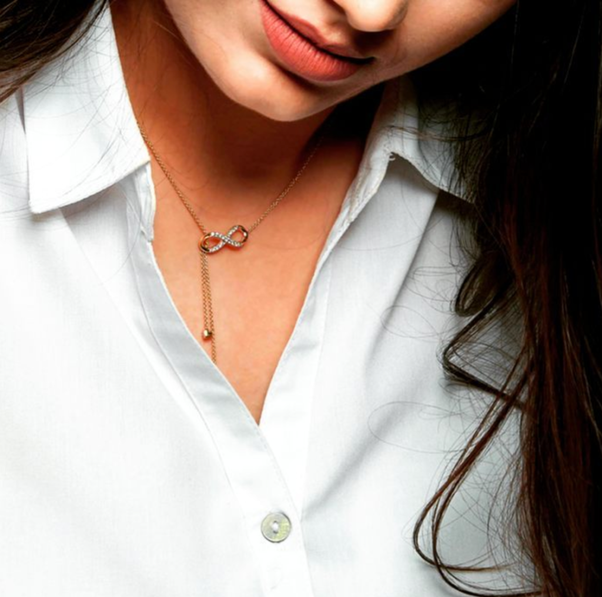

Chandni stacked the remaining files neatly in one corner of her desk to deal with them the next day. She seemed to be the only one around on the entire floor of her company office. It wasn’t late but a lot of people had left for the day. She wondered why. _“Oh yes, how could she forget?”_ she wondered as she skimmed her eyes across the workstations of her team members outside her glass cabin. A red petal here, a ribbon there, a heart-shaped card pinned on a soft board, chocolate wrappers popping out of the bins, it wasn’t difficult to miss Valentine’s day, right? She had tried to dismiss the hullabaloo that surrounded her all through the day.

Instead of rolling her eyes at people who asked her if she ever planned to settle down in life, she had mastered the art of smiling curtly and replying with, _“I’m already settled. I’m married to my job.”_ Her corporate career was going great guns. She had slogged her way up from a gawky clueless intern to a self-assured senior professional. Pieces of advice went on about important it was to have a companion to enjoy the finer things in life. Someone who would care for you, pamper you and treat you like a queen that you so deserved to be. She would shake her head in exasperation. _"Was it like the end of the world?"_ She too had nurtured dreams of finding an ideal partner. In fact, she had kissed a few frogs in the last few years but was sorely disappointed to discover that none of them deserved to be her prince.

She did not fit the standards of traditional beauty norms in any way. The generously endowed curves that peeked out of her business suits and her glowing honey complexion was viewed as a disadvantage in the marriage market. Her parents had long given up on searching for grooms for her, given her high qualifications and earnings. The ones who matched her in terms of her success standards were always on the lookout for the traditional fair, slim and homely trophy wives. The rest, unfortunately, seemed interested only in the perks of her success.

The other day she was out jewelry shopping with her family for her cousin Riya’s wedding. She helped Riya choose her jewelry. While they were at it, Chandni’s mum noticed her daughter gazing longingly at a gleaming piece of jewelry. _“Do you like it?”_ asked her mum, _“Let us buy it for you, darling.”_ Chandni shook her head. It was a delicate diamond pendant. _“Aren’t exotic things like diamonds gifted on occasions that are worthy of them by people who loved you?”_ she thought to herself.

Her phone beeped with yet another mushy Valentine's day forwarded messages, bringing her back to the present. Something within her stirred. It was a moment of epiphany for her. _"What was it that she was waiting for? Did she really need someone to get her what she desired? Was she any less worthy of pampering herself when she was toiling hard to become what she was today? A self-loving independent woman who had earned her freedom. A freedom that could allow her to treat herself like a queen whenever she wished to."_

She quickly opened her laptop, excitedly punched the keys to get to her favorite and reliable online shopping jewelry portal, [CaratLane.com](https://en.wikipedia.org/wiki/CaratLane). The webpage opened with an array of beautifully cut diamonds encrusted in the most exquisite craftsmanship. Finally, she found the diamond pendant that she was fascinated with the other day. Within the next few minutes, she had booked the piece for herself. They even had services where one could try the piece before they ordered. But since she wanted this as a Valentine gift for herself, on her way home she drove to the nearest Caratlane store and picked it up. One wouldn’t have imagined doing something like this a few years back, would they?

It was the evening of Riya’s wedding. Chandni looked gorgeous in her dusty rose _lehenga_. Her aunt pulled her aside to introduce her to an interesting looking gentleman. Ratan Soni was a successful business tycoon famous for his dedication to social causes and an eligible bachelor despite his age which was beyond the traditional marriageable age. The diamonds in her neck sparkled in his eyes. He tried to fathom the shine of pride in her eyes as he struggled to mask his attraction towards her. Was it the romantic beginning of another diamond studded story? She smiled to herself. The first one had begun with the twinkling self-love in the diamonds that prettily rested above her heart.

[_Gift yourself your first diamond._](https://www.caratlane.com/jewellery/diamond-pendants.html)

_This post is written for [CaratLane.](https://www.caratlane.com/)_
