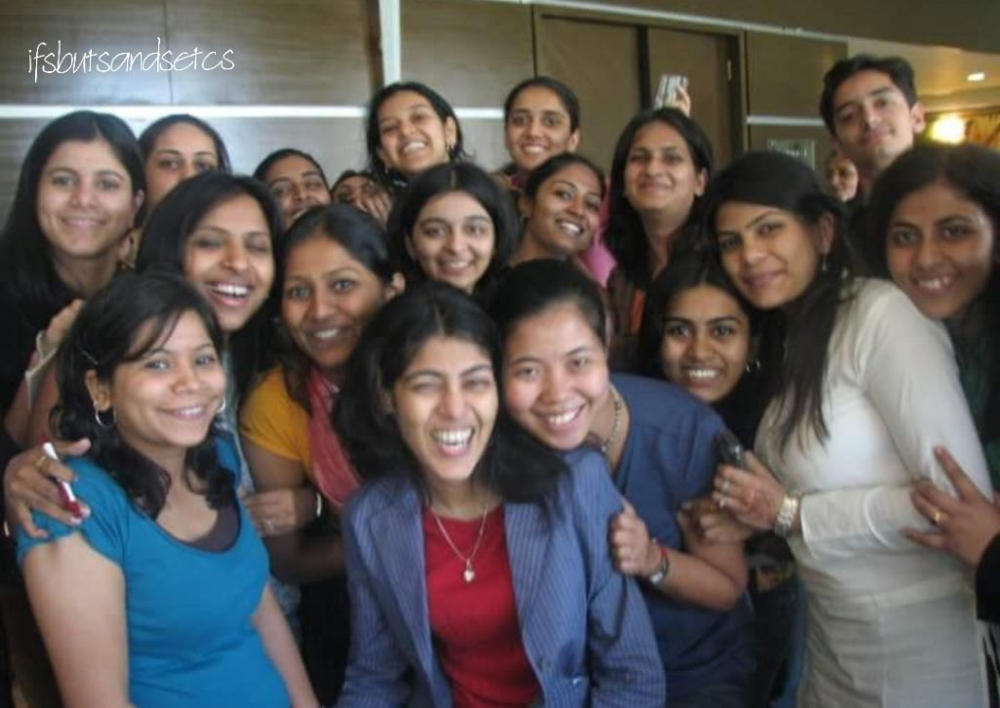

The year 2017 comes to an end for me with mixed feelings and emotions. Despite wanting to write this post that reflected on the year that went by my energies were directed towards other personal commitments. However, the words threaten to spill through as I try to absorb a shocking news I received yesterday.

This has been an eventful year for me. Most of you who have read my previous posts would know why. My son took off for his higher education abroad. I accompanied him to a new country and helped him settle in his first few days there. I returned to an empty nest and tried adjusting to this new life which had me worrying endlessly about how my son was taking to his new surroundings. The daily video chats with him were like a silver lining to the cloud. He's home for his holidays bringing in a brief spell of cheer but will be heading back to his university soon leaving me again with the emptiness that I have come to dread.

I always thought that I was quite strong mentally and would be able to fight every challenge that came my way with this strength but we often forget that stress has a way of creeping in and taking a toll on the physical body no matter how strong you are. My health suffered in the days that followed. I was on complete bed rest due to a severe back problem. Just as I started recovering I suddenly started feeling very dizzy. I was diagnosed with vertigo and B12 deficiency. So more bed rest and restricted activity followed. I'm not the kinds who could remain confined to the bed for a long time and it surprised me that this was happening to me - someone who eats well, exercises in moderation, meditates and seems to be fit as a fiddle. These two months have put me in a state of self-doubt about my coping mechanisms.

Just as I was coming to terms with my own problems, I received a shocking news of the horrific death of an ex-colleague in the Kamala Mills fire accident on 29th December in Mumbai. I had yet to recover from the previous rude shock that we received just a few months ago when we lost yet another dear ex-colleague and friend to cancer. I had worked with both of these wonderful women in the same organization back in 2006-2007. Each of them was an epitome of youthful vigor. Who would have thought that they would leave us in such an untimely fashion? I wasn't really in touch with both of them, except through social media or a rare bumping into each other at malls or offices of companies that we worked with later on.

Kavita was out to celebrate her friend's birthday at '1 Above,' a pub at Kamala Mills in Lower Parel. Soon after her friend cut her birthday cake, a huge fire engulfed the place and many people lost their lives in this mishap including Kavita and her friend who had just ushered in her 29th birthday, mostly because of suffocation due to smoke. Kavita is survived by a young daughter and husband. I shudder to imagine what she must have gone through in the last minutes of her life. Had she the slightest inkling that night as she dressed for the party that this would be the last time she would be seeing her dear ones? Her warm charismatic smile will stay with us forever in our memories.

\[caption id="attachment\_2635" align="aligncenter" width="680"\] Kavita, seen on the right in a white attire.\[/caption\]

Neha, on the other hand, surrendered to deadly cancer a few months ago and fought with the disease valiantly. She was probably slightly more prepared for the finality. Although, I wonder if there is just anything that can prepare you for your end, no matter how well you know your situation. After Neha passed away, a string of social media posts by her bereaving husband highlighted on how well she had lived her life and dealt with her adversities. We saw her smiling through pictures clicked at all the exotic locations she had wished to travel, relishing food that she loved and overall enjoying life to the fullest. She had a vast reserve of bubbling energy stored in a petite body. Her enthusiasm for everything she did was infectious.

May these beautiful departed souls rest in peace. I'm praying for their families to find the strength and courage to cope with their losses.

\[caption id="attachment\_2636" align="aligncenter" width="680"\] Neha, seen on the extreme left.\[/caption\]

Life tests us in most unpredictable ways. Just when you feel that you've figured it all, fate throws a googly at you catching you unaware. All I take forward from the experiences of this year is that no matter what the situation is, learn to breathe and let go. Stay alert, take good care of yourself and of people around you. Enjoy what you have at this present moment. Tomorrow is never promised and today is all that you've got.

_May the coming days bring in peace, abundance and good health in your lives. Stay safe._ _Happy New year 2018!_
