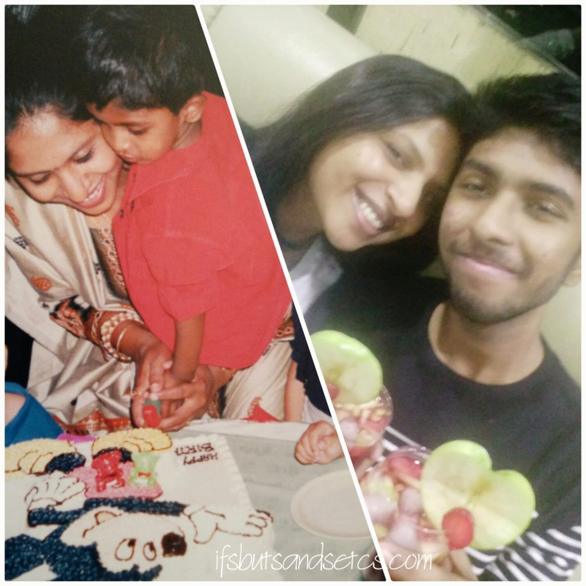

Last year around this time, as a participant of the Blogging from A to Z  Challenge, I had written a series of open letters to my son who was soon to fly out of the nest to pursue his further education abroad. On reaching this important milestone of his 18th birthday, I gifted him a set of twenty-six letters compiled in the form of a personalized handbook in which I touched on various common situations of life that one goes through as a part of growing up and also as a full-grown adult. I had shared my own experiences and advice on what worked best for me while coping with such situations. These letters covered various subjects like dealing with bouts of anger, setting goals, surviving low phases, nurturing friendships, finding love, maintaining a positive attitude, managing life outside the secure confines of home in a new place and many other topics which are a part of growing up. I have been in the middle of a lot of things of late and hence I could not participate in the A to Z Challenge this year.

Today my son turns 19 and this is his first birthday that he spends away from us, far across the seven seas in a new world that he has set off to explore all by himself. I felt it was time for me to write him one more open letter just to look back on the year that's gone by from the time he had ventured out on his own in the big wondrous world.

\*\*\*\*\*\*\*\*\*\*\*\*\*\*\*\*\*\*\*\*\*\*\*\*\*\*\*\*\*\*\*\*\*\*\*\*\*\*\*\*\*\*\*\*\*\*\*\*\*\*\*\*\*\*\*\*\*\*\*\*\*

_Dear Son_

_**Wish you a Happy 19th Birthday!**_

_Welcome to the last year of your teens. I'm sure this birthday is going to be very different from all of those that we've celebrated together. This is the first time you're not with us on your birthday and it feels kinda weird. Needless to say that I miss you tremendously today. April was always about preparing for your birthday celebrations. Looking for innovative cake designs that would be about whatever that you had taken a fancy to in that particular age and year - Superheroes, Pokemon, The Big Bang Theory or simply anything that caught your fancy. Scouting for the perfect party venue, finding ways to entertain your friends, planning the midnight surprise with them, buying return gifts for them and of course shopping for those birthday gifts that you couldn't wait to unwrap! Suddenly this month seems to drag by and there's very little to do this year. I miss the excitement of your growing years._

_On the other hand, April for you this year seemed to be packed with action, studying for the final exams at the university, winding up for the year and packing up your stuff before you head for your much deserved holidays. The year simply zoomed by. From the time I accompanied a young unsure boy to his new environs in a new country to the responsible, affable, self-assured and extremely adaptable young man (stop gloating!) that I see today, this journey of yours only seems to be getting highly interesting with time._

_Ever since you've reached there we have had our share of pulling our hair in frustration figuring out a lot of things along the way, some anticipated and some that spring at us as surprises, I guess this is when all our growing up is happening. I say 'our' growing up coz it's not only you who is learning and growing. It is also me learning to let go and trust you to handle things on your own. They say that the umbilical cord never really gets severed. An invisible cord always connects the mother with her child despite the distance that separates them from each other. But the biggest challenge a mother faces is to loosen the grip on this cord to facilitate her child to grow independent. In the past few months, I feel that I have been able to do that. Sometimes consciously and sometimes coz there was really no other choice._

_It wasn't easy of course in the beginning. I fretted about what you ate, and why you suddenly decided to go off dairy. How would you remain strong and healthy without getting your daily dose of calcium? I anxiously hoped that you could get the last bus back to your campus after your night out with friends, not to mention scolding you when you forgot to send me the confirmatory ping in the middle of the night to let me know that you were back to your dorm safe. I worried about the friends you made and wished that you made some more Indian friends so that you could hang out with them at least to satiate your taste buds with the Indian food that you so craved for. I bit my nails praying that you did not fall ill and covered yourself with thick warm clothes when it started to snow there. I wondered if you were choosing the right subjects and doing your research on your course well for setting future goals. I lost sleep on many nights waiting for you to let me know how your test or exam went through that day, and also on those occasions when I was checking that you had packed your luggage properly, checked in and made it in time to take the flight back home only to be chided by you to go back to sleep at three in the morning. I battled the timezone difference with bleary eyes just to make sure that things were going right with you. Sometimes you must have felt that I came on you quite strongly trying to push you into doing things. That was actually my way of ensuring that you did not make mistakes or leave loose ends. There were things that you were doing differently and some of which I didn't wholly approve of. You once told me when I tried to correct you that you wanted to make your own mistakes. So well, I decided to go ahead and let you make them and for once figure it out for yourself. I am glad you're ready to take the onus for your mistakes and honest enough to correct them when required._

_Thankfully, most of my anxieties were laid to rest when I saw the way you slowly adjusted yourself to get in sync with the familiarity of the new routine. I noticed all the efforts you put in to do so and I secretly admired you for it. After all, this was all so new to you, being a single child who had never ever been left on his own. It was reassuring to know that you ate your regular share of greens, jogged, studied hard, scored exceptionally great numbers, did your laundry, hung out with a set of bright friends and above all took care of yourself the way I would have wanted you to. I am sure you know who's the proudest mum in the whole world! I can't even begin to describe how a parent feels when they see their child starting to look after themselves._

_I still do worry and obsess about the tiniest challenge that comes your way but from what I've observed over the last few months, you somehow manage those challenges, sometimes a tad clumsily but at most times beautifully. It also gave me great comfort to know that you have been referring to my series of letters from time to time and that they gave you solace during trying times. At least those letters are there with you, wording my thoughts at every step you take. In time you might not require my gentle admonishing or guidance to get through the obstacles, but well, I doubt if I will ever stop looking over you! That's what mothers are all about, right?_

_This is the perfect day for me to tell you that you make me feel blessed with each passing day with the way you are evolving as a person. May God bless you with the abundance that continues to fill your life with happiness, success, good health, prosperity, and compassion. Make a wish as you blow the candles (don't forget to eat an extra thick slice of cake for me!) count your blessings, laugh a lot and have lots of fun. You absolutely deserve it for all the hard work and resilience that you have displayed in the year gone by. I love you so much._

_**Happy Birthday, sweetheart!**_ 

_Big hugs and lots of love_ _Ma_
