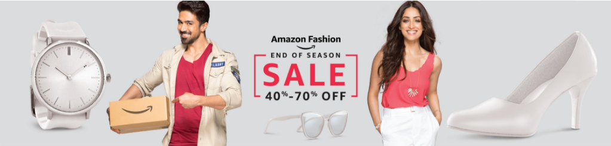

Fashion has been a crucial part of everyone’s life in this digital age. I have seen teenagers arguing a couple of times about the trends to follow and the brands they need to buy. And not only teenagers, even grown-ups who are fashion conscious and those who want to look better than their colleagues and friends are quite updated on fashion. Earlier in the 90s, it was not like this. People hardly cared about coordinating their clothes and accessories or wearing well-fitted garments. One could say that a sense of fashion in most people was quite undeveloped back then.

From what I have observed, ever since this whole tech-age has arrived and everyone has a smartphone in their hands with internet connectivity, everything about fashion goes viral in seconds and anything that a celeb wears starts trending amongst netizens almost instantly. It is therefore quite easy to keep track of the latest trends and follow them accordingly.

One can look great if he or she has a great sense of fashion. It just helps you to achieve the best-looking version of yourself. It suddenly boosts your confidence and your morale making you feel more presentable. A lot of people suffer from serious anxiety issues worrying themselves constantly with complexes about their looks. But the reality is somewhat different. One can actually look sharper and a classier in structured and well-fitted clothes. There are so many YouTube channels that can help you find the best color and the best fit for you. A pair of jeans looks way better with sneakers than a pair of flip-flops. That’s the beauty of coordinating well with attention to small details. That reminds me, I have seen some of the best collection of jeans available on Amazon.com. Not only jeans but their entire collection in fashion will make you want to change your wardrobe and get a whole new makeover. Every year Amazon comes out with their great [Amazon sale](https://www.gopaisa.com/amazon-great-indian-festival-sales-offers), where they give you the best clothes at a very discounted price. At times, the prices are just unbelievable!

The question is, why should you opt for the Amazon Sale? It’s simple. The Amazon sale is one of the biggest celebrations for all the fashion enthusiasts around the country. From the least known indirect clothing brands to the bigger well-known brands, you get everything at a cheaper price. They cater to both the genders. From trendy western wear to beautiful ethnic sarees, they have the best of ladies’ wear. For men, they have an extensive collection of the best of tee-shirts and shirts. You can be rest assured that these clothes will give your wardrobe the required boost of updated fashion!

Coming to another important deal I wish to share with you. Have you heard about GoPaisa.com? This is the best Indian cashback site which gives you cashback on every purchase. If you haven’t visited their site, I suggest that you should definitely go and visit them at [GoPaisa.com](https://www.gopaisa.com/). You can be assured of some more discount. All you have to do is visit Amazon store in their website and do the shopping from there. You get the best clothes, best offers, and cashback that will make your shopping experience value for money. Doesn’t it sound like a festival now? Then what are you waiting for? Come let’s celebrate fashion in a big way!

_\*This is a sponsored post. This blog has no direct affiliation with the offers on the links provided here._
