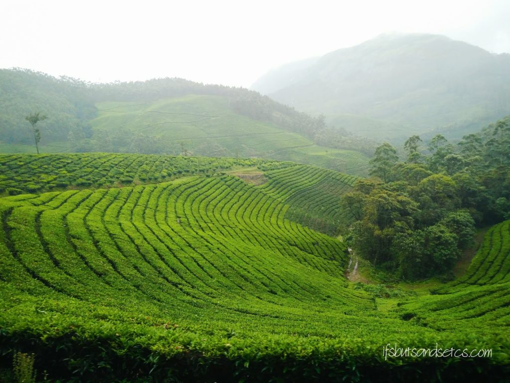
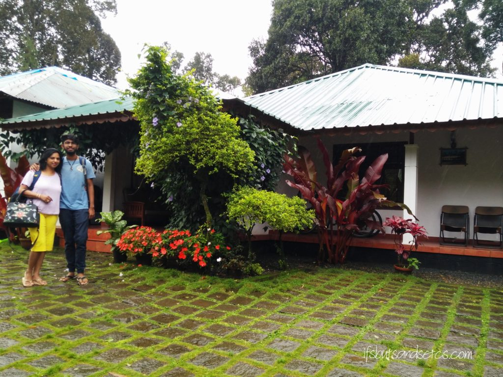
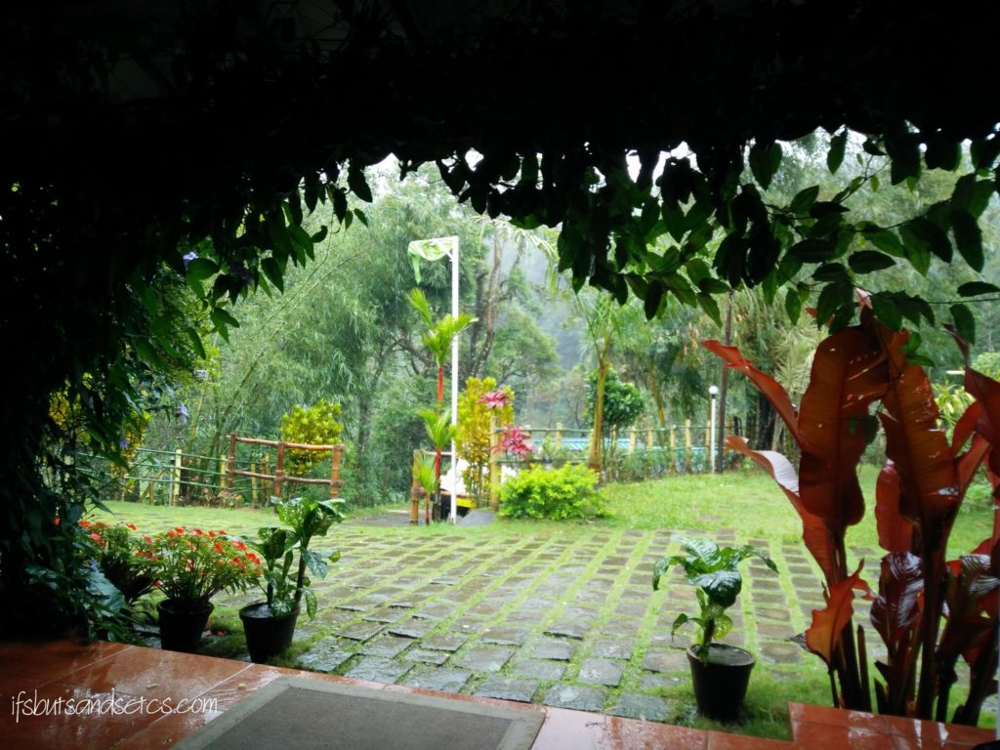
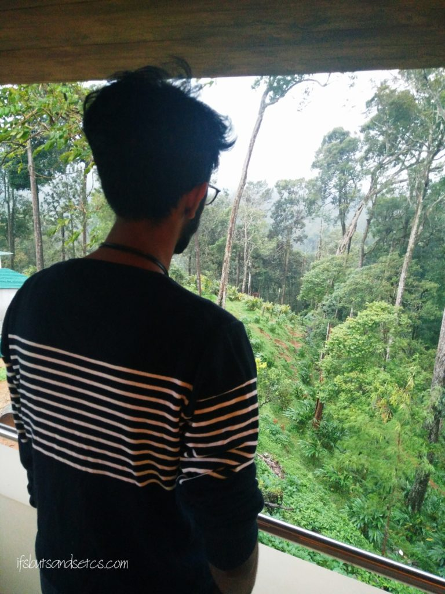
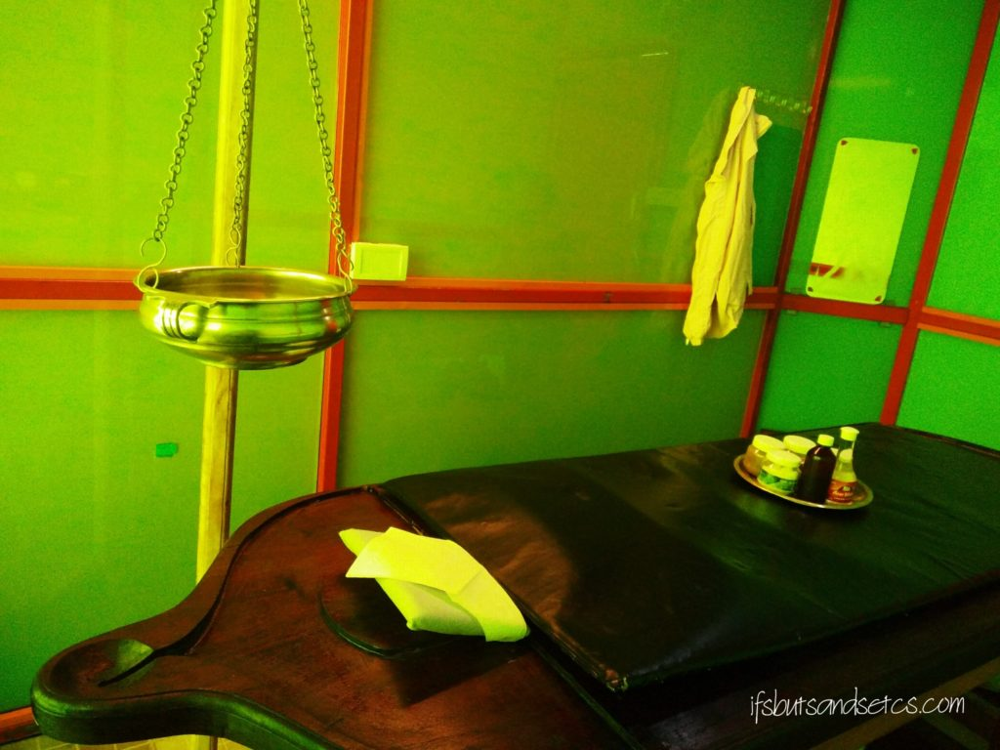
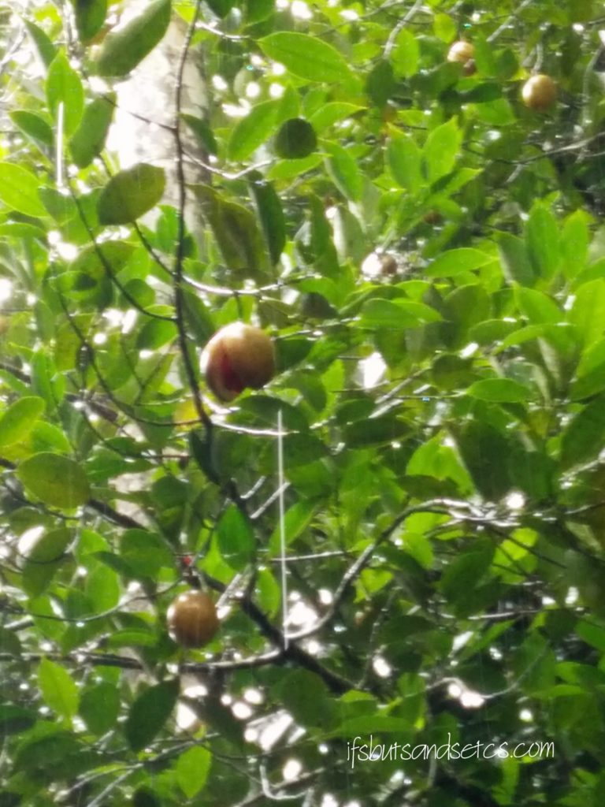
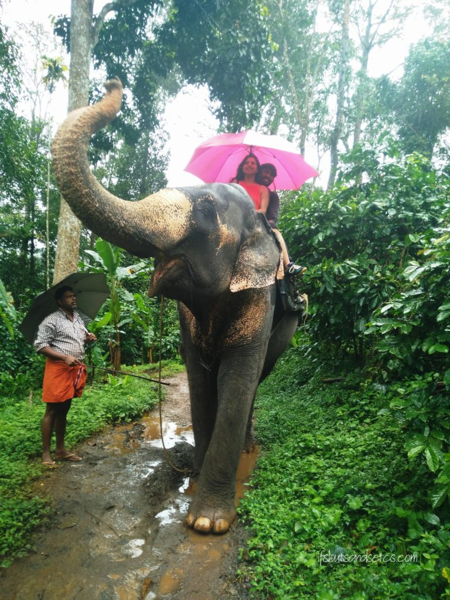
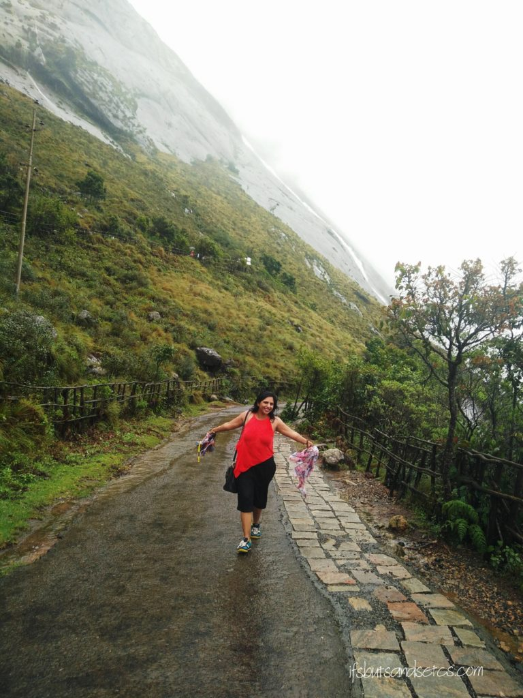
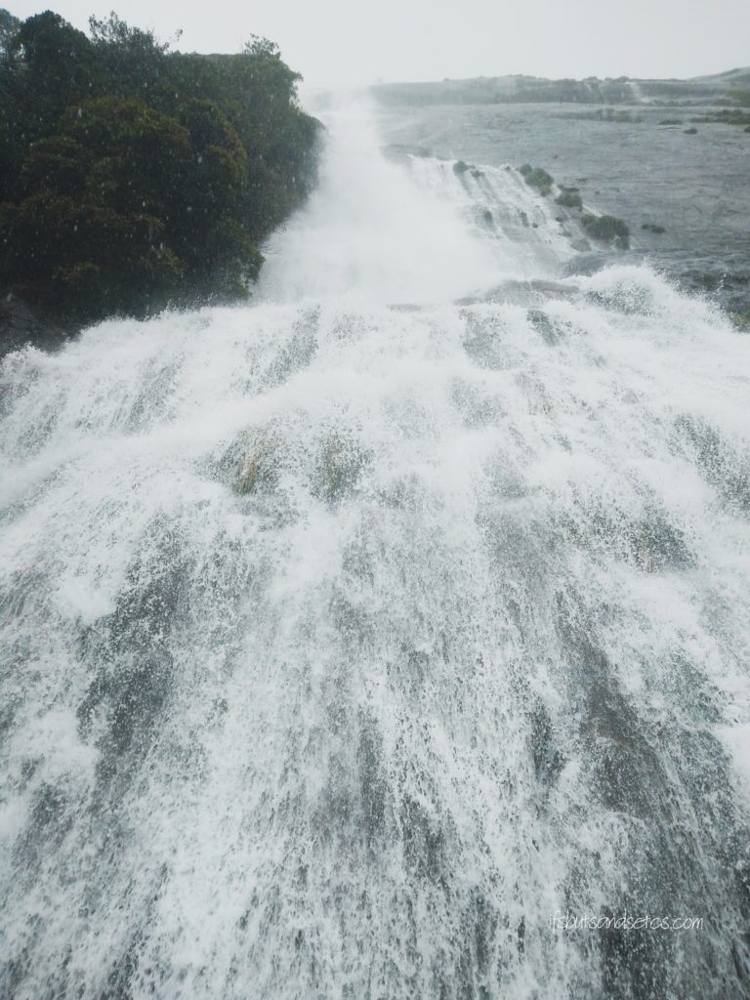
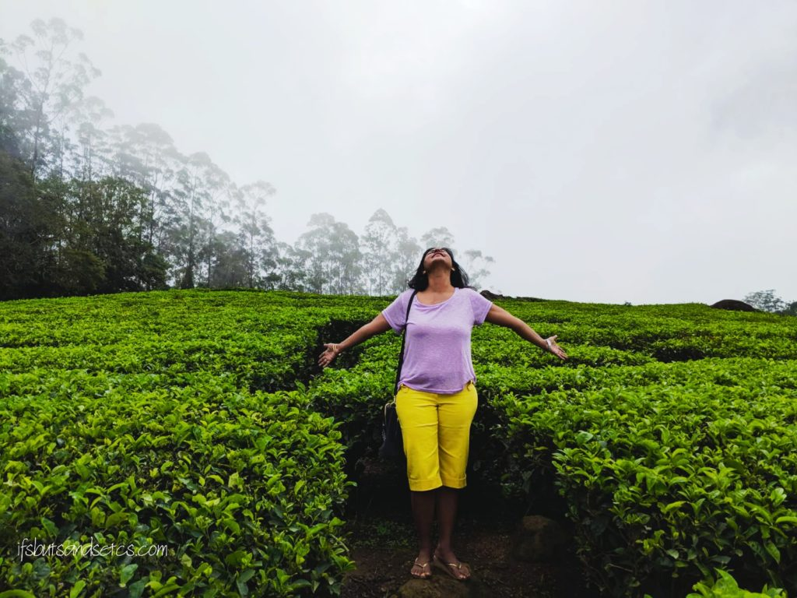

A holiday in Kerala at this time of the year is undoubtedly a visual treat. The rains washing down the expanse of foliage to the brightest of greens soothes the senses beyond imagination. The first time I had visited Kerala was when I attended a yoga retreat near Trivandrum. You can read about it [here](https://ifsbutsandsetcs.com/2014/01/memoirs-of-sivananda-ashra/). So enthralled was I by the greenery that I saw there that I had decided that very moment that I would make a special trip to Kerala sometime in the future to simply lie back and enjoy mother nature.

My son is down from his university these days to spend his summer holidays at home. After a whirlwind month of catching up with friends and family, he was game for taking a break to unwind. We needed that quality time to spend with each other. After all, he was away for most part of the year. So we decided to go to someplace beautiful which was both serene and relaxing. The idea was to just crash and absorb the beauty of nature at the same time recharge ourselves. We weren't high on sightseeing. That's the reason why we zeroed on visiting only Munnar instead of taking a package deal with a couple of other places like Alleppey, Thekkady or Kumarkoam thrown in. We weren't big on extensive road travel or seeing too many places, so we ended up with an exclusive trip to Munnar.

After a bit of research online, I came across a resort in Munnar which stands in the middle of spice and coffee plantations, called the Dew Drop Farm Resorts. I read a lot of rave reviews from people who had visited the place and it was recommended heavily by most of the travel sites. The idea of spending a few days away from the noise and chaos of city life and somewhere that was not too touristy made me settle for this destination. It just sounded perfect for what we had in mind.

We landed at Kochi airport and hired a cab to reach the resort which is located on Kurishupara Kallar Anakkulam Road, 15 km from Munnar town. The resort is about 96.5 km from Kochi international airport. We were soon snaking along hilly roads winding mysteriously into twists and turns to get the first few glimpses of lush flamboyance. Slicing our way through the occasional showers, holding our breath at the sight of mist-laden rolling hillscapes and delightfully spotting gushing waterfalls that streamed down from nooks and crevices of the gorges, we had finally arrived at God's Own Country.

 

There was more of natural beauty waiting to wow us at the resort. The Dew Drops Farm Resorts is located on a private property which spans across 370 acres of coffee and pepper plantations. Once inside the premises, we were greeted by a gurgling stream flowing right through the property. We reached the reception area which is nestled amongst a bunch of traditional Kerala style quaint cottages. They looked unpretentious and authentically local. There are a total of nine cottages which overlook the plantations. We were welcomed by the manager of the resort who was quite helpful throughout our stay. He offered us a choice of staying in a cottage overlooking the plantations or in a room with a balcony that overlooks the farms. I had actually booked a room as opposed to the cottage hoping that a top view of the hills would be heavenly. And I wasn't disappointed. Our room was a short drive away from the cottages in a newly constructed building with fresh new amenities. We were escorted to a jeep which transported us through the sloped roads that led us to our room. I was glad I had opted for the farm view room when I saw the wonderfully spacious L-shaped balcony that was attached to the room we had checked into. It overlooked the green farm valley full of tall trees swaying in the breeze fringed by misty ranges not very far away. A sight that we could spend endless tranquil hours gazing at.

\[caption id="attachment\_2801" align="aligncenter" width="680"\] At the Dew Drop Farm Resort\[/caption\]

\[caption id="attachment\_2819" align="aligncenter" width="450"\] Farm view from the balcony in our room\[/caption\]

They have a small cafe which serves freshly cooked meals as well as caters to room service. I felt that owing to the remote location of the resort the menu was quite limited. However, the food was not bad at all. The staff was extremely gracious and their service was good. Although phone connectivity is limited (only available network is BSNL), they have a basic Wi-Fi connection which serves its purpose. I must also add that it is an eco-friendly resort. The farm houses livestock which we had a chance to go and see. The resort offers various activities like jeep safaris, treks and cycling through the plantation. They also assist and organize your sightseeing, shopping or any other local experience that you wish to indulge yourself with.

\[caption id="attachment\_2803" align="aligncenter" width="680"\] Shirodhara at Punarjani Ayurvedic Center\[/caption\]

Since we did not want to rush too much with the sightseeing we took it easy the next day. On our request, the resort manager booked an appointment for us for a massage session at an authentic Kerala massage center called Punarjani Ayurvedics. Both I and my son are big fans of good massage so this was definitely high on our priority list. I mean who would miss a good massage if you're right there in the midst of expert masseuses? We opted for the traditional Shirodhara massage which was combined with a full body massage. Shirodhara is a form of Ayurveda therapy that involves gently pouring liquids over the forehead and can be one of the steps involved in Panchakarma. Shirodhara is thought to work by relaxing the hypothalamus in the brain. It can also normalize the functions of hormones that regulate sleep and emotions. The massage was not really something I would rave about. The ambience was slightly dingy. Both of us felt that their therapists were not as deft as those one would expect in the heart of Kerala. It ended with a steam bath in a traditional wooden cubicle. The session left us drowsy and lethargic. A good shower and nap later it felt as though all the tiredness from the travel had dissolved.

\[caption id="attachment\_2807" align="aligncenter" width="455"\] Mace crop at the Spice Garden\[/caption\]

The next day we decided to explore a bit of Munnar. Our first stop was at the Spice Garden which got us to see fresh cinnamon, mace, cardamom, pepper, cocoa, vanilla cultivations and many plants with medicinal values. I had no idea how these spices looked in their raw, unprocessed form. It was an interesting and informative experience. The heady scent of spice stayed with us for a long time after we left the place. We ended up buying a lot of tea leaves, coffee beans, spices and freshly made delicious chocolates to take back home. Munnar sells a wide variety of homemade chocolates due to a bounty of fresh cocoa beans it produces. I also picked up some locally produced pure coconut oil along with some medicinal oils for specific uses. We really were spoilt for choice here!

\[caption id="attachment\_2810" align="aligncenter" width="455"\] Elephant Safari\[/caption\]

The next stop was at the Elephant point. Although we were unsure about taking an elephant safari since it was drizzling mildly, our cabbie assured us that we would enjoy it. He was right! We got onto this magnificent guy who was escorted by his mahout. We meandered through rows of leafy green forest trails clutching on to each other while balancing the umbrella to save us from the rain. It was endearing to see how this royal being actual obeyed his master to curl up his trunk to pose for our pictures. We ended up with some good pictures. The only thing that left me uncomfortable and unsure about taking the ride was that these poor elephants dragged heavy chains on their legs which I only noticed once we were halfway through our ride. On an afterthought, I'm not sure if the animal lover in me will ever take this kind of a ride again.

\[caption id="attachment\_2805" align="aligncenter" width="455"\] At the Eravikulam National Park\[/caption\]

We headed to the Rajamalai Eravikulam National Park next. It had started to rain heavily by then. We were supposed to take a bus to a certain point after which no private vehicles were allowed in the park. We were advised to explore the rest of the park thereafter on our own on account of the rains. We took a chance and went ahead. By the time we got out of the bus, it was pouring really hard. However, we started climbing up hopefully. The Eravikulam national park is spread over an extensive area of 97 sq km along the crest of the Western Ghats in the high ranges of Idukki district. It is said that apart from Nilgiri Tahr, one can find around 26 different species of mammals at this park. A number of elephants, langur, and marten can be found here. And this year the major attraction at Eravikulam was seeing the Neelakurinji blossoms that bloom only once in 12 years. However, it was our bad luck that we could see none of it due to the heavy rains. Beyond a point, we could not even walk due to the heavy downpour. We were completely drenched, our umbrellas being of no help at all. But we still enjoyed the breathtaking sights of mist clad cliffs and cascading waterfalls.

\[caption id="attachment\_2806" align="aligncenter" width="680"\] Karimeen Fry\[/caption\]

Another to-do was to sample the local cuisine which is always on my priority list when I travel. We stopped at Munnar town for a meal of hot Appams and Karimeen fish fry, a local delicacy which a friend had recommended. The fish was deliciously fried crisp and was the perfect accompaniment to the fluffy appams. There was a whole lot of things on the menu that we wanted to try from curries to stews to squid to prawns. But well, it wouldn't have been all possible in one go, right?

We had pre-booked tickets for viewing a Kathakali and Kalarippayattu performance at the end of the day but since we were soaking wet from the rains we had to postpone watching it to the next day. The next morning we woke up to thunderous rains. In fact, the best thing about staying in this resort was the sound of lashing rains and the eerie sounds of the valley breeze in the middle of the night which was mysteriously thrilling. It was almost as though a dramatic scene from a thriller was playing in the background! It was impossible for us to step out during the day. In the evening when the rain had relatively subsided we tried to go for the performances that we missed the other day. But when we drove out of the resort premises we noticed that rainwater had flooded the roads making it impossible to cross it. It left us stranded at the resort on the last day of our trip!

So well, we missed out on seeing a lot of things in Munnar. Especially the famed tea museum, the Mattupatty dam and lot many other attractions. We tried to compensate a bit on our way to the airport the next day. A slight detour led us to a stretch of tea plantations. I'm glad we took this chance, coz the sight of miles and miles of the leafy green origins of this wonder brew was a sight to behold. Although entry to this private tea plantation was prohibited we sneaked in for a bit and clicked some pictures there to take back as memories. Carrying back the aroma of fresh tea we bade lush Munnar a goodbye, our souls rejuvenated with the exotic experience.

\[caption id="attachment\_2804" align="aligncenter" width="680"\] The Refreshing Tea Plantations\[/caption\]
