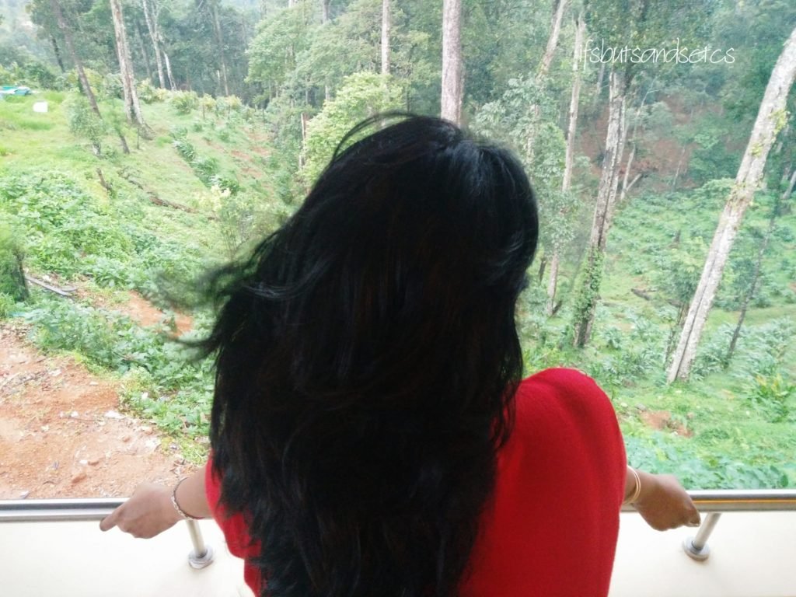

What would you do if you suddenly discovered that today was the last day of your life? Say you get to know miraculously as soon as you wake up in the morning that tonight as the clock strikes twelve you would be breathing your last. You'd say why would that happen to me? Well, I'm only suggesting a what if.

A few days back I was browsing through some videos on YouTube and I chanced upon one of Sadhguru's video about doing this one thing every day that could change your life forever. He speaks about reminding yourself to be aware every hour that you're alive and feeling grateful for the same. He explains how this simple exercise can change your outlook on life. Do watch the entire video if you haven't already.

\[embed\]https://www.youtube.com/watch?v=L3JWdWEtmU0\[/embed\]

We go about life assuming that life will go on forever the way it is right now. But what if you know that the time frame is short and that too only for a day? So that's where my initial question propped up from. What if you only had a day to live? What would you want to do in that one day? Find faults with the government? Go fight with the neighbors for being atrociously loud at their house party last night? Scroll through social media and judge everyone on your feed? Nag your family for not loving you enough? Blame your friends for neglecting you? Nah...not really, right?

I ended up making a list of things I'd like to do in that one day and here it is.

1. Catch up with the few closest people in my life that I can count on my fingers. Family and friends. Allocate the time I'd spend with them as per their importance in my life and spend short yet quality time with them telling them how they touched my life in their own special ways.
2. Call up or write to people who hurt me or I hurt and tell them how it helped me grow in life and that I love them anyway.
3. Laugh outrageously over a Joey special episode of Friends with my son. Listen to our favorite music especially ('Time in a Bottle' by Jim Croce, _'Channa Mereya'_ and many more) as we drive down the streets to go and have a round of unlimited _Panipuris_. The sweet-tangy-spicy burst of the flavors of _Panipuris_ is what my life has been like ever since he was born.
4. Gang up with my family to make fun of my dad's absent-mindedness before he forgets how we always did it.
5. Ask my mum to make her special Andhra style tomato _dal_, sweet n sour bitter gourd fry, steaming hot rice topped generously with _ghee_ on it and a huge chunk of fiery Andhra mango pickle on the side, all devoured with my bare hand in finger-licking morsels. Ah, soul food! I have to have those flavors on my taste buds before I go.
6. Make a will for the valuables I have. By valuables, I do not mean only wealth and assets. Of course the wealth and assets part will have to be inherited by my kin but that's a no-brainer. I hoard on a lot of things out of pure sentimental attachment. That would mean going through old greeting cards, gifts, letters, memorabilia, a huge collection of pictures and songs on my cloud and hard drive, artworks, art materials, books, souvenirs, stuffed friends, baubles, shoes, bags, clothes that don't fit me anymore and also ones that fit me since I won't live to wear them anymore. I would want each of them to go to the right person who would value them. And most importantly, I'd like to donate my organs before I go. It would be great to know that someone would still be able to live healthily because of my organs.
7. Gift all my size - S clothes to my size - XXL friends and insist that they fit into my clothes in my loving memory. While I am at it I intend to indulge in all the cravings of my sweet tooth. _Rasgullas, Rasmalai, Malpuas, Rabri, Moong dal halwa,_ cream soaking waffles, brownies, decadent cheesecakes, and gooey desserts. Dig in all of it. Who knows which _Janam_ I'm going to get to eat them again?
8. Watch Anil Kapoor grooving with his hands thrown up in the air to _'Ay Ji O Ji'_ one last time. I've never had enough of that to this day. Guess I might end up grooving to it amidst fluffy clouds in the heaven too! How filmy would that be?!
9. Pull my brother's leg just one more time and make him feel guilty for always being loved by my mum for his feigned innocence more than me despite him stealing money to buy _S__amosas_ in school!
10. Go and tell our neighbor _Gujju_ aunty how much I loved the hot crispy _Handwo_ and _Pakoras_ that she would send us after dinner since we were early eaters and we would still enjoy them on a heavy stomach.
11. Visit my art college one last time, absorb the heady scent of turpentine and paints. Spend some quiet nostalgic moments in front of the pond feeding the fish and mindlessly creating ripples in the water with pebbles.
12. Tell our domestic help how much her Good Morning Didi greeting and silly wisecracks brightened my days.
13. Treat the stray dogs in my locality to an extra-large Pizza loaded with extra cheese and watch them bury their noses in the melting cheese. It would be their cheat day!
14. Have one last ice cream with mum. Large scoops, of course!
15. Write a line of wisdom for every year since I would not have time for a set of letters to my son for his next hundred years and tell him what exactly he could share with his kids about me and what he couldn't. Also that he's not done with me yet. Not that easily. I'll be watching over him.
16. Click that one last selfie with my folks and force a genuine smile out of them that they could later look back at fondly and smile, wondering how I got away with it all!

I just noticed that there's so much food on my list. You might think I'm a glutton but I swear I only dream about half these foods! So well, I could go on and on with this list but I have to keep it concise since it needs to be doable in a day, right? However, I am sincerely going to try and fit these and the ones that I intend to fit in that one day in the time I still have, hopefully, more than a day. How about you? What are the top-most on your list of to-dos before you go? Let me know in the comments below. Till then, be thankful that you're still alive and kicking! Live life as though it is your last day. Love and light to all of you.

