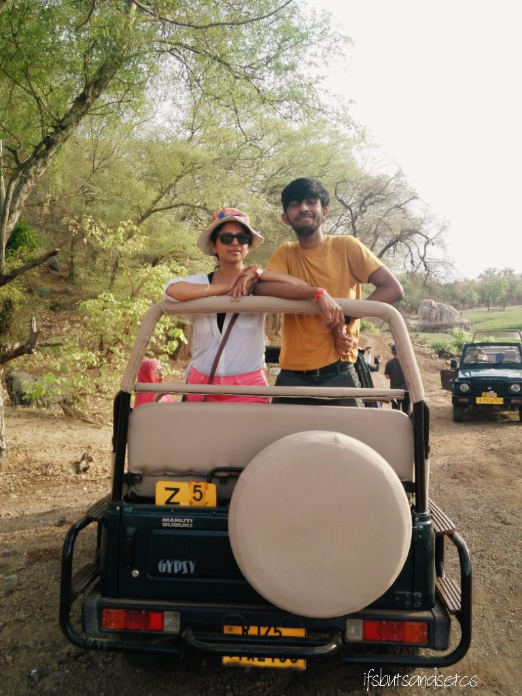

As with most of my travelogues, this one also comes out little later than I hoped. Last month I visited Ranthambore with my family. My son is home from university for his summer holidays. My parents wanted to spend some quality time with both of us. However, the sweltering heat did not seem too encouraging for long travel plans. So we decided to take a short trip somewhere close by.

Most of the popular destinations were overbooked but we were fortunate with Ranthambore owing to its extreme temperature. What made us decide for it despite the heat scare was that there are more chances of sighting a tiger when the temperature soars. Now that sounded promising! I am quite a bit of a wildlife enthusiast, you see. And the prospect of seeing a tiger in its natural environs was tempting even at the cost of enduring the scorching heat!

Ranthambore National Park is one of the largest and most popular national parks in Northern India. Located in the Sawai Madhopur district of southeastern Rajasthan, which is about 130 km from Jaipur. The park is spread over an area of 392 sq km and is well-known for its tigers. It is one of the best locations in India to observe the striped predators in their natural habitat. Ranthambore is also a famous heritage site due to a number of ancient monuments around the park.

The nearest railway station from Ranthambore is at Sawai Madhopur and the nearest airport is at Jaipur. We took a flight to Jaipur from Ahmedabad. Jaipur to Ranthambore is a 3-hour cab ride.

We stayed at the Ranthambore National Resort. This palatial property gives the feel of a heritage resort due to its architecture and rustic charm. The royal facade of the resort overlooks a small swimming pool and a sprawling well-maintained lawn. The nights are mystically beautiful when the jharokhas are lit dimly, casting reflections on the blue waters of the pool. Being an off-season there were very few occupants in the resort around this time. We welcomed the peace and solitude. The staff was warm and friendly. They also helped us plan our sightseeing and safaris.

The next morning we were off to check out the Ranthambore Fort. Since the fort has a long climb of stairs we were not sure if my parents would be able to make the most of it. However, we decided to go there hoping that we might at least see some parts of the famous monument.

Ranthambore Fort lies within the Ranthambore National Park, the former hunting grounds of the Maharajahs of Jaipur until the time of India's Independence. The fort was captured by Prithviraj Chauhan in the 12th century from the Yadavas. During the Muslim rule, the fort was attacked numerous times to gain control over Rajputs and the western part of the country. It was finally conquered by Khilji by bribing a minister. This is a monument of high significance in the history of India. In 2013, Ranthambore Fort has been declared a UNESCO World Heritage Site.

We got our first glimpse of the National Park when we set out for the fort in an open jeep. The early morning fresh air coupled with the wild lush greenery of the forest set our mood for the day. Once we reached the fort my dad decided to stay back near the foot of the fort while the rest of us hiked our way up to the fort. He was entertained by troops of monkeys, the black-faced Langoors to be specific. These monkeys are seen in great numbers across the fort and the park.

After taking a flight of 250 steps, we reached the oldest and famous Trinetra Ganesh temple. Surprisingly the climb was not as tiring as we imagined it to be. The old world charm of these ruins offered brilliant opportunities for some great photographs.

According to history, it is said that in 1299 AD, a war took place between King Hammeer and Alauddin Khilji at the Ranthambore fortification. During the war, they filled the godowns with food and other utilities in Ranthambore Fort, where the King dwelled. But since the war lasted for a long time they were soon out of the essential items. King Hammer was a great devotee to Lord Ganesh. One night when he was sleeping, Lord Ganesh appeared in his dream and told him that everything they needed would be replenished by the next day. Next morning, an idol of Lord Ganesh with three eyes (Trinetra) stamped from one of the walls of the fort. Also, a miracle took place and the war got over while the godowns got filled again. In 1300 AD, King Hammer built a temple of Lord Ganesh. He placed the idol of Lord Ganesh, Riddhi Siddhi (his wife) and two sons (Shub Labh) along with the idol of _mushak_ (mouse, his vehicle).

\[caption id="attachment\_3074" align="aligncenter" width="480"\] Notice the white mouse between the lamp and silver pots at the bottom center\[/caption\]

An element of interest in this temple is a live white mouse that hovers around the feet of Lord Ganesha's idol. After darshan when we stepped out of the temple, I was accosted by a monkey who made away with the marigold garland I was carrying in my arms. These Langoors are known to target people with food and garlands. It left me shocked but I convinced myself that it was Lord Hanuman who came to claim the garland from me!

After a brief stop at a local handicrafts store for shopping for some souvenirs, we made our way back to our hotel for lunch. It was time to sample some of the local Rajasthani cuisines. Although our hotel did not have specific Rajasthani dishes on their menu, they generously complied to our request and served us with _Dal Baati Churma_, a local delicacy. _Baati_ (little doughballs made of wheat flour, ghee, and milk) is served with the _Panchmel Dal_ which a simple and nutritious mix of five lentils prepared with a fragrant tempering of cumin, cloves, and other spices. _Churma_ is a sweetened and cardamom-flavored mix of crushed _Baati._

\[caption id="attachment\_3078" align="aligncenter" width="580"\] Seen here is the crumbled _Baati_ balls served with _Dal_, fried green chilies and _Churma_\[/caption\]

This dish originated in Mewar. Back then, the Rajputs were establishing their stronghold in the region and _Baati_ was their preferred wartime meal. Rajput soldiers would break the dough into chunks and leave it buried under thin layers of sand to bake under the sun. On their return from the battlefield, they would dig out the perfectly baked _Baatis_ that was then slathered with _Ghee_ and consumed with curd made from goat or camel milk.

_Churma_, on the other hand, is believed to have been invented when a cook of Mewar’s _Guhilot_ clan accidentally poured sugarcane juice into some _Baatis._ Realizing that it had made the _Baati_ softer, the women of the clan started dunking the _Battis_ in sweet water (made from sugarcane or jaggery) in an attempt to keep the _Baatis_ soft and fresh for their husbands.

There is so much you learn about a new place when you sample their local cuisine. I always make it a point to do so when I am traveling. The earthy flavors of _Dal Baati Churma_ that we relished were heavenly!

After the hearty lunch, my son and I embarked on the mission we had come to Ranthambore for _―_ a rendezvous with Shere Khan! We opted for an afternoon safari in an open jeep. There are safaris two times a day, one in the morning and another in the afternoon. There are 10 zones in the park. We were headed towards Zone 4 which was supposed to be a core zone. There's an option of either taking a canter or an open jeep. We opted for the latter.

A lot of people asked me how safe it was to go into the jungle in an open jeep. Well, if you stick by the rules of not getting down from the vehicle during the safari you're supposed to be safe. The animals only attack in defense when they feel threatened. Most animals including the tiger are used to seeing people in vehicles and are comfortable in their presence.

We kept our fingers crossed hoping we would get lucky if a tiger shows up in the afternoon to quench its thirst at a waterhole. We chanced upon herds of deer, antelopes, and a bask of crocodiles lazing outside a pond on our way into the thickets of the jungle. We also came across some gigantic owls. After reaching the end point of the zone, we lingered around hoping to get a glimpse of a tiger. But as luck would have it, the celebrity of the show eluded us. As we were coming out of the zone we got to know that a tiger was spotted in Zone 1. We returned disappointed but hoped to track a tiger on our next round of safari. It drizzled on our way back cheering us up after the incomplete safari.

The next day early in the morning we headed for yet another safari, this time in Zone 1. My parents joined us on this one. We were late since there was some confusion at the hotel regarding our morning coffee orders. We south-Indians, find it impossible to start the day without our morning cup of strong coffee. Unfortunately for my parents, they had to let go of their morning coffee ritual, a tad grumpily, since our jeep had already arrived. The tour guide sulked at our lack of punctuality grumbling that we might miss seeing a tiger just because we were late. Thankfully he was wrong.

No soon did we breeze through the fresh morning air down the tracks of Zone 1 did we observe a few vehicles before ours slowing down. Our tour guide signaled us about the possibility of a tiger lurking around. We waited in expectancy with bated breaths. And soon enough, we spotted the showstopper! It was strolling languidly ahead of a chain of jeeps and canters. The sheer presence of a mighty creature up close had us in awe, failing to think of anything else to do but watch it intently. A few seconds later we regained our composure and started clicking pictures. The striped beauty cast side-long glances at us pretending to ignore us as it marked its territory by peeing on trees.

Unlike lions who move in herds, a tiger is said to be a loner. They prefer to be by themselves. So much so that the young cubs are said to shoo away their mother from their territories so that they could have the entire area to themselves. As in the case of the tiger who was in front of us. Apparently, his mother Noor was driven away by her own cubs to claim their sole authority over that particular stretch of forest. This tiger goes by the name of Sultan from the district Sultanpur, named after him.

After spending almost an hour silently following him and staring at the amazingly majestic beast in admiration, we called it a day. My parents almost forgot the lack of the morning dose of caffeine in their systems, all thanks to Sultan! The tour guide exclaimed that we actually got lucky in sighting the tiger because we arrived late. After all, spotting a wild creature is all about correct timing.

We headed back to the resort where crisp Kachoris and piping hot Mirchi Vadas waited for us for breakfast, courtesy our hospitable hosts at the hotel. Coming to Rajasthan and leaving without enjoying these delectable treats was criminal!

\[caption id="attachment\_3077" align="aligncenter" width="480"\] Kachori and Mirchi Vada served with green coriander and tamarind chutneys\[/caption\]

Same goes for the star of the jungle. It would have been a pity to have missed seeing the tiger after coming all the way to Ranthambore. But we were lucky enough to tick it off our bucket list!

