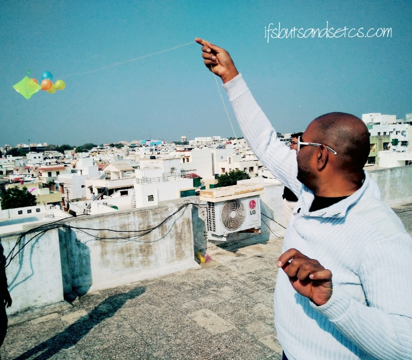

During these days of lockdown and social isolation due to the novel coronavirus pandemic, the days seem to stretch like there's no end to them. Thankfully for us, we have a small terrace garden at home which serves to provide us with fresh air and also some interesting flashes of the outside world.

Since my daily walks at a park nearby have stopped due to the lockdown, I now pace the terrace during the pleasant hours of the day. I enjoy it the most particularly in the evenings when I see a lot of neighbors climb up their respective terraces, probably after feeling claustrophobic for being cooped up in their homes all day. Besides binge-watching on Netflix, Amazon Prime and Youtube videos, my daily dose of entertainment come from these scenes that I get to see from my terrace during the evening. Mind you, I don't mean to be nosey or pry into their lives, but well, you just can't miss a few things that are happening right in front of your eyes!

**Scene 1:**

For once, _Gujjus_ are the best when it comes to finding ways to make their lives happening in the direst of the situations. Even during these desolate times, our Gujarati _chhokras_ have found an alternative for keeping themselves entertained while maintaining a safe social distance. What would they do when they only had a small terrace to their disposal? Climb up and fly kites, of course! So, out came all the kites and _manjhas_ that were leftover from _Uttarayan (Sankranti)_ this year.

- 

The protocol is duly maintained, each of them is on their respective terraces, on their own or with their family. The evening sky is now dotted with different colors of kites! I shook my head and smiled fondly when I first spotted a kite up in the sky last week. Only a true blue Gujarat-bred person will probably relate to this fondness for a few things specific to Gujju land–Garba, Farsan, and kite flying of course!

**Scene 2:**

There's a swanky three-storeyed bungalow diagonally across our building. The top floor has a dedicated gym area attached to a small terrace with a few outdoor equipments. I'd like to believe that my daily cardio activity inspired the young 20-something man of the house to start his workouts during the evenings. He would diligently start his sets, weight training, squats, lunges, and the works.

All was well till one fine evening a monkey decided to join him in his fitness mission! So yeah, it's pretty common around here to see troops of black-faced monkeys or _langurs_ hopping across from one rooftop to another. And this particular monkey seemed to have taken fancy to the guy's workout moves. He actually perched himself on top of a solar panel on the terrace right opposite the guy and started mimicking the workout gestures! All attempts to shoo him off were not seeming to work. The monkey just wouldn't budge! That was the last day I saw the man on the terrace again.

**Scene 3:**

So there is this couple I notice one block away from ours who seem to enjoy releasing their adrenaline on their terrace in the most innovative of the ways. That's perfectly okay, but their creative methods caught my eye every single time. One day each of them was zooming past each other holding a wooden plank each above their heads.

The other day they were gyrating to some dance moves. I initially assumed that it was Zumba coz' I couldn't hear the music from the distance. But wait, I then stopped in my tracks to see them doing a _Kajrare_! Finger movements coordinated with eyes...almost as good as Aishwarya's and Amitabh's. Now, this I could make out even without the music. _Wah wah!_

**Scene 4:**

I thought I had seen it all till the time I chanced upon another couple a little off our block. I first did not believe what I saw, so I rubbed my eyes and watched them as my jaw dropped open and then I burst out laughing. The couple in question were actually playing a game of chase and catch...good old _Pakkdamdok,_ as we call it here in Gujarat. Naturally, the man was chasing the woman!

Yes–they were grown-up adults, a married couple in all probability. Well, there was nothing wrong with that but the sight of two adults giggling and chasing each other on their own terrace was amusing, to say the least!

**Scene 5:**

Nature seems to be recuperating itself after we humans have been restricted in abusing it for the last few days. Some of the hearteningly beautiful scenes that I see every evening these days are of birds. Flocks of different kinds flying in large swarms across the orange-pink twilight skies. I don't remember seeing such dense groups of flight ever in my life.

A pair of them have actually inhabited a battered birdhouse on our terrace which was lying vacant all these years. I enjoy clicking the lady of the house who seems to be much more cooperative than the man who always seems to flit away in disgust when he sees me approach their boudoir with my camera. While the lady preens and poses to my heart's content every single time! A few gender-specific traits are inborn irrespective of species or breed I guess.

So well, this has been pretty much a summary of my life these days. I am sure someone across my terrace might be peeping onto mine and having his share of a laugh, watching me groove to the music on my headphones even as I pace across the terrace or when they catch me with a stupid smile on my face as I listen to the radio jockey cracking a funny joke.

No matter how socially distant we tend to think we are, we're never alone. Just look around. I am sure there are a lot of amusing anecdotes waiting to happen around you. While we together are battling this war against the virus in isolation, it helps to take our minds off the dreariness at times and focus on the lighter side of life. Go look outside your window, balcony or from top of the terrace, but on your own. You might just end up spotting a man chasing his giggling woman–literally!

And if your neighborhood doesn't happen to be as interesting as mine, why not watch a standup comedy show tonight? I do a lot of that too these days. Even a small hilarious ten minutes clip is enough to lift your spirits substantially. Try it.

Here's one that had me in splits! Watch it for a guaranteed good laugh.

https://www.youtube.com/watch?v=ux8GZAtCN-M

Till then, believe that this too shall pass, stay safe, stay indoors and find your own reasons to smile. There are many, you just need to look around.
