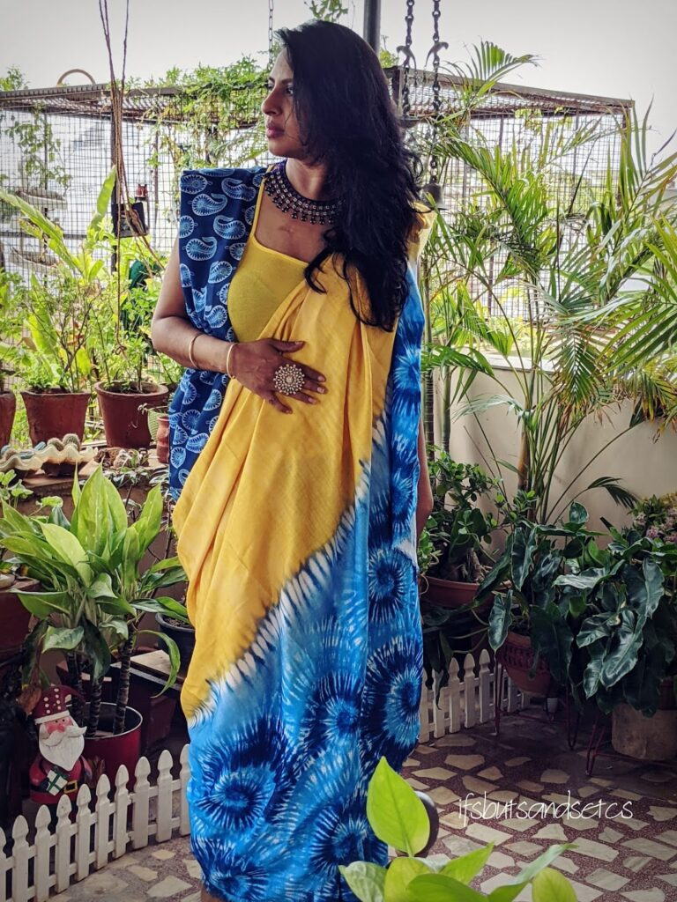
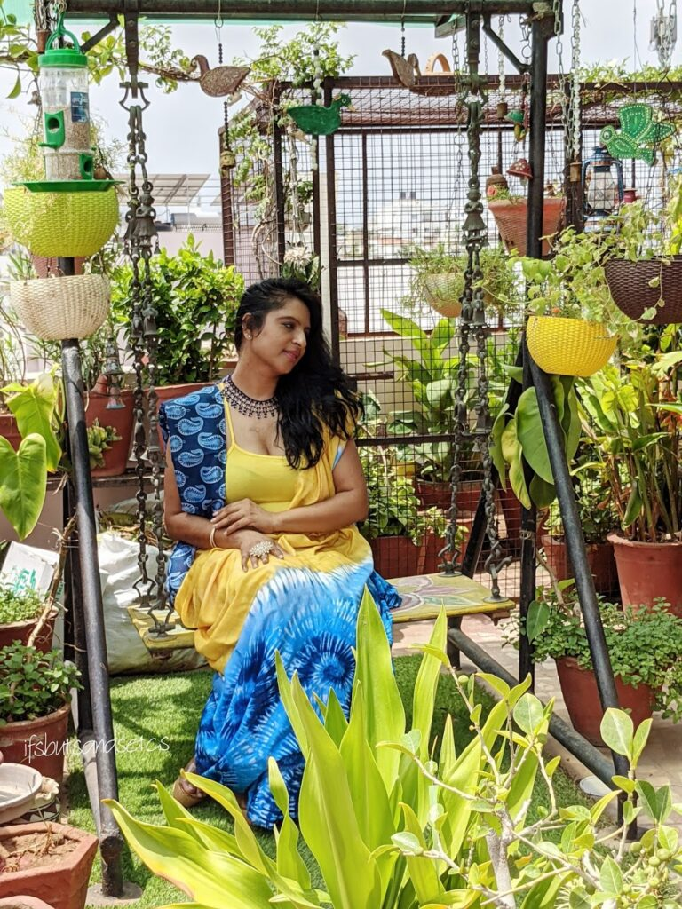
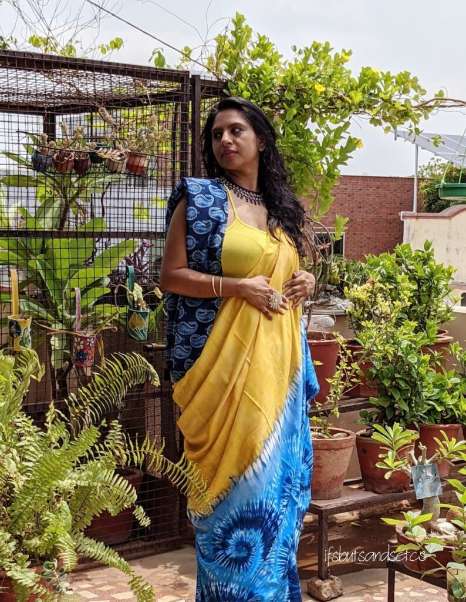
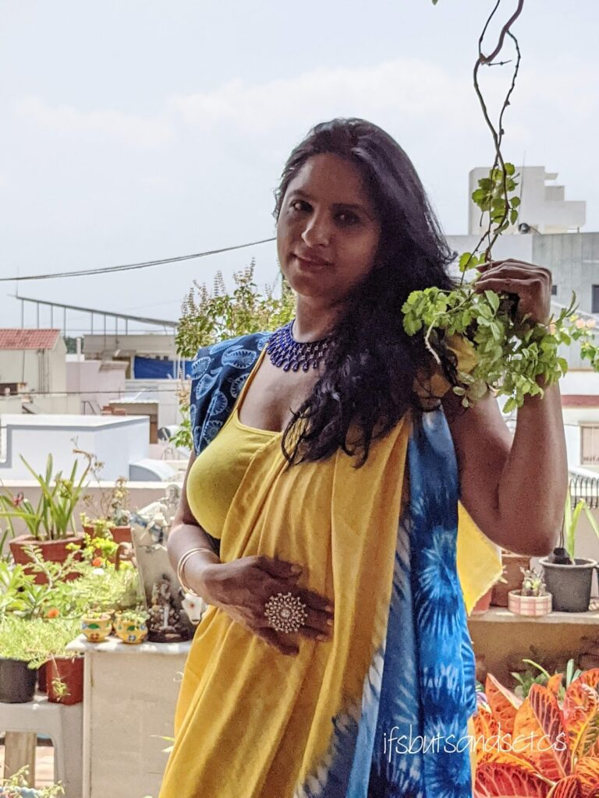

I had been meaning to write this post for a long time now. At the beginning of summer actually, because it is a summer special post. Why summer? Well, because the colors around me are all summery. But the mood seems rather blue—not at all in sync with the warmth of the season. One of the many hazards of the pandemic. It did not help much with having to attend to an unwell family member. I decided to do something about it and snap out of the blues with a bright splash of yellow color.

With work-from-home and attending virtual meetings in your pajamas becoming the norm, my wardrobe had been languishing in the dark. Except for that rare pair of jeans with a tee that I would quickly slip into to dash out for attending to essential chores. Most of my beautiful clothes have not seen the light of the day for more than a year now. I realized that I needed just a new splash of gay colors in there.

## Getting the Yellow

And then I received an invite to try out an exclusive collection of fabrics from [Fabcurate](https://fabcurate.com/). It seemed rather exciting to step out of the drab monotony and give their extensive range a try. They source their textiles from the rich heritage of the Indian Handloom Industry. Talented artisans from the industry are given a platform to showcase their work on this website. This is a huge encouragement for them to explore their creativity further and earn the respect that they deserve.

Browsing through their Kalamkaris, Ikats, Ajrakhs, Indigoes, Tie & Dyes, Dabus, Shiboris, Banarasis, Bandhanis, and Batiks, it was rather challenging to choose. They have a vast collection of beautifully curated fabrics. And the best part is that if there's something particular on your mind they even custom design it for you. What makes them unique is that they provide as many meters of a particular fabric as you desire. So if you decide to jam up with your girls for a theme party (a virtual one for time being), you know where you can get similar fabrics for each of you!

I finally chanced up a swirl of bright [Yellow And Blue Tie & Dye Pattern Digital Print Moss Crepe Fabric](https://fabcurate.com/collections/digital-print/products/yellow-and-blue-tie-die-pattern-digital-print-moss-crepe-fabric-31002539). My eyes remained transfixed on it for a while. This was it! It was so symbolic of what was happening around me. Yellow summer. Blue mood. Although I'm not a big fan of digital prints or synthetic fabrics and would have loved a proper Tye & Dye on an organic fabric, this looked simply too good to resist.

And just as I was about to close it, I came across this [Navy Blue And White Paisley Pattern Digital Printed Muslin Fabric](https://fabcurate.com/collections/digital-print/products/navy-blue-and-white-paisely-pattern-digital-printed-muslin-fabric-31003013). The mango-shaped paisley is again so suggestive of Indian summer! I reckon I sound a little whimsical. But excuse me, that's one of the side-effects of enduring dull solitary lockdowns! Our senses need some oiling, I believe. And our wardrobes need a bright new addition to get the spark back into dressing up!

## The Bright Results

So here's what I went with. Canary yellow crepe fabric with splashes of blues on its border. It can be styled into practically any outfit, be it a snazzy Lehenga, a chic Palazzo, a flowy Anarkali, or a layered Boho dress. My first instinct was to style it into a saree. But after receiving the fabric I felt it could do more justice as a structured garment. I had initially planned to use the paisley print navy blue fabric for a blouse to contrast with the yellow saree. But alas! With neither the saree nor the blouse happening, I ended up with a draped number. One that had each fabric complementing the other in an offbeat way. I must add that the navy muslin fabric is super-soft and the best for this sweltering weather.

The beaded neckpiece is an old acquisition from my mum. And the ring was picked up by her on a whim on one of the spontaneous shopping expeditions in the past. The spaghetti is a comfy all-time favorite. I kept the makeup minimum coz' I was literally melting in the heat! For what it was worth, all this effort did make a sea of a difference in my mood. Give a lady some fine clothes, jewelry, and makeup, and watch what it does to her and the mood around her!

<figure>

<figcaption>

Find your perfect Yellow [here](https://fabcurate.com/collections/digital-print)

</figcaption>

</figure>

<figure>

<figcaption>

Where Blues Embrace Yellow

</figcaption>

</figure>

<figure>

<figcaption>

Shop for Muslin Blues [here](https://fabcurate.com/collections/muslin-fabric)

</figcaption>

</figure>

<figure>

<figcaption>

Can you spot the Yellow overshadowing the Blues?

</figcaption>

</figure>

If you got these fabrics what would you do with them? Let me know what you think about this look in the comments below.

\*_Disclaimer: This post has been written for the brand that provided its products in exchange for an honest review. All the information and opinions shared here are my own and to the best of my knowledge._
