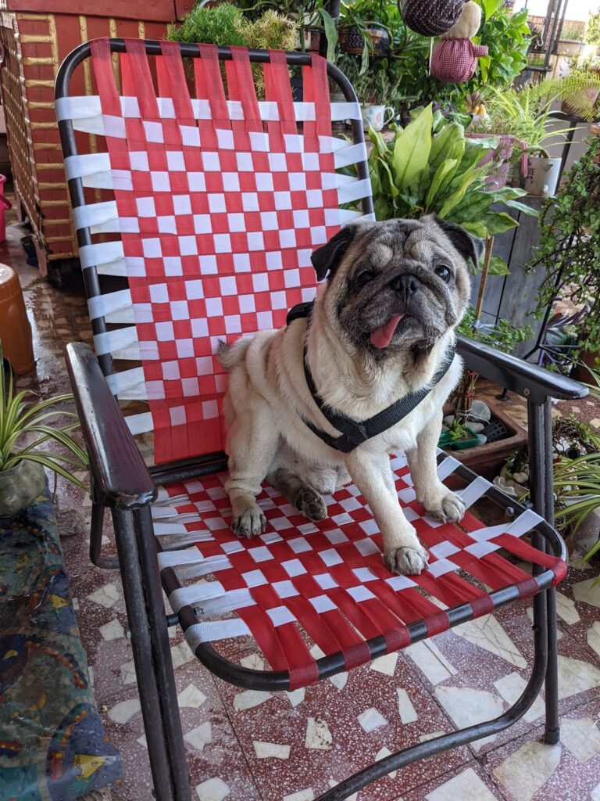
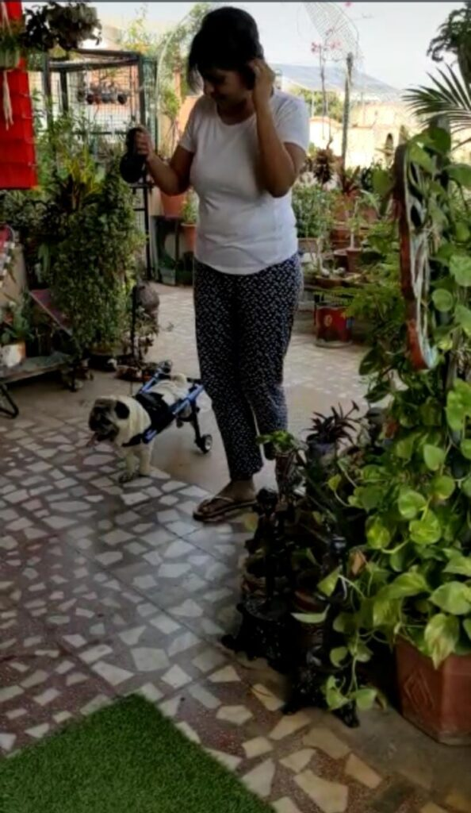
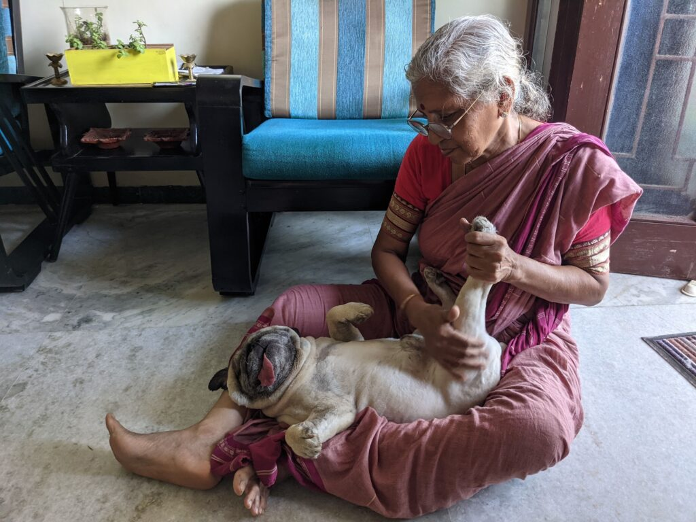
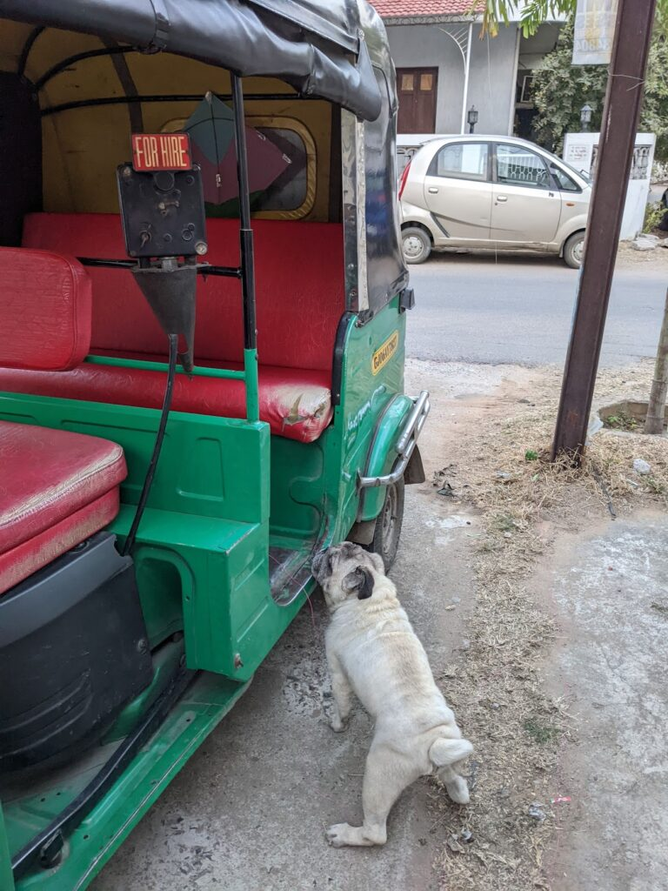
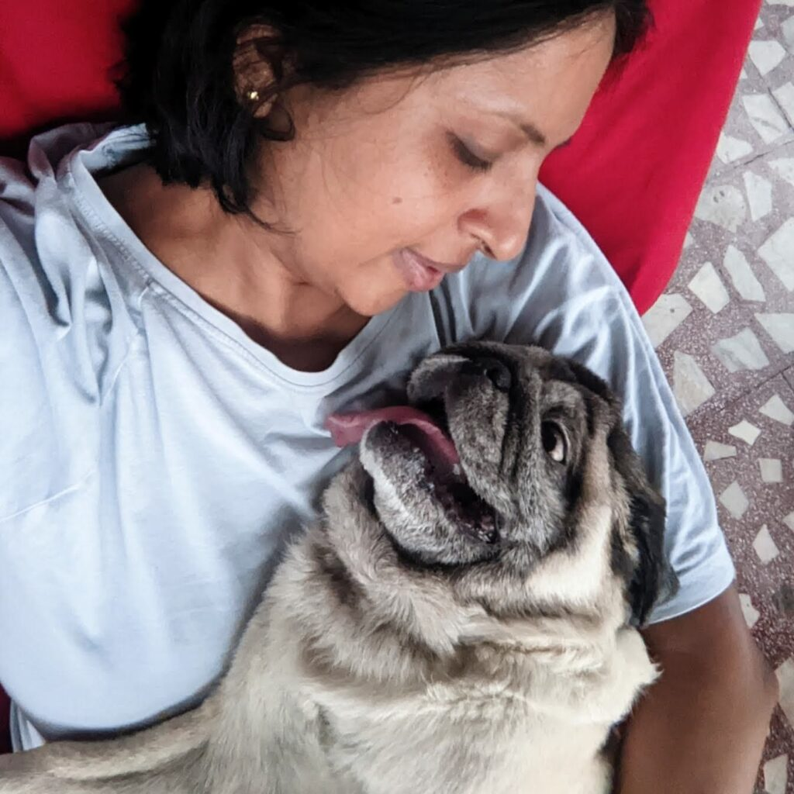

Hola friends! I finally make a comeback to this space after almost two years and two months. And it feels like I've come back home. Besides work, a lot has happened over these two years for me to have not been able to post anything here. But today, I've come back for a special reason. This post is a tribute to an extraordinarily special being that changed my life forever.

## The Cutest Pug Ever

If you have been reading my blogs or following me on social media, you probably know about Sam. Here's the [post](https://ifsbutsandsetcs.com/2021/04/welcome-home-sam/) I wrote to welcome him into my life. Sam, the cutest pug you would have ever come across, came to me at the ripe age of eight. His family was moving abroad and was unfortunately unable to take him with them. They were looking for someone to adopt him, and as destiny would have it, one look at his picture on social media and I was madly in love with him. It was an instant connection when we met and an inexplicably strong bond that we developed over almost three years. I lost Sam on this very date seven months ago. After grieving his loss for the last six months, I can finally bring myself to write this post as a tribute to my dearest Sam.

## Deteriorating Health

Sam underwent great trauma during his last few years. After getting separated from his family, he developed multiple health issues. We discovered that he had an enlarged heart. A few months later, he started losing grip when he walked, the reason for which could never be diagnosed properly. Eventually, he ended up being immobile for almost a year before he passed. No amount of medicines, physiotherapy, or equipment could give him relief. We pampered him to the core with the best food, treats, toys, and plenty of unconditional love, hoping it would make him happy. He cuddled to me for comfort, and I hope I was able to give him some kind of emotional respite in his days of suffering.

## What made Sam Special

Sam's best quality was that although he was in so much pain, both physically and mentally, he never once made us feel that he was unhappy with us or missed his previous family (although he surely did). This gentle soul with rock-solid resilience became one with our family in no time and forged deep connections with each one of us at home. Losing him left us shattered beyond imagination.

Sam and I were inseparable. It is amazing how we developed this strong attachment in such a short period of association. It seemed as though he had been with me for years. I have had many pets in the past, each of them special and loved in their own ways. But with Sam, it was different. He and I shared a relationship that cannot be described in words. He would sit by my side on my bed all day as I worked on my laptop and hug me to sleep every night. I built my daily routine around Sam, hardly leaving his side. I would feel restless if I ever had to step out without him in dire situations and would rush back to him as soon as I could.

Sam was a favorite with everyone who came in contact with him, right from my parents, the veterinary team that treated him to daily help, and our neighbors. He left his mark on everyone. Sam loved auto-rickshaw rides, and he was lucky to have a dedicated auto-rickshaw driver who took us for weekly spins and would also babysit him in his auto if I needed to step out and shop. He was blessed with a set of loving grandparents (my parents) who doted on him endlessly. His Ammamma (granny) indulged him with relaxing massages, and his Tatha (grandpa) sat with him and watched birds.

## Bidding Adieu

In his last few days, many people advised me to put him to sleep, but I could not bring myself to do it. However, I found it unbearable to see his suffering, and everyday I started whispering into his ears that he could go whenever he wished to. I told him not to worry about me and that I would take care of myself after he was gone. The first time I said this to him, he looked at me with his soulful eyes and started whimpering. I told him Roger Bhaiya (my late pet labrador, read more about Roger [here](https://ifsbutsandsetcs.com/2014/04/romp-ades-rogue-ades-with-roger/)) would receive him on the other side and make him comfortable. I hugged him tight, hoping I could give him the strength and conviction to move on. I told him I would always be with him in spirit, no matter where he was. Little did I know that he would take it so literally.

In the following days, he gave up eating, and the vet confirmed that he was sinking. The night before he passed, I kept feeding him spoonfuls of water and some milk just to keep him comfortable. We spent an entire night cuddled for what seemed like an eternity. Early next morning, his breathing turned raspy, and I noticed his tongue going pale. I took him into my lap and called out to my mother. I kept on whispering to him that I was with him all through, even as his eyes started to glaze, and he finally crossed over, making sure that he was comfortably cocooned in my lap. In the presence of all his loved ones, Sam was cremated with all due respect at a spot close to the auto-rickshaw driver's house. That way, he could easily go on his favorite auto-rickshaw outings whenever he wished for it!

## What is Animal Communication?

**Animal communication involves a telepathic exchange of information between the animal communicator with one or more animals.** **The communicator usually connects with the living or deceased animal energetically via its photo by looking into the animal's eyes.**

Skeptics might regard animal communication as hogwash, and some people probably do not know what it is. But I believe in the mystical unknown. After all, do we have any proof of God's existence? It all works on faith and belief, right? It exists if you believe in it. If you don't, I would not encourage you to read further. I am not here to prove a point and as much as I respect your belief system, I would still request you to refrain from sharing your thoughts here.

## Sam's Communication Sessions

When Sam was alive, as a last resort for treating his health issues, I connected with a professional animal communicator to see if she could talk to him and get to know more about his medical condition so that it would be easier for us to take care of him. Animal communication is known to have helped many animals and their owners worldwide, in diagnosing their ailments, treating their psychological issues, and also finding lost animals.

The first animal communication session was not exactly helpful for Sam in terms of his diagnosis but was surely insightful. A few days after Sam passed, I reached out to the animal communicator once again and asked her to talk to Sam in spirit and let us know how he was. We were having a tough time coming in terms with his absence. This particular animal communication session was unbelievably accurate!

The communicator came to us with information she had no access to otherwise since we never met her in person. Sam, in his conversation with her, had mentioned his favorite spots in our house, even showing her something as precise as a birdhouse that he loved watching on our terrace. He spoke about some of our undergoing family issues that were disturbing him and many other details that no outsider would know of. And lastly, he conveyed to the communicator that he had not reincarnated and that he had now become my guardian angel, along with three other dog spirits who were his spirit guides, living with us and helping us cope with his loss. One of the three dogs I got to know later is Roger, who did come to comfort Sam on the other side, much to my surprise and delight! This piece of information was all the assurance I needed. To think of it, Sam actually took my words to heart, and the fact that, to this day, he is always with me in spirit feels so reassuring.

## My Journey as an Animal Communicator

Over the next few months, I was inspired to learn animal communication just to be in touch with Sam. I always believed in telepathy and was also intuitive to a large extent. Soon I took up a series of certified animal communication courses. And today, with daily practice and diligence, I get to talk to Sam every single day, along with many other pet animals of friends and acquaintances. Thankfully, a large part of the information I receive from the animals often is validated as close enough to the truth by the animal's owners.

One such communication happened with a cat in the UK whose owner had reached out to me to talk to her cat to convey a message to him. This cat used to slip out of the house in his owner's absence and would venture out far from the house, which his owner felt threatened his safety. So I had a chat with the cat and told him that his owner wished him to remain indoors to stay safe. To which the cat asked me if he could stay on the roof or in the bushes. When I conveyed this question of his to the owner, she was shocked, and she confirmed that I indeed had spoken to her cat as these two places, the bushes, and the roof, are where he normally hangs out! These are small confirmations that I am on the right track, and they keep me going. I wouldn't say I am 100% accurate. Actually, no animal communicator is, but most of the times you can expect some amount of resonance. So well, I'm working on my skills, and I believe I am reaching somewhere with it, which gives me great contentment.

I must say, Sam has been instrumental in changing me for good. I am a different person now. My daily communication sessions with Sam are incredibly precious as he guides me and helps me cope with many important life situations. I believe my empathy, patience, belief in spirituality, and understanding of life and death have heightened with every passing day. While many would say that it's only a dog, only those who have truly known the love of an animal understand where I am coming from.

## Reach Out for Animal Communication

If you or anyone you know believes in the power of telepathic animal communication and would like me to communicate with your animal, do reach out to me. As a tribute to my beloved Sam, I am offering free animal communication sessions for the next three months. This is the legacy that Sam has left me with, and I would love to help other animals in his loving memory. Lots of love and light. Rest in peace, Sammy Boi. We love you so much.
