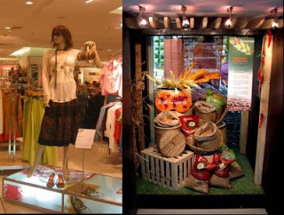

 Moving from lifestyle format retail to value format retail has been quite an experience with an exposure to a whole new way of looking at 3D display.

After coming from a background which was predominantly apparels, doing up displays to highlight wheat, bottled olives and even more mundane eggs were definately a daunting task. It came as a package of surprise at times when one did a display which attracted the required attention & exclamations !

But there were many a frustrating times when one would struggle with the sheer unsophisticated quality of a product to make it look classy, so that the prospective customer would find it worthy enough to put it on his shopping trolley.
