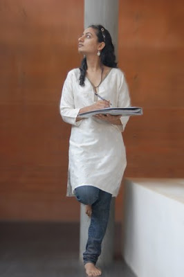

In every proud fashion conscious Indian woman's wardrobe lies atleast one special white kurta.Its almost as important as the little black dress is, to every party hopping babe. It could be a rich embroidered chickankari with silver threads glinting like stars or a plain over used muslin one, threadbare and almost nearing a shade of yellow with frequent washes. To each her own length and fit varies as per the vital statistics of the person wearing it.

This kurta gets frequent outings from the boredom of hanging in a wardrobe mostly in the months of summers. It soaks the prespiring stories of every woman who bears the brunt of the hot Indian summer.On days when one can't make up their minds with the colors and patterns flooding their overflowing wardrobes, this white kurta comes to the rescue to the lazy shoddy dresser and also the forever fashion-conscious socialite.

With options unlimited available in the market, one can be a proud owner of an array of white kurtis.The chic linen, flowing crepes and chiffons, super soft muslins that give an amazing silhouette, and our own pure cottons and khadi which go well with our climate.Silver accessories also add to the jazz factor and so do stoles of myriad colors.So let the breeze take over the hot months as you slip into your signature white kurta!
