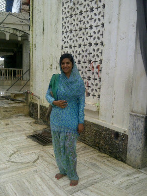
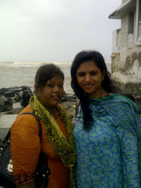
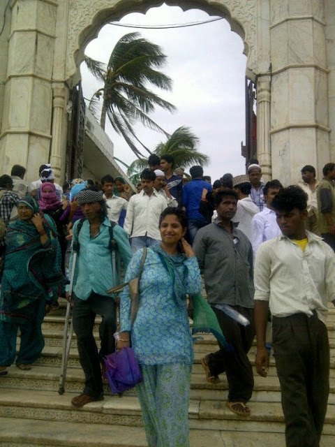

Yet another adventure today, after the nerve-racking dune bashing at the desert safari in Dubai a month ago. But this time around it seemed perfectly plotted by the Pir Haji Ali Shah Bukhari himself.

A visit to Haji Ali was not a part of the agenda when we set off impromptu, for a trip to all places holy, in Amchi Mumbai. So, Mount Mary, Siddhi Vinayak, and Mahalaxmi it was! The idea was that if one of them was on a weekly off probably the other deity might oblige to our long list of wishes. The highlight of this one-day metro pilgrimage turned out to be the visit to Haji Ali Dargah. As though it was the call of the divine; we suddenly decided to pay homage to the ever popular, highly romanticized Haji Ali as well at the very last moment. And my, oh my...what a visit it was!! It could have put the most dramatic of Hindi movie scenes to shame!

 As soon as we stepped onto the bridge connecting the road to the monument, amidst the sea, the clear skies suddenly darkened. It was a moment of pure melodrama as we walked down the stretch...Mom, Dad, my friend Michelle and me. The crazy breeze shot rain drops at us, catching us completely unaware. And as if that wasn't enough, the waves from sea leaped on us from both sides of the bridge. Mind you, on this surprisingly happened only to the four of us, being attacked from the top and both sides. The rest of the crowd that walked ahead of us had their clothes still reasonably dry, while we looked like a bunch of drenched cats. Our clothes clung to us like a second skin with hair flying all over the place. It didn't help that I was in the flimsiest of my salwars. The winds turned my seemingly sturdy umbrella concave on the opposite side with the spokes threatening to break free. Amongst all this chaos, the slime below our feet threatened to throw us off balance if we dared to take a careless step. Mom tried to tame the wild waves every now and then by showing them off with her hand but it didn't work. To call it a struggle would be an understatement.

\[caption id="attachment\_2250" align="aligncenter" width="300"\] Finally inside the Dargah!\[/caption\]

\[caption id="attachment\_2251" align="aligncenter" width="240"\] Cajoled dad to click this one. He obliged somewhat disapprovingly!\[/caption\]

With herculean efforts, we maneuvered our way through the fury of rains and sea to the entrance of Haji Ali. After bowing our heads at the dargah when we stepped out; the sun was shining happily and looked like it was doing so all day. Only, we looked like we just got rescued from the sinking Titanic! Really…was it our imagination? The storm seemed to have been customized solely for our entry. The only things common between the dune bashing at Dubai and the scamper to Haji Ali were my nervous giggles throughout! Pssst...Mom-Dad thought it was a ridiculous idea to be clicked when one was all salty, sticky and shaken, hence you won't see any of their pictures. :)

The only things common between the dune bashing at Dubai and the scamper to Haji Ali were my nervous giggles throughout! Pssst...Mom-Dad thought it was a ridiculous idea to be clicked when one was all salty, sticky and shaken, hence you won't see any of their pictures. :)

\[caption id="attachment\_2257" align="aligncenter" width="480"\] Phew...on my way out!\[/caption\]

The pictures used here are the personal property of the blog owner. All rights reserved. © 2016 Vinodini Iyer.
