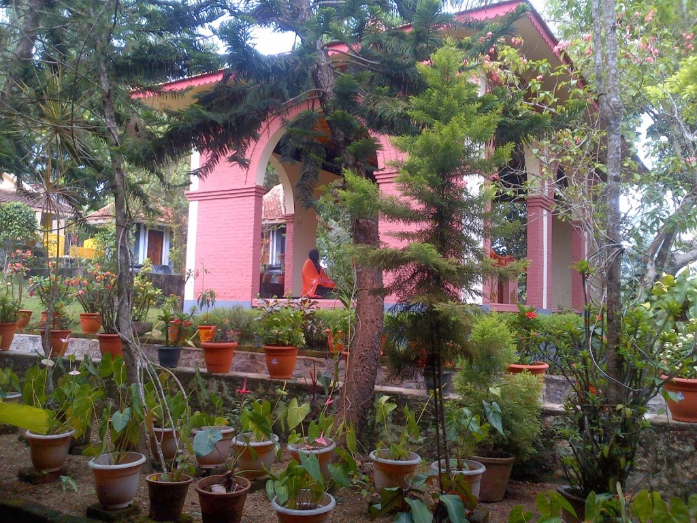
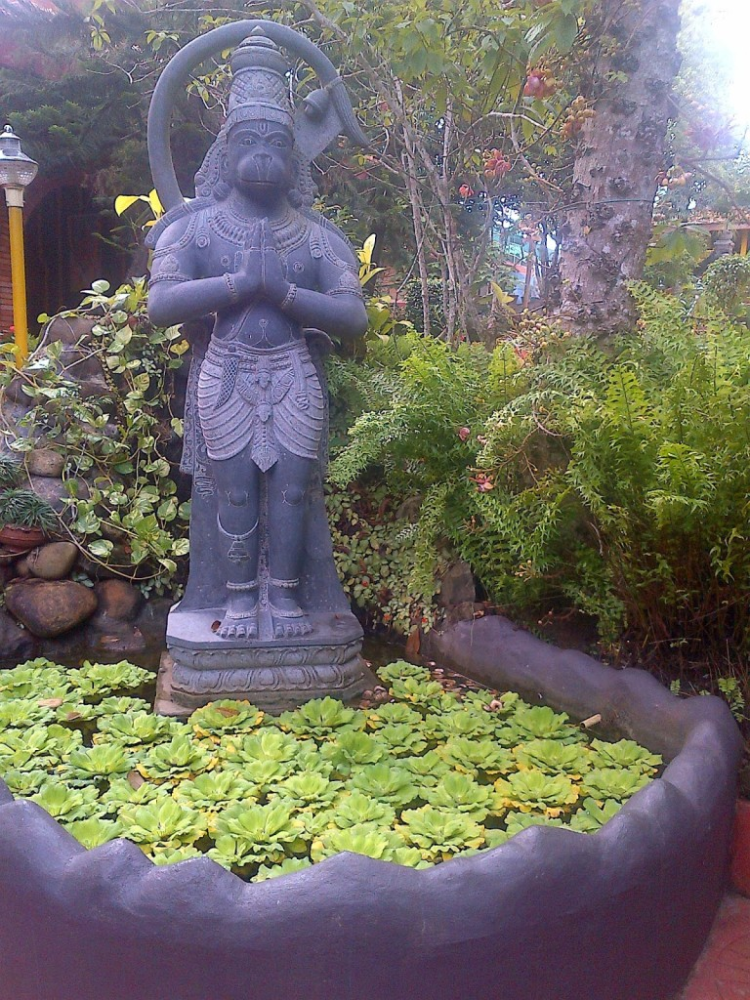
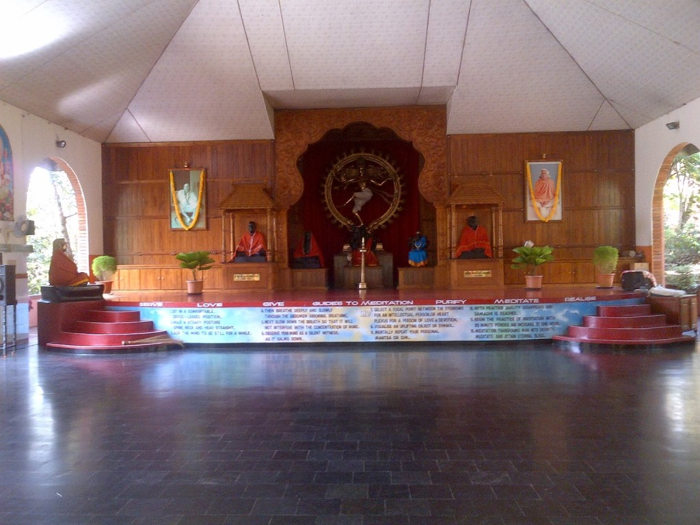
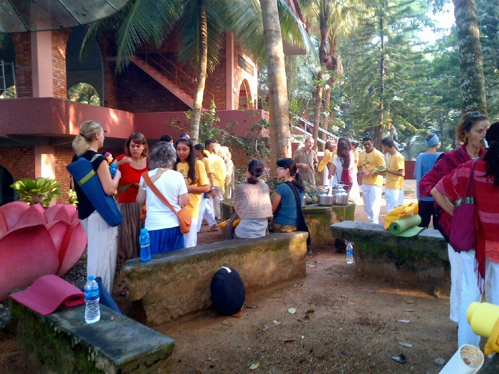
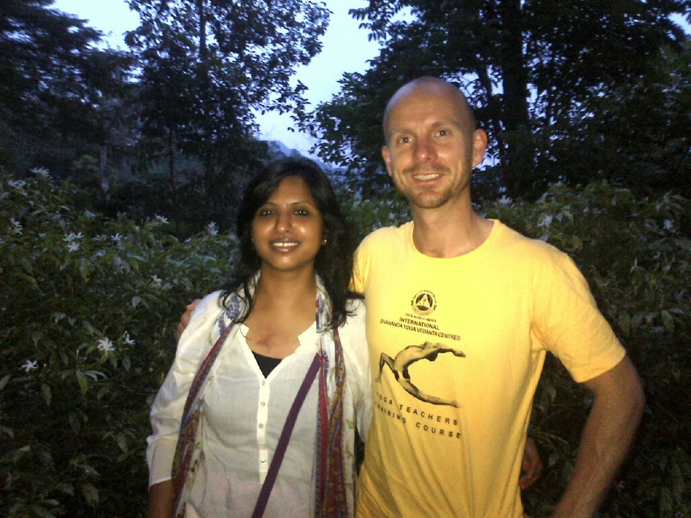
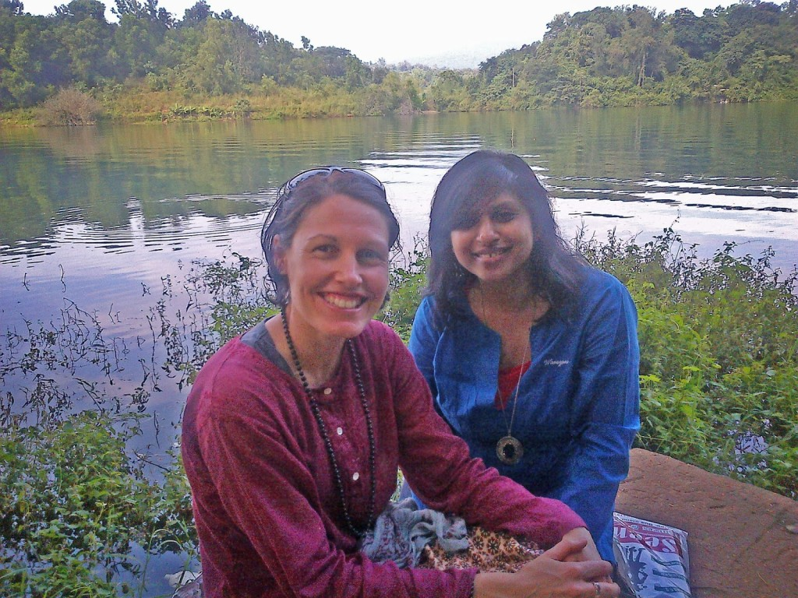
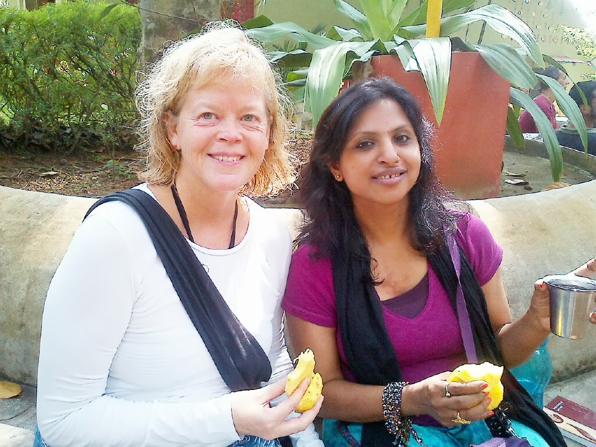
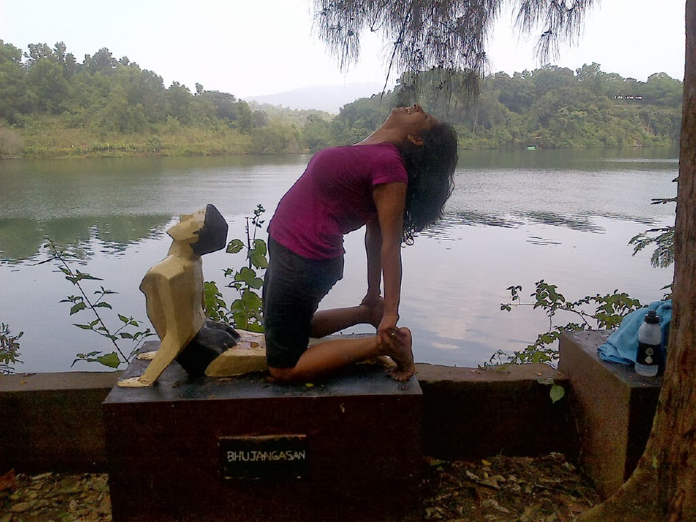
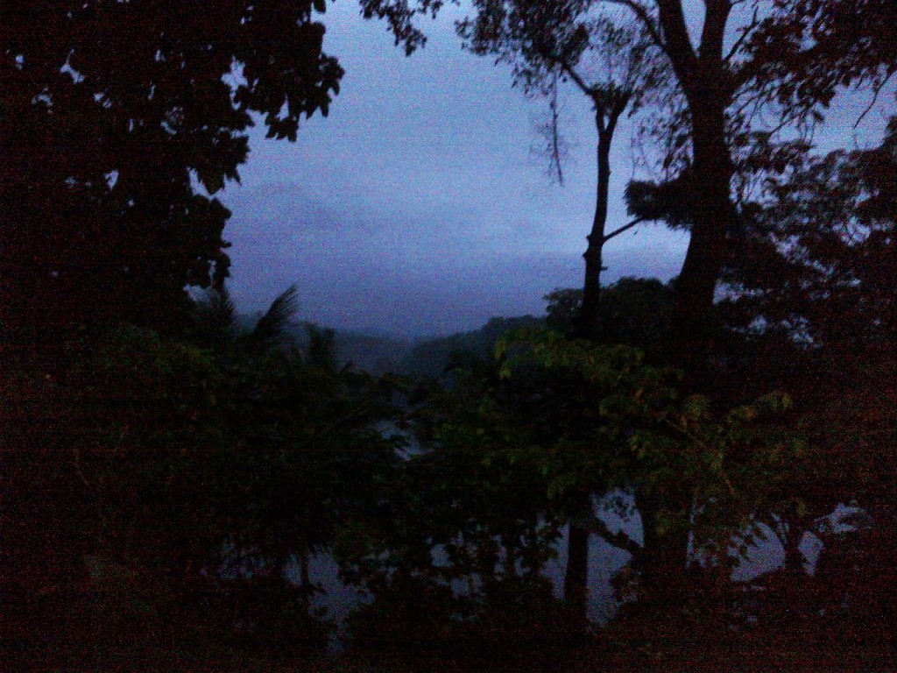

I had to get away. Somewhere close to nature,where I knew no one. The daily humdrum of life had got to me and I needed  to be by myself for a while. Hence, in a heartbeat I decided to go to the Sivananda Ashram in Kerala. Had heard a lot about the place from a friend who had been there.So, a few online exchanges later I was on a flight to Trivandrum. It was my first visit to Kerala and also my first ashram experience. I recollect, a few years back I had been to the Osho Ashram in Pune and I couldn't bring myself to stay there beyond a few hours. Probably I was not ready then to dive into a spiritual experience of this sort. But this time around I was positive and I felt that I was ready to bring in the change in me.On my drive to the ashram which is 45 minutes away from Trivandrum, I realized why it was called 'Gods own country'. I forgot the count of the number of shades of green my eyes feasted on all along. Coconut palms dotted either side of the spiraling roads in clusters.

 

The International Sivananda Yoga Vedanta centers were founded in 1959 by Swami Vishnudevananada, disciple of H.H.Swami Sivananda with the aim of promoting the ancient science of yoga for physical, mental, emotional and spiritual well-being and to thereby create a more peaceful world. The Sivananda Yoga Vedanta Dhanwantari Ashram is set in 12 acres of tropical splendor in the foothills of Kerala's western Ghats. The natural beauty of Neyyar dam, the forested surroundings, the cool green coconut  groves and colorful flower-filled views, offer an ideal atmosphere for the practice of yoga and meditation. The ashram program covers classical yoga techniques, taught in a warm and friendly environment, helps to instill in the guests a deep awareness of the spiritual essence of life. Every year hordes of people from across the globe visit the ashram either for a yoga vacation to recharge themselves or for advanced courses in teachers training for yoga. I had opted for a week of yoga vacation, although I wasn't much of a yoga enthusiast.

 

So engrossed was I in the mesmerizing aura of nature along the way, that I felt I  had reached the ashram sooner than expected.A steep flight of steps led me up to the ashram. The moment I set my foot in the premises, it felt like I had walked into another world altogether. Huge stone sculptures of lords from Indian mythology stood at corners midst the glory of rich fauna. The premises were surrounded by lush green valleys and the ashram overlooked a serene lake. I was met warmly at the reception by a black gentleman who guided me through the formalities and in no time I was led to the building that housed the ladies dorms. Women of various ethnicities residing there greeted me with happy smiles.I settled for for a bed close to a window which overlooked the lake.

The early morning flight had made me weary so I excused myself from the daily schedule of the ashram to take a nap. After about two hours of deep slumber I suddenly awoke disoriented in my new surroundings. Aimlessly I walked out of the dorm.I needed my dose of caffeine after all that sleep, but alas couldn't spot a soul who could guide me to a cuppa! I wandered aimlessly in the well manicured lawns, suddenly gripped by a bout of anxiety. Where the hell was I?? I wouldn't be able to leave the premises of the ashram at an immediate notice, forget about getting a decent cup of coffee! Panic stricken, I called my mom first. Told her that I had come to the wrong place,this was not for me. And we mutually agreed that I should book myself on the next flight home. The next call I made, was to the friend who had referred me to the ashram. She seemed to have been expecting this kind of a call from me. Very patiently, she heard me out and then told me that it was a natural reaction for most people who were new to the ashram. They panicked and felt displaced for the first few days at the ashram. She also made me realize that I was stronger than that and half convinced me to give it a shot. Looking back, I feel so glad to have spoken to her then!

The premises wore a deserted look since every one was at their respective classes as per ashram routine. The ashram has a rigid schedule with strict rules in terms of  usage of mobiles phones and dressing appropriately. Usage of mobile phones was limited to only two areas in the ashram, the reception and a hall which was WiFi friendly. Loose clothing with minimum skin exposure was the rule. That meant no sleeveless tops,tubes,shorts skimpy dresses and skirts.

<table class="tr-caption-container" style="margin-left: auto; margin-right: auto; text-align: center;" cellspacing="0" cellpadding="0" align="center"><tbody><tr><td style="text-align: center;"></td></tr><tr><td class="tr-caption" style="text-align: center;">The Communion Hall</td></tr></tbody></table>

The schedule of the ashram comprised of a combination of satsangs, yoga sessions, classes on Hinduism and a very fixed timetable for meals and refreshments. The day began at 5.30 am with a satsang which started with chants and ended with meditation. Followed by this is the only cup of regular tea that we were allotted in the day. This we had, under a tree which was called the 'tea tree.'Kettles containing tea, with and without milk and sugar,were sipped out of glasses while mingling with the ashram inhabitants. Some of them had been there for weeks and for some it was their first day. It was wonderful to share the ashram experiences with each one of them.After tea, there were yoga classes for two hours and then we were off for the first meal of the day. Served at 10 am, one would have assumed it was breakfast, but no, this was proper lunch, a delicious one at that. The food was satvik,without onion and garlic. But the various dishes I relished there were nothing like what I had ever tasted before. For example, the succulent pineapple chunks dunked in spiced 'Kadhi' (a yogurt preparation) were a treat to my tastebuds. And so were the mulligatawny drumsticks in a coconut based gravy with lots of whole cashew nuts. All these dishes were served with boiled rice, that the Keralites are known to be fond of.

<table class="tr-caption-container" style="margin-left: auto; margin-right: auto; text-align: center;" cellspacing="0" cellpadding="0" align="center"><tbody><tr><td style="text-align: center;"></td></tr><tr><td class="tr-caption" style="text-align: center;">The Tea-Tree</td></tr></tbody></table>

After meal, was the 'Karma yoga' time. Karma yoga was a practice by which one could unconditionally give back to humanity at large, by providing assistance in daily activities of the ashram.It turns out to be a very humbling experience when you actually get your hands dirty doing it. Be it mopping the floors, serving food or volunteering in various other activities conducted at the ashram. It was compulsory for each to do his or her karma yoga. I was assigned the job of emptying all the garbage bins in the ashram, along with a fellow ashram inhabitant, from Brisbane called Woody. Both of us used to scout the ashram, lifting huge garbage bins and emptying them at the designated place. After this exercise, and a shower later it was time for yet anther round of tea. But this time around it wasn't the regular tea, it was herbal tea. We would sample various concoctions of teas, spiced differently everyday. My favorite was the one which had ginger,jaggery and cinnamon in it. This we used to sip, with a serving of fresh fruit, chatting away under the tea tree. After this we would attend lectures which would be on various topics regarding Hinduism and yoga which would conclude with a healthy discussion or debate. A small break after this session, and we were off again to yet another two hours of yoga. I panted and cribbed my way through this part of the day! The 2 hours of yoga in morning session was more than enough physical exercise that  my body could take. Soon after yoga, at 6 pm, yet another shower later, it was dinner time. After a light meal, we were free to explore the library,the boutique or the health cafe housed in the ashram.

<table class="tr-caption-container" style="margin-left: auto; margin-right: auto; text-align: center;" cellspacing="0" cellpadding="0" align="center"><tbody><tr><td style="text-align: center;"></td></tr><tr><td class="tr-caption" style="text-align: center;">With my Karma Yoga partner Paul Wood aka 'Woody'</td></tr></tbody></table>

The day ended with another satsang. After the first two days of satsang, I managed to stop smiling secretly at the various kinds of thick accents with which the bhajans and chants were sung, since most of them were non-Indians who were singing. Instead, the euphoria of the whole experience sunk in gradually and I began to look forward to more of it. The rhythmic sway of the communion chorusing the chants coupled with the merry jingles of the manjiras, stayed with you much after the stillness of the concluding meditation. It is a feeling no words can describe. The first few days I fought the urge to leave the ashram.It was still a challenge for me, with huge waves of  anxiety flooding me at nights with the feeling of being holed up in a place so different. The ashram schedule was such, that one longed for the normalcy, the routine and the comforts that one was used to, in the world outside.The irony of it was that, these were precisely the things I had longed to escape from a few days back and landed there in the first place! The whole experience took three days to seep into me and make me want to continue there for the remainder three days.

I made some amazing friends who had traveled from various corners of the world to gain some insight. I particularly got comfortable in the company of Tirene Edwards, who had come from Brisbane. It seemed like we knew each other since years. Soon I moved into the dorm above the one I  stayed, to be close to Tirene. Caroline Ohman from Sweden was this motherly figure who slept two beds away from me.She would tuck me safely to bed each night, under the mosquito net, after she learnt about my paranoia for the creepy crawly visitors to the dorm, lizards and bats in particular! In days that followed, we went on a moon light walk to the lake nearby, crossing the Neyyar dam and meditated by the lake bathing under the moon light. We also managed to go to the town near by and shop a bit, especially for the local specialty, banana chips.The lake across the road was another spot we visited randomly.There was a lion breeding farm right across the lake and the roars of lions in the background did take us some time to get accustomed to.The lake was scenic with a temple standing on its banks. Some dared to take a swim, although the lake was supposed to be have crocodiles! I also managed to get the luxury of taking a heavenly body massage at the massage center at the ashram. It was nothing less than bliss!

<table class="tr-caption-container" style="margin-left: auto; margin-right: auto; text-align: center;" cellspacing="0" cellpadding="0" align="center"><tbody><tr><td style="text-align: center;"></td></tr><tr><td class="tr-caption" style="text-align: center;">By the lake side with Tirene</td></tr></tbody></table>

 

<table class="tr-caption-container" style="margin-left: auto; margin-right: auto; text-align: center;" cellspacing="0" cellpadding="0" align="center"><tbody><tr><td style="text-align: center;"></td></tr><tr><td class="tr-caption" style="text-align: center;">With Caroline Ohman</td></tr></tbody></table>

<table class="tr-caption-container" style="margin-left: auto; margin-right: auto; text-align: center;" cellspacing="0" cellpadding="0" align="center"><tbody><tr><td style="text-align: center;"></td></tr><tr><td class="tr-caption" style="text-align: center;"></td></tr></tbody></table>

Soon it was time for me to leave the ashram. The day before I was leaving was my happiest, for two reasons. One, I was going home! And two, because I got the chance to experience something so different,so rejuvenating and so life changing. Yes, it did change my life in a lot many ways. The discipline, the echo of the re-vibrating chants, the stillness of the meditation, the greenery and the rippling water of the lake still lives within some corner of my psyche. I'm not sure when next I would be back there again but the experience will live with me for quite some time...

<table class="tr-caption-container" style="margin-left: auto; margin-right: auto; text-align: center;" cellspacing="0" cellpadding="0" align="center"><tbody><tr><td style="text-align: center;"></td></tr><tr><td class="tr-caption" style="text-align: center;">My last click, just as I stepped out of the ashram as the dawn broke out...</td></tr></tbody></table>
