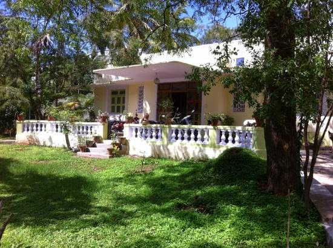

An old couple lived in a cute little cottage just a block away from where I live. It was small, modest yet appeared comfortable to live in. It did not reek of luxury as most bungalows and cottages in the vicinity did, but yet there was something endearing and unpretentious about this house. The front veranda overlooked a small patch of garden which they tended with much love. I still remember noticing the first few saplings that dotted the edges of the lawn which have now grown into flourishing trees.

Since I've lived in this neighborhood for almost a decade now, they were among the few familiar faces I would come across routinely. At times, we would throw knowing glances to acknowledge each other when I would cross paths with them, while taking a walk in a public park near their house. That was about it. No words exchanged ever. Not even a friendly nod.  
Every single time I saw them, they would be together, not on any occasion had I seen anyone of them by themselves. Be it shopping at the grocery store around the corner, praying at the temple nearby or taking leisurely evening strolls, they would always be seen together.Walking in a easy companionable silence at a pace that they had long attuned themselves to suit each other. Occasionally engrossed in some deep conversation.Although it did not seem necessary. They seemed to understand each other without speaking a word.Such was their camaraderie. On some days I would catch a glimpse of  them at their kitchen window sill, quietly making the day's supper. One could only hear the faint sound of her ladle clanking on the pan and his knife chopping the veggies on the board. At times they would be seen in their little garden, him trimming the hedges while she watered the plants from a hose pipe. One couldn't miss their comfort level with each other-easy and natural.

Old, graying, hunched, wrinkled and weak, yet they seemed to have the eyes only for each other. I would watch them from a distance and secretly wish that someday if I grew to be as old as them, that would be the kind of companionship I would love to be in. They appeared to be well beyond their 60s without any offsprings or dependents living with them. It often made me wonder what would happen if one of them died leaving the other one behind...stranded. The very thought of it would make me gloomy. Could not imagine seeing either one of them alone. They never seemed to have visitors to their house nor were they too friendly with the neighbors. All they had was each other.

A few years ago I took up a job and moved out of town.After my return recently, one day on my way to the park for my morning walk, I met with a sight that stopped me short in my tracks. The sweet little cottage  was mowed down.It now lay in a pile of rubble. There were tell tale signs of a new construction commencing, with bricks and sand parked in a corner. Apparently a multistory building was coming up in its place. Some of the trees along the hedge were felled down. The wind-chimes that once used to jangle merrily in their veranda, now lay soiled among the remnants of broken walls and window panes. A sad reminder of the past co-existence of the loving inhabitants.

I do not have the courage to ask around to find out what happened to the couple, not wanting to reaffirm my worst fears. In my head I have assumed that the couple is no more and would like to believe that they left effortlessly for their heavenly abode together...in their easy affable warmth and companionship, that even death did not have the heart to seize from them...

Such was the beauty of relationships from the days of yore. In this era of dipping patience levels and impetuosity, where many a relationships die at the drop of a hat, it is rare to come across uncomplicated love of this kind. Every time I pass the patch where the cottage once stood, a silent prayer escapes my lips. I pray to God with all my heart, that where ever they are, please keep them together-_they deserve to be together._

[Ultimate Blog Challenge](http://ultimateblogchallenge.com/)

