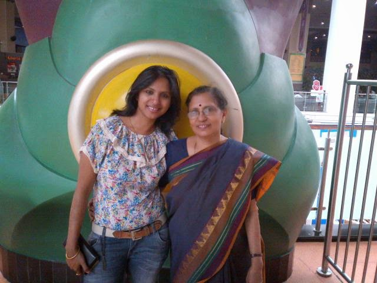
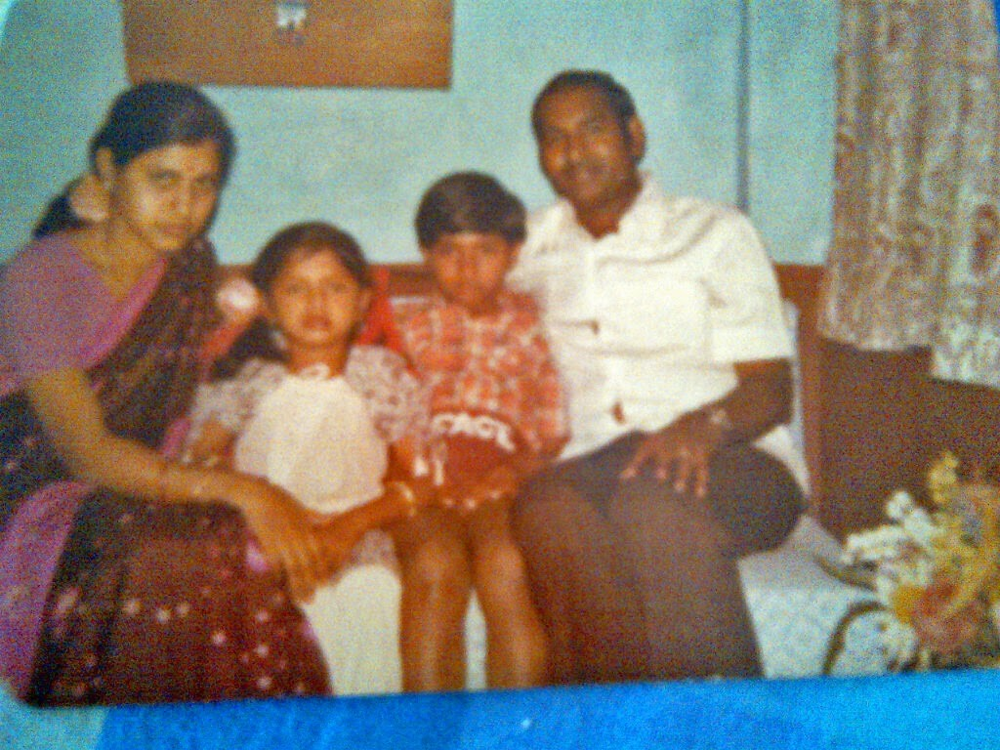
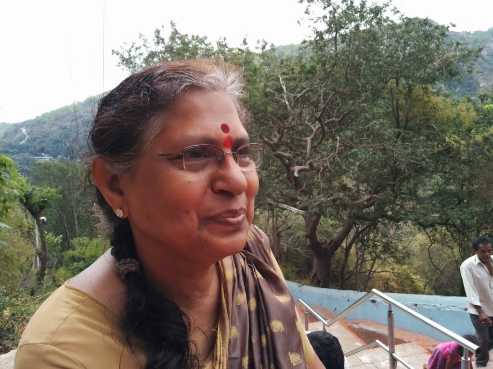
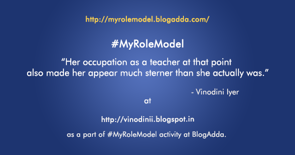

Its mum's birthday today. The perfect day to talk about her.

She remains way above the rest in my list of favorite women. A source of inspiration in all aspects of life. Her outlook towards the most mundane and the most complex of situations is what makes her the charismatic person that she is.

<table class="tr-caption-container" style="float: left; margin-right: 1em; text-align: left;" cellspacing="0" cellpadding="0"><tbody><tr><td style="text-align: center;"></td></tr><tr><td class="tr-caption" style="text-align: center;">Me And Mum</td></tr></tbody></table>

After a fulfilling career as a school teacher for fifteen years, she chose to retire much before her official age of retirement to answer to the needs of her family at that point. Much to the disappointment of a lot many of her students, who looked up to her  for her down-to-earth attitude and were fond of her for the warmth she exuded. But her retirement from her job was hardly a retirement coz she forever kept herself busy by means of enhancing her talents further. The list of her talents is never ending. Her forte lies in anything and everything creative. Be it making Tanjore paintings, Pyrography, Quilt making, Soft toy making, Chocolate making or churning out the most exotic and delicious of dishes.The list of the skill sets she has honed over a period of time is exhaustive and cannot be listed in one go.

<table class="tr-caption-container" style="float: right; margin-left: 1em; text-align: right;" cellspacing="0" cellpadding="0"><tbody><tr><td style="text-align: center;"></td></tr><tr><td class="tr-caption" style="text-align: center;">Tanjore painting made by Mum</td></tr></tbody></table>

I wouldn't have discovered my own passions had it not been for her. Early in my school days, she would send in my paintings to national level competitions, where I managed to grab a few accolades. And which in turn prompted me to study the subject further in college. I had the habit of writing poems randomly at the back page of my school notebooks and forget about them. She would file these papers carefully and send them to the local newspapers who would in turn publish them in their kids talent columns. She also ensured that her children turned into voracious readers, which is a habit I strive to inculcate in my child. Even to this day, she has ensured that I never slip into a phase of non-productivity. She nags me to the point where I have not been able to sit idle for more than a couple of days. I owe her for my success as a professional, not matter which field I chose to meander into.

If it wouldn't have been for her, my transition from the 'girlhood to motherhood' would not have been half as smooth and less chaotic than it usually is. I still turn to her for counsel when I am at tenterhooks with my soon-to-be adult tyke. Although from the day I was born to this day, she still treats me like a doll. Shops for me,dresses and organizes my life like no other mother would. Her perspective on my life is much ahead than most people of her times.

Although, as a child my opinion about her was slightly different owing to my level of maturity. I always felt and accused her of loving my elder brother more than me at that point. The fact that I was the outspoken one as compared to my quiet (but devil in the garb of an angel) bro always worked against me. I would always be the first to be accused in a mischief that involved me and my brother. He just would have to bat the lids of  his puppy eyes and she would melt! I suspect it was more so coz, he was old enough to help her around when the daily help did not turn up. He would butter her up by acts like mopping the floors after she swept them clean!

<table class="tr-caption-container" style="float: left; margin-right: 1em; text-align: left;" cellspacing="0" cellpadding="0"><tbody><tr><td style="text-align: center;"></td></tr><tr><td class="tr-caption" style="text-align: center;">The happy family</td></tr></tbody></table>

Her occupation as a teacher at that point also made her appear much sterner than she actually was. So much so, that most of our school/college friends were so intimidated by her that they would promptly leave in a tensed urgency from the doorstep itself if they learnt from her that me or my bro were not home! But over a period of time, that changed. Most of our friends, now look forward to see her and devour the yummy goodies she dishes out. Her grandchildren adore her to bits. Her daughter-in laws hate to love her! And her husband cannot do without her for even a moment.

_Here goes an anecdote from my childhood we enjoy laughing over every time we reminisce it. This was when I was probably in my 4th grade. I had lost my pencils at school for the umpteenth time that week, in spite of repeated warnings from her to take care that I don't lose more. So, in a fit of impatient rage she threw me out of the house and slammed the grilled front door. I begged and pleaded to be let in and when she did not relent, I yelled out at her in agony and asked her where I was supposed to go.And she replied back that I could go and ask the neighbors if they would hire me for daily help as a maid for their house keeping chores, since I was not responsible enough to handle my own things.So I went and did exactly that. In a moment of genuine innocence I actually went to the lady who lived next door.With tears streaming down I asked her if she needed a servant to help her with her chores. And if so, please hire me coz I have been chucked out of the house by my mum and have no where to go! The amused lady, escorted me back to my house and gently reprimanded my mum, who laughed it off and hugged me back into the house!_

I am sure every one attached to her have at least one warm memory of her which makes them smile every time they think of it.For as long as I can remember, we have never had a single visitor at home, be it a friend, relative or daily help who have left our house empty handed. When she travels or goes shopping, she ends up picking random items that she might want to gift someone someday!

<table class="tr-caption-container" style="margin-left: auto; margin-right: auto; text-align: center;" cellspacing="0" cellpadding="0" align="center"><tbody><tr><td style="text-align: center;"></td></tr><tr><td class="tr-caption" style="text-align: center;">Love you Ma!</td></tr></tbody></table>

Her ethics and principles are what me and my brother proudly stand by and it has helped us evolve as individuals in our own right by a silent understanding, that the path she guided us to has always been the right one, no matter how hard we rebelled with her or disagreed with her. We might have wronged her many a times with our actions but she was always right in her own judgement on most things. She is the solid pillar to our healthy existence and of course not to mention dad, who unmistakably is her foundation, after her parents.Through the ups and downs of life, she has stood by us unshakably making us stronger than the situations and helping us decide the best for us. Can't thank her enough for it...

Happy Birthday Ma!

This post has been written about [#MyRoleModel](http://myrolemodel.blogadda.com/) as a part of an activity by [Gillette India](http://www.rewardme.in/tag/gillette-cricket) in association with [http://www.blogadda.com](http://www.blogadda.com/).

