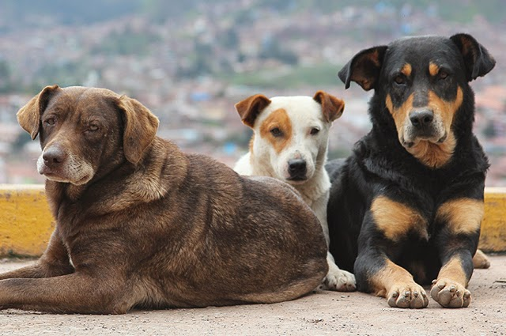
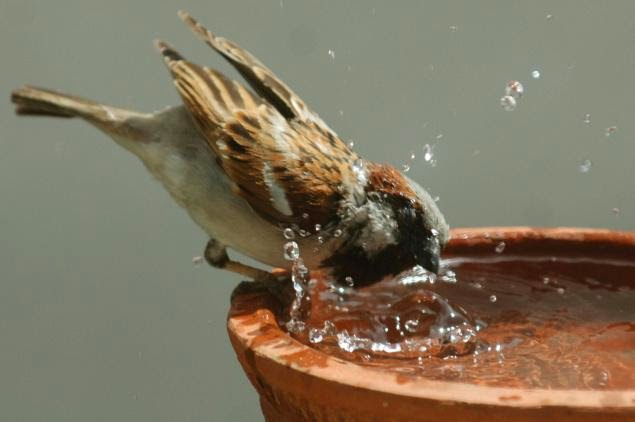
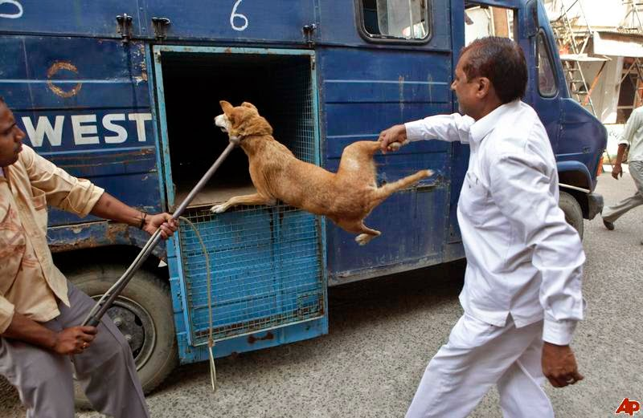
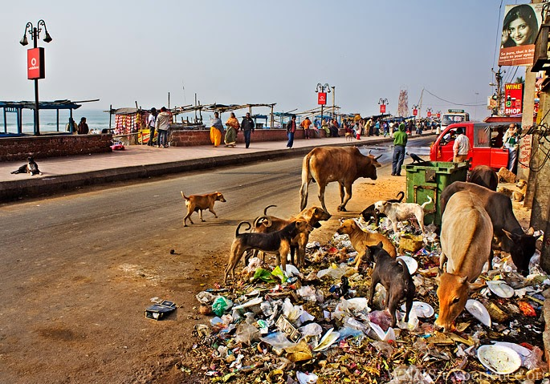

I watched a pigeon dip its beak into the makeshift bird bath placed on the parapet of our terrace. Soon it was joined by yet another pigeon and a crow. Tiny though the bath bowl was, all three of them accommodated each other to perch on the rim, and quench their thirst. While we chill in our air-conditioned rooms in the sweltering heat of Indian summers, how often do we spare a thought to what happens to these birds and stray animals who have to find their own means of finding respite from extreme weather conditions?

My pet lab loves going out for walks. But no matter how long it has been since he last relieved his bowels, he refuses to step out in the harsh sun for his post-lunch walk. Well, he's been lucky to have a home with amenities to help him get through the extreme heat. But what about the strays out there - do they have an option?

For once, I loathe my country for being so hard on these animals to survive in. Our strays are literally orphans who run rampant on the streets most of the time, with minimal or no supervision and help of any kind. Be it the birds, dogs, cats, monkeys, cows, or buffaloes. Some of our festivities only add to their never-ending woes.

Come the festival of Diwali - 'the festival of lights' or a fat Indian wedding, we express our joy by bursting loud crackers which not only create noise pollution but also emit harmful chemicals into the atmosphere. These emissions are equally hazardous for all-both humans and animals. The loud noises that these fireworks produce, sometimes alarm these animals to the extent that it sends them running in a frenzy which ends in some kind of accident by either being run over by a vehicle or stepping on a live firework on the road. Even birds do the disappearing act when the fireworks start bursting!  I guess the sound, smoke, and harsh lights makes it just too unbearable for them. Come to think of it, we used to have so many sparrows around here but they seem to be turning extinct. I hardly see them anymore.

Another festival that is full of accidents is the Makar Sankranti or 'Kite flying festival' in January. In many parts of India, people fly kites from their rooftops. Every year, there are accident cases of either people falling off the roof or getting injured very lethally by the particular thread used to fly kites. This thread is treated to make it extra sharp by dipping it in a solution of powdered glass so that it is easy to snap off the opponent's kite by tangling their kite thread with the opponent's thread when the kites are swaying up there in the sky. Definitely makes for a thrilling game, but is it worth all the risk it comes with? Goes without saying that the maximum causalities that it induces again involve animals. Imagine birds flying in a sky full of kites tagged along those sharp-edged threads. The birds get badly tangled in these threads, which sometimes slices sharply through their necks. The same happens with the stray dogs, monkeys, and cows on the roads when they become victims to a stray strand of this lethal thread drifting past the roads they cross.

In a country that worships cows, we commit such grave atrocities with the stray cows. Loose plastic bags, used sanitary napkins, and other harmful non-bio-degradable wastes littered on the roads find their way into the bellies of these cows. Hindus don't only worship cows. We respect, honor, and adore the cow. By honoring this gentle animal, who gives more than she takes, we honor all creatures. So, with our thoughtless actions, are we really giving the cow or any other creature its due respect?

_Mahatma Gandhi once said: 'One can measure the greatness of a nation and its moral progress by the way it treats its animals. Cow protection to me is not mere protection of the cow. It means protection of all that lives and is helpless and weak in the world. The cow means the entire subhuman world.'_

I know a family in Mumbai which feeds 27 odd stray dogs every single evening for last 8 years. The brainchild behind this action was their 15-year-old daughter. If someone as young as her could have that kind of compassion for stray animals, why can't you and me? If only each of us could do our bit to give these animals the slightest of relief, wouldn't it make at least some difference to the existence of these helpless beings? Not on a large scale, but in some minuscule way. If you can't feed them at least don't cause harm to them. None of the facts stated above are new to us. We all are aware of them, yet we go on committing the same mistakes over and over again.  The least you could do is say no to fireworks, kite flying, loud music, go easy with the usage, and be cautious with the disposal of non-biodegradable items.

[Ultimate Blog Challenge](http://ultimateblogchallenge.com/)

