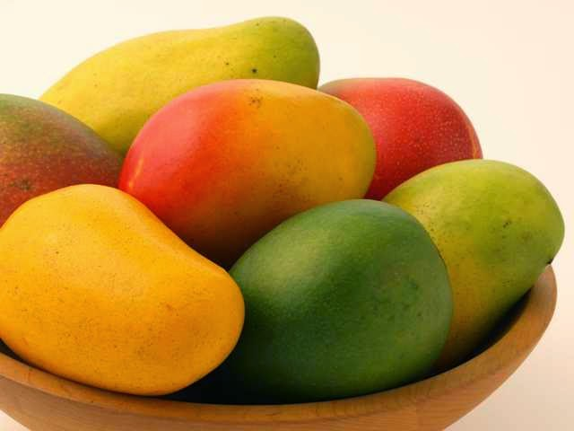
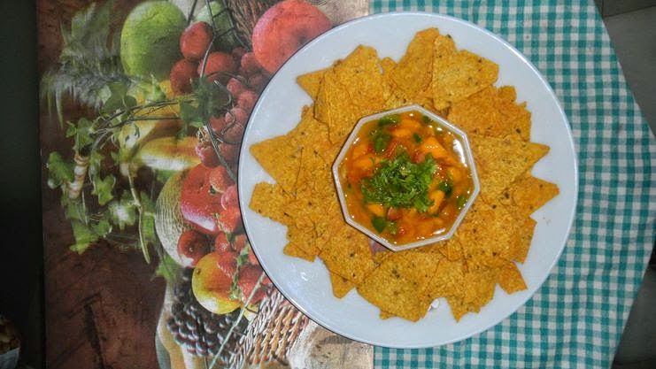

**Q: What's the best thing about Indian summers?**

**A:  MANGO!**

Could you have thought of a better answer to that question? None other, right?! The whole trauma of enduring the heat, sweat, and sizzle gets compensated by this short-term visitor to our fruit market called the Mango. The title, the King Of Fruits, is truly befitting for this fruit, which oozes such rich exotic flavor that it cannot be compared to just any other fruit. I haven't yet met an Indian who actually detests mangoes....most of us love it to death! We wait for the ripe fruit to hit the market from the onset of March. There's nothing more nostalgic than the whiff of ripe mangoes. Last night, I had my first mango of this season, a tad too late this time. The after taste of the succulent Alphonso still lingers in my mouth...

Started with the raw ones as soon as they hit the market. Nothing adds zest to a boring dish as dramatically as a tangy raw mango does. Be it pickles, jams, salads, gravies, or spicy _'Chaats'._ Or, have it sliced - raw by itself with a dash of salt and red chili powder...the very thought of it makes my mouth water!

During our summer holidays in school, the only incentive for going to the south of India where we originate from, to visit our grandparents, was the availability of amazingly large varieties of mangoes out there. We would get spoilt for choice between the _Rasaalu_ (juicy ones which can be just sucked into or extracted for juice) and the _Banginpillis_ (large fleshy ones which could be sliced and munched on). In Gujarat, the Gujaratis extract _Ras_ (thick mango extract), have it fresh with all their meals when in season, and deep freeze it to store it for the rest of the year in large containers. Any authentic _'Gujju'_ house you visit would have '_Keri nu Ras'_ in their fridge given any time of the year! The _Kesar_ variety is the next best option available in Gujarat after _Hafoos_ or Alphonso. It becomes mind-boggling at times to choose from the wide variety of mangoes that are available. Though, having lived in Mumbai for the past few years, I have become partial to the exotic _Ratnagiri_ Alphonso.

Well, I can have this fruit in just any form. Ice-creams, salads, milkshakes, desserts, or just sink in my teeth in the whole fruit by itself!

Here's a recipe of **Mango Salsa**, that I chanced upon, somewhere long back. I make this more often than other mango dish coz it's fast, easy, and super yummy!

**What goes in...**

1 large semi-ripe Mango...the tangy-sweet _'Badam'_ variety which can be diced easily works well.

1 small capsicum

A big pinch of black salt

Half tsp red chili powder

One tsp lime juice

Salt to taste

**Here's how...**

Dice the mango into small pieces. De-seed and chop the capsicum into tiny pieces. Toss the mango and capsicum in a bowl with all the other ingredients and mix well. Adjust seasoning to taste. You might want to add a bit of sugar if the mango is too sour. Top it with finely chopped coriander to garnish. Let it stand in the refrigerator for about an hour.

Bring it out when chilled. Pop open a bag of Tortillas...dip in and munch on! Makes for super comfort food....yum!

[Ultimate Blog Challenge](http://ultimateblogchallenge.com/)

[A to Z Challenge](http://www.a-to-zchallenge.com/)

