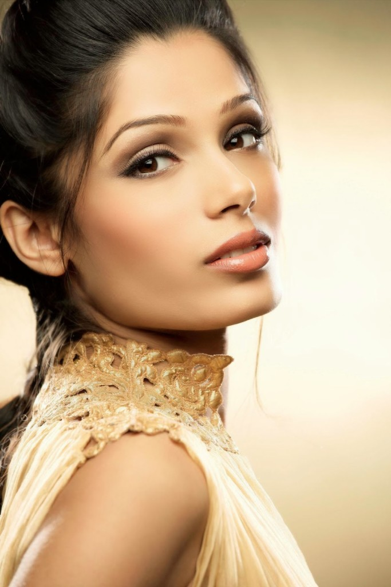
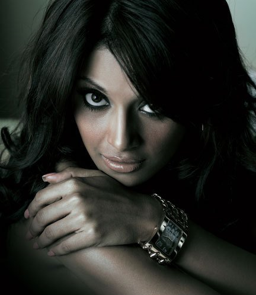
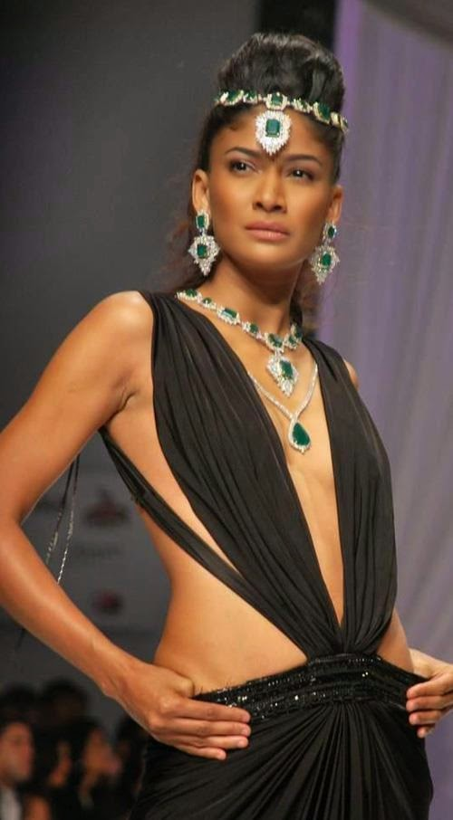
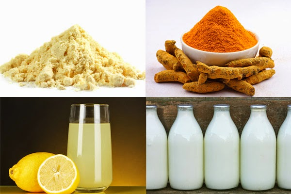

What is it with this mindless obsession that an average Indian has for fair skin? Recently on a popular television talk show, Freida Pinto, the actress of the much-acclaimed film, ‘Slumdog Millionaire’ pointed out about this obsession of Indian men for women with fair skin and light eyes which most of us are familiar with. Most matrimonial adverts from eligible men state a requirement for a FAIR, slim, and tall woman. It makes me question the eligibility of these men.If all they merit a woman with is her looks, what is the quality of mental makeup that they themselves possess?

<table class="tr-caption-container" style="float: left; margin-right: 1em; text-align: left;" cellspacing="0" cellpadding="0"><tbody><tr><td style="text-align: center;"></td></tr><tr><td class="tr-caption">Actress: Freida Pinto</td></tr></tbody></table>

And if at all it was about looks, then the most exotic beauties in our land are dusky, with amazingly sharp facial features, blessed with clear glowing skin, appropriate curves at the right places, and sensuous to the core. Think Bipasha Basu, Carol Gracias, Sheetal Malhar, Laxmi Menon, Frieda Pinto, and the list is endless. These are women with beauty, brains, talent, and are also amazing human beings in their own right.

<table class="tr-caption-container" style="margin-left: auto; margin-right: auto; text-align: center;" cellspacing="0" cellpadding="0" align="center"><tbody><tr><td style="text-align: center;"></td></tr><tr><td class="tr-caption" style="text-align: center;">Actress: Bipasha Basu</td></tr></tbody></table>

<table class="tr-caption-container" style="float: right; margin-left: 1em; text-align: right;" cellspacing="0" cellpadding="0"><tbody><tr><td style="text-align: center;"></td></tr><tr><td class="tr-caption" style="text-align: center;">Super Model: Carol Gracias</td></tr></tbody></table>

The latter four attributes don’t seem to really matter to the men to look out for a life partner. A question that these young men need to address is that, how long will the looks of a woman contribute to the stability of a relationship? At the most, she might help you produce a bunch of kids who

might inherit from their mother’s genetics, the skin color that you're so obsessed about. What about maturity, humility, compassion, intellect, and everything else that does not attribute to the physical appearance? These qualities definitely make a lot of difference to relationships of all kinds. Imagine living all your life with a woman who is beautiful to the point of perfection but lacks compassion and intellect. Would she be able to willingly share with you the ups and lows of your life? Would she be kind to your parents, siblings, relatives, and friends? And if she is low on intellect or maturity levels, what kind of value would she be able to add to you and your future children’s lives?

The intention here is not to state that women with fair skin lack these qualities or vice versa dusky women essentially possess these qualities. But these definitely should be the major parameters one should give precedence to when looking for a life partner. The blind obsession of the so-called parameters of beauty should take a back seat, more so for the sake of a healthy relationship.

And it’s not about only changing the man’s perspective here. All those lovely women out there, blessed with dusky skin, should actually revel in the earthiness of their gorgeous honey color and feel proud for what they are, not for their skin tone alone but the other qualities they are blessed with that make them unique in their own ways. While the rest of the world is using all kinds of products and sunning themselves to get a tan which they consider beautiful, we Indians are still layering ourselves with those so-called fairness creams which promise to give us that edge at the interview or get us lucky with a prospective spouse!

Having stated the virtues of all attributes other than the physical, let’s not ignore the advantages of having clear beautiful skin, no matter what color-honey, wheat, or peach. Like most kids in India, more so if you originate from the south of India, we would go through the weekly ritual of an oil bath, which involved applying a traditional pack called ‘Ubtan’, made of chickpea flour and turmeric powder. This also is a requisite ritual all Indian brides go through a few days before their wedding, so that they appear their glowing best on their D-day.

The ingredients of this pack are commonly found in most Indian kitchens, easy to make and does not cost a bomb like those heavily chemical-laden creams promising the impossible. We owe our healthy clear and glowing skin to this miraculous ritual which if done regularly gives the best result to all skin tones. Sharing it, for all those who wish to give it a try.

**What goes in…**

Coconut oil for body massage

Chickpea flour-About 3 tablespoons

Turmeric powder-1 tsp

Lime juice-1 tsp

Milk cream or milk-just enough to help make a thick even batter out of all the ingredients above (except the oil).Use milk for oily skin and milk cream if you have dry skin.

**How to…**

Gently massage warm coconut oil all over your body. Let seep in for about 15 minutes. Apply the chickpea pack. Avoid eyes and mouth. Leave it on for 5 mins. Gently exfoliate the pack with your hands after it dries a bit.Shower.You can skip the exfoliating process for the rest of the body if you are low on patience and time. Do it only for your face, since this process also helps reduce facial hair. The rest of the pack can be applied to the body and washed off normally if you do not want to exfoliate. Preferably skip using soap for 24 hours after using this pack.

The milk moisturizes, the lemon lightens, the turmeric is an antifungal agent and the chickpea powder removes excess oil. The after-effects of this ritual is sound and blissful sleep after the languorous shower!

While the importance of qualities other than those connected with the physical appearance remains undisputed, a glowing healthy complexion always adds to the confidence of a person, no matter what his or her color is. Let the obsession shift to a healthy mindset and a confident state of being with an acceptance of the unique qualities each of us possess which might not necessarily be skin deep.

[Ultimate Blog Challenge](http://ultimateblogchallenge.com/)

[A to Z Challenge](http://www.a-to-zchallenge.com/)

