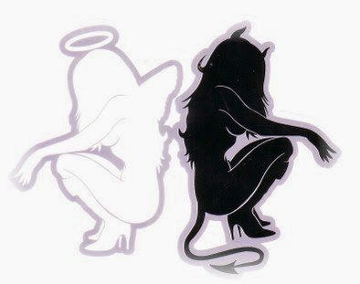

A Gemini is like that combo-pack offer you get at the departmental stores, in which with one product you get another free. A mixed bag of versatile 'Unique Selling Points'. Like most of these offers, you only get to choose one particular product of your choice. The rest of the products that accompany the combo-pack are either chanced gains or just another addon to the list of things you could do without.

<table class="tr-caption-container" style="margin-left: auto; margin-right: auto; text-align: center;" cellspacing="0" cellpadding="0" align="center"><tbody><tr><td style="text-align: center;"></td></tr><tr><td class="tr-caption" style="text-align: center;">GEMINI -THE TWINS (May 22nd-June 21st)</td></tr></tbody></table>

So, if you happen to have a friend, love interest, spouse, boss, in-laws, or someone you choose to or have no option but to be in the company of, you tend to expect from them, a few unsaid prerequisites. The rest of the attributes are like those chanced gains or unwanted things in the combo-pack. You just need to live with those. Here goes the list of things that you could look out for, as those 'addons' when you're with a Gemini.

You may wonder how different are the dynamics of this relationship from the ones with people of other zodiac signs. The difference here is the multiple identities a Gemini reveals in the course of various situations-some of which might flabbergast you for the extremely opposite attributes that show up in the Gemini, from what you thought you knew of them. They do not represent the Twins for no reason-all thanks to their dual personalities.

**The challenge that most people feel with a Gemini is that they 'don't know who they're talking to'** **since they are so multifaceted.** _You have to be able to adjust yourself to get along with their many characters._ Their multiple changes and many moods might 'charm' a lot of people. They might laugh for 2 minutes and later suddenly turn quiet.

Because a Gemini has multiple personalities and multiple ideas, they hate to put them down in written proof. Because they know _what they believe today can be different tomorrow._ **You may not see all sides of the Twins even if you are married to one unless you see him or her in all possible areas.** For example, your Twin may be a real soft touch at home but a despot at work. Two jobs or major interests are common such as an advanced degree in some scientific discipline and then a consuming hobby on the side such as an amateur radio jockey.

Occasionally their personalities are so diverse that _they embrace two diametrically opposed moral standards and truly believe in both,_ making them prime material as politicians. Don't mistake this for the same behavior as Librans who try in their infinite fairness to see both sides of an issue. **The Twins can go beyond understanding to living and believing two mutually exclusive value sets.** Twins are very comfortable with the concept of two lives. This helps them avoid boredom and is also an escape mechanism if one of their lives becomes tedious or too demanding.

**Being a mutable sign, change is not only accepted but embraced or in some cases sought.** They don't do this on purpose to annoy or deceive, it's just how they are. To them this is normal and _they may have a hard time understanding those who have a single personality and more concentrated interests._ They also tend to believe that when they leave one life for their backup plan, whatever the reason or length of time involved maybe, that life grinds to a screeching halt and will be exactly the same when they return. They are entirely oblivious to the fact that they might be missed or things might change while they're away.

<table class="tr-caption-container" style="margin-left: auto; margin-right: auto; text-align: center;" cellspacing="0" cellpadding="0" align="center"><tbody><tr><td style="text-align: center;"></td></tr><tr><td class="tr-caption" style="text-align: center;">THE GEMINI CELEBS</td></tr></tbody></table>

_Some famous celebrities who were born under the Gemini sun sign include four of the tallest pillars in the world of Literature, namely Walt Whitman, Ben Jonson, Thomas Hardy, and William Butler Yeats. Fellow Geminis like Angelina Jolie, Johnny Depp, Nichole Kidman, and Marilyn Monroe have got many an admirer swooning over them. Back home in India, A.R.Rahman, the Oscar-winning music composer too represents the symbol of the intertwined twins._

Being a Gemini, myself I am often oblivious to the possibility that a different twin might have suddenly popped up from within, out of the blue from nowhere, in yet another random situation...which often demands an explanation...and trust me, I would have explained it if  I had the slightest clue of 'that side of me' myself!

[Ultimate Blog Challenge](http://ultimateblogchallenge.com/)

[A to Z Challenge](http://www.a-to-zchallenge.com/)

