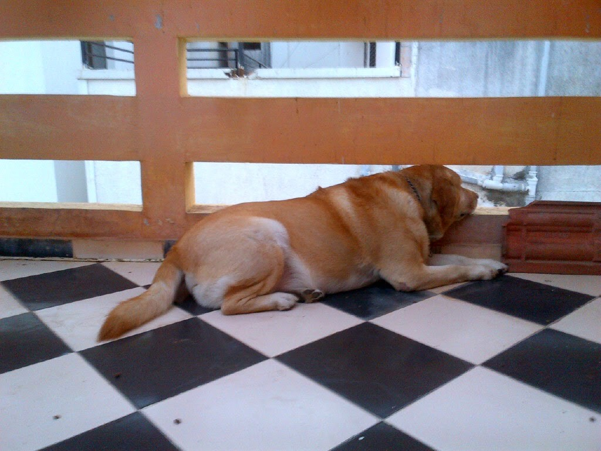

Roger and I share a 'love-hate' relationship. In case you're wondering who Roger is, he's my seven-year-old pet Labrador. It is a love-hate relationship coz I find him rather dumb and he finds me rather dominating. Although I'd like to put this in the right perspective and say that he probably just acts dumb so that he could get away with a lot of mischief! And I appear dominating coz I try to be his much-needed disciplinarian! But yet the love we share is one of its kind.

<table class="tr-caption-container" style="margin-left: auto; margin-right: auto; text-align: center;" cellspacing="0" cellpadding="0" align="center"><tbody><tr><td style="text-align: center;"></td></tr><tr><td class="tr-caption" style="text-align: center;">Our daily 'us-time' every morning.</td></tr></tbody></table>

Every morning soon after I'm up, we share a few quiet moments of quality time with each other on the terrace that our living room opens into. Me on the swing munching on fruit and he staring out on the road from the narrow horizontal bars on the parapet wall which give him a view of activities happening in the lane below. This 'us-time' lasts only for about three minutes. This routine, however, is conditional. Conditions being that he had not sneaked and climbed on the living room sofa when I was still asleep. As soon as I step out every morning my eyes instinctively scan the sofa for traces of fur that his coat sheds, to check if he's again slipped into his rebellious obstinate mode and done his bit to agonize me. I insist on this discipline coz he sheds very badly and soils the sofa which in turn becomes too much of a cleaning process to handle. He has his own couch next to it and that is where he ideally should be lounging. The days he breaks this rule, he disappears in some invisible corner of the house as soon as he sees me, with his tail tucked between his legs. He knows he'll be questioned and that freaks him into a panic mode!

<table class="tr-caption-container" style="margin-left: auto; margin-right: auto; text-align: center;" cellspacing="0" cellpadding="0" align="center"><tbody><tr><td style="text-align: center;"></td></tr><tr><td class="tr-caption" style="text-align: center;">The rebellious and obstinate Roger on the sofa-his favorite way of pissing me off!</td></tr></tbody></table>

Roger came to us when he was about a few odd weeks old, from a family who lives in Pune. Pune is popular for locally producing yummy bakery goodies. Strangely even though Roger was too tiny to register something like this when he was still in Pune, he goes uncontrollably when he gets a whiff of the bakery products that come into our house from Pune. Mind you only baked goodies from Pune evokes that kinda greed in him. And I wonder why?! In our absence, he once tackled to the floor and gobbled up an entire one-kilo box of 'Shrewsberry' cookies rich in butter someone had got us from Pune.

On his birthday in the month of October, we order an entire double cheese margarita pizza only for him. He gets to eat this whole thing only on his birthday. And while we cut his birthday cake, he sits very patiently eyeing the cake waiting to get a slice of it. This is one day he loves me to bits for indulging him in with his favorite goodies.

<table class="tr-caption-container" style="margin-left: auto; margin-right: auto; text-align: center;" cellspacing="0" cellpadding="0" align="center"><tbody><tr><td style="text-align: center;"></td></tr><tr><td class="tr-caption" style="text-align: center;">Waiting patiently for a slice of his birthday cake.</td></tr></tbody></table>

Often people who are uncomfortable around dogs get intimidated by his size. But I put them at ease by reassuring them to not get fooled by his size. As expected of his natural instincts, he doesn't even know how to bite! He once got bitten by a stray dog just for the reason that he was unable to defend himself from the stray due to his inability to bite back. All my life we have had pet dogs who have been ferocious and intelligently street smart. Hence this guy's dim nature does amuse me a lot and gets the prankster in me to challenge his faculties so that I could push him to a point of behaving like a dog and not a docile cow! As goes the popular dialogue from a recent Hindi film 'Rowdy Rathore' in which the hero of the film, in his broken English, keeps saying: "Don't Angry Me!".....it is just apt for this 'Rowdy Roger' who otherwise behaves like a cow but is a rogue to the core!

Well, all said and done, he's my solace on my bad days when I withdraw into my shell and boycott all humans! The very joy of being greeted by his yelps and wags when I walk into the house after a prolonged trip out of town, makes me feel wanted unconditionally like no human can ever make me feel.

P.S. Roger also happens to be on Facebook by the name of Roger Iyer on '[https://www.facebook.com/roger.iyer.7](https://www.facebook.com/roger.iyer.7)'...if you may want to add him! Hey, but I took him off my Facebook list sometime back...when we had a bitter tiff yet again due to his sofa climbing!

[Ultimate Blog Challenge](http://ultimateblogchallenge.com/)

[A to Z Challenge](http://www.a-to-zchallenge.com/)

