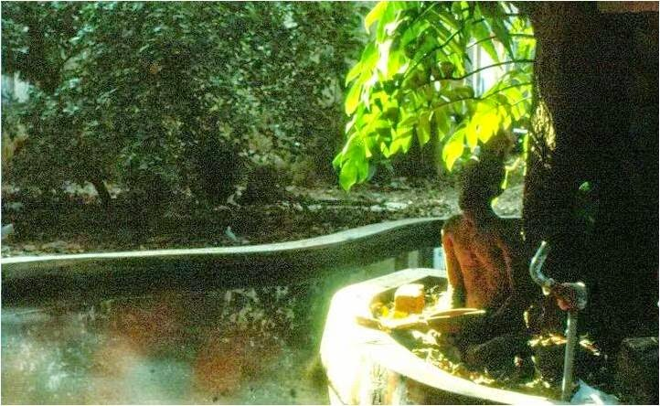
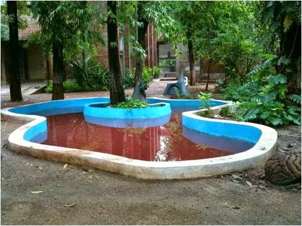
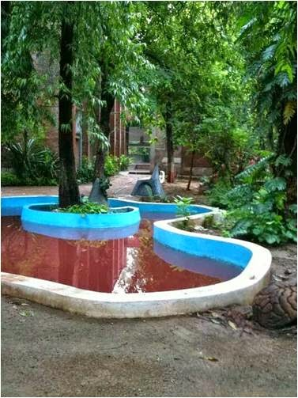
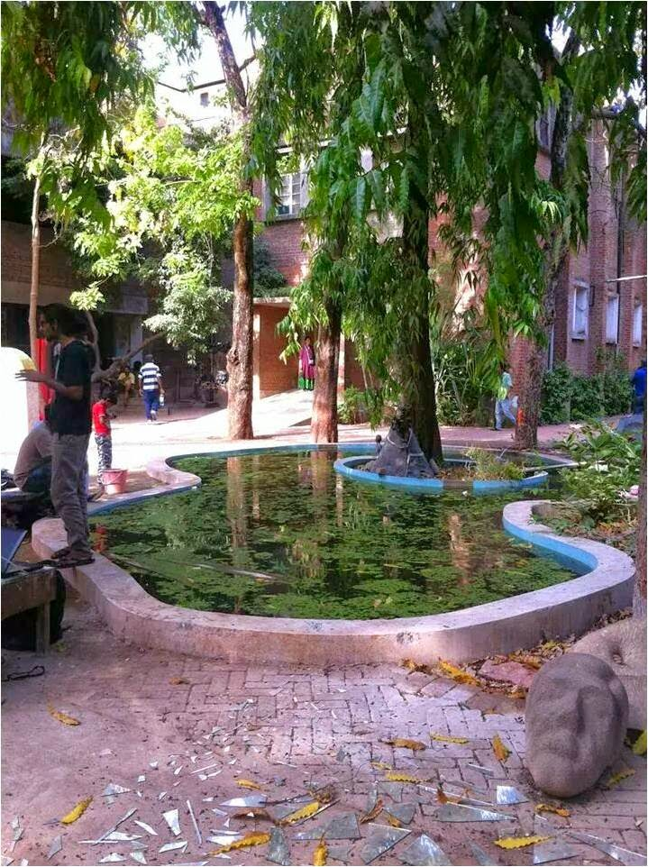

<table class="tr-caption-container" style="margin-left: auto; margin-right: auto; text-align: center;" cellspacing="0" cellpadding="0" align="center"><tbody><tr><td style="text-align: center;"></td></tr><tr><td class="tr-caption" style="text-align: center;">Photo Courtesy: Sandeep Damre</td></tr></tbody></table>

Back in my college days, at _the Faculty of Fine Arts, in the Maharaja Sayaji Rao University at Baroda_  (touted as one of the best-known art colleges in India), there was a tiny little pond right in the middle of the college campus. A gigantic sculpture of Mahatma Gandhi stood right in front of the pond in those days. The sculpture no more stands there. But in those days the podium on which Mahatma stood, was where most of us would be seen hanging out in our free time between and after lectures, literally at his feet.

The pond is made of concrete cement in abstract shape and is a house to millions of tiny fishes. It lays flanked by various large and small interesting pieces of sculptures made by the alumni of the faculty. There was a time when you could catch a glimpse of lotus flowers and leaves floating atop the still waters. Shaded by lots of surrounding trees and a huge one on the small island spreading out its branches above the waters, this was the kind of place you would like to linger around endlessly, be it to escape the scorching heat of summers, or to bask in the warmth of the sunshine in winters. Sketching on the ground with lazy strokes of a stray twig, sometimes catching your reflection in the green waters. Aiming a pebble to create a splash or simply just losing yourself in a quiet moment of nothingness.

<table class="tr-caption-container" style="margin-left: auto; margin-right: auto; text-align: center;" cellspacing="0" cellpadding="0" align="center"><tbody><tr><td style="text-align: center;"></td></tr><tr><td class="tr-caption" style="text-align: center;">Photo Courtesy: Sandeep Damre</td></tr></tbody></table>

<table class="tr-caption-container" style="margin-left: auto; margin-right: auto; text-align: center;" cellspacing="0" cellpadding="0" align="center"><tbody><tr><td style="text-align: center;"></td></tr><tr><td class="tr-caption" style="text-align: center;">Photo Courtesy: Sandeep Damre</td></tr></tbody></table>

Many lazy noons were spent here brooding endlessly...sometimes all on my own, trying to get a new perspective on my painting. After lunch, some of us would feed the fish in the pond with tiny bits of bread. I would dip my hand in the pond and let them a peck on it...the way it tickled while they nibbled on it was so much fun...I had discovered the joys of fish pedicures and manicures way back then, free of cost though! By the pond next to the Gandhi sculpture was a bush, which in certain months of the year got dotted entirely with tiny yellow colored berries that were extremely sour in taste and milky. Few of us would pluck these and cringe at the sourness yet relish this seasonal treat.

<table class="tr-caption-container" style="margin-left: auto; margin-right: auto; text-align: center;" cellspacing="0" cellpadding="0" align="center"><tbody><tr><td style="text-align: center;"></td></tr><tr><td class="tr-caption" style="text-align: center;">Photo Courtesy: Sandeep Damre</td></tr></tbody></table>

The pond witnessed so much through the years of our college life. Everyday banter of jokes, pranks, and leg-pulling amongst friends.Healthy arty discussions, sometimes philosophical and at times pointless arguments.Budding romances.Teary heartbreaks.All kinds of highs and lows. And at times just a companionable silence. Many a time just alone in a moment of self-exploration. A place one turned to for solace no matter what the state of mind was.

Of course, some of these quiet reflections led to the making of some brilliant artists in the coming years. Each one a stalwart in the field they chose. But I doubt if it ever occurred to any of us back then, sitting by the pond, that stepping out of that comfort zone of campus after our education, would meet us with a whirlwind of responsibilities to undertake, a lot many answers to find and so much of ourselves to give up to the big bad world. A world that was waiting to swallow us up in the depths of its doldrums. Those dreamy carefree days were gone. They just slipped by in a hazy blur of nostalgia...

[Ultimate Blog Challenge](http://ultimateblogchallenge.com/)

[A to Z Challenge](http://www.a-to-zchallenge.com/)

