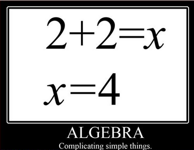
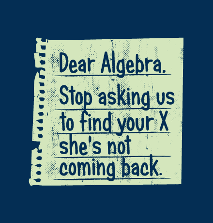
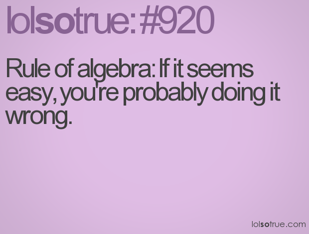
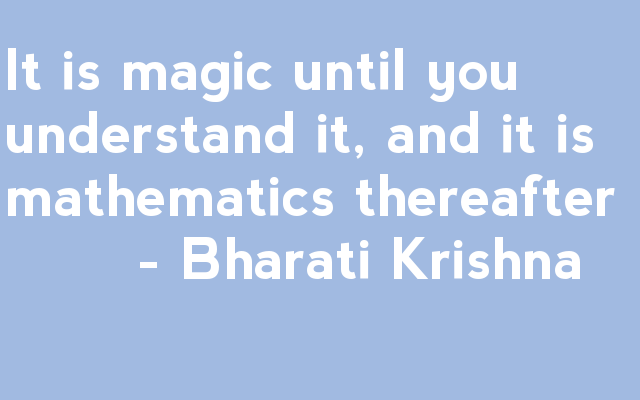
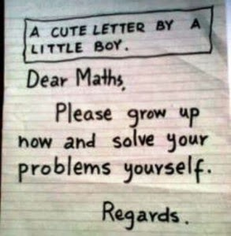

**x^2 + 3x - 18 = 0**......and thank god its a 0.I wouldn't attribute that x anymore credential than a 0!

X reminds me of Algebra.Not the best of my subjects in school...in fact I hated it to the core.As much as I hated Mathematics.Those mind boggling theorems were never my best friends.Nor were the numbers and the + and - signs that stood before the x. Boy...if only I could have got away with one murder...it would have been of the one who had invented the Algebra! But I could have had that privilege only if I was born in 820 AD it seems.Turns out that the man who invented Algebra was a gentleman with the name of Al Khwarizmi. He was a Persian mathematician living in 820 AD, and he wrote a book that displayed the beginnings of Algebra through problems and equations. Kudos to him !...I mean that with all due respect, for the genius he must have been for coming up with something as useful as the stuff I was getting harrowed over!

But why us...the right-brained people? Wouldn't we be well off using it for expressing and reading emotions through literature, exploring and rendering soulful music, coloring the world with  strokes of our creative art inclined sensibilities? Well that's not me trying to flaunt my expert abilities but these are facts which the psychologists have discovered over years. The left brainers are the ones who have the forte to tame the numbers with their gift of logical, critical thinking, reasoning powers and grip on the numbers.This was the question my mind popped me with every time I got worked up with my Math, throughout the years, when I went through the torture of figuring out the numbers! "Why me?!"

My poor mum spent some very patient minutes and innumerable absolutely impatient insane hours trying all possible tricks and techniques to get the sums right from me, just so that I wouldn't flunk in my exams.Thankfully I somehow managed to clear marginally in Maths every time.Being a school teacher herself, I did really prove to be one black sheep of a student in her favorite subject.

I had known in my early days of schooling itself that my specialization in college would have something to do with Art thanks to my inclination to the subject. It only seemed practical to take up the Arts stream for the last two years of my high school.So, when I finished my 10th grade I was relieved.Relieved coz there was no more Math or Algebra to torment my mental faculties in my 11th and 12th grades.The relief was short lived.Statistics awaited me in the Arts stream with open arms to shove more numbers down my poor right brain!

Two more years and I finally got rid of the subject when I went to the Fine Arts college to specialize in Painting. Although I never needed to study Maths again I did fumble through my college years when I required to do any kind of calculation. It was only when I stepped out of college, into the professional and domestic responsibilities that I realized that I was never ever going to get rid of these numbers! They still haunt me through excel sheets and grocery bills.But well, I've made friends with the calculator and that helps.

Pssst....just between you and me-"It wasn't that I could never figure out those numbers.Its just that I never 'wanted' to.My right brain just blocks out all numbers and goes into a freeze mode when encountered with the XYZ of Mathematics." Hope my mum never finds this out!

 

 

 

 

[Ultimate Blog Challenge.](http://ultimateblogchallenge.com/)

 

[A to Z Challenge.](http://www.a-to-zchallenge.com/)

