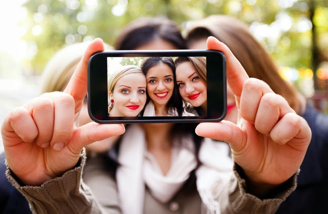

<table class="tr-caption-container" style="margin-left: auto; margin-right: auto; text-align: center;" cellspacing="0" cellpadding="0" align="center"><tbody><tr><td style="text-align: center;"></td></tr><tr><td class="tr-caption" style="text-align: center;">Image Source: http://indiatoday.in/</td></tr></tbody></table>

The newest word attracting a lot of hype and flak, all at once is the 'selfie.' If you tell me that you have had a smartphone for sometime now and you haven't ever taken a selfie, in all probability I might tick you off as a liar. All the furore about the posting of selfies on social media platforms, being treated as a means of attention seeking is slowly dying down.

A selfie speaks a lot, not about the person who posted it, but the feeling with which he posted it. Someone was pleased with himself to think it was worth presenting to the world and henceforth made the effort to post it publicly.It has a lot to do with the self confidence of the person-the fact that he is comfortable in his skin and elated to share it.

But some people who beg to differ on this topic.They believe that selfies encourage self obsession to a point of being vain.You often come across people trying to make digs at selfies, based on this theory of vanity.The point worthy of thought here is that, the culture of posting selfies might actually end up making one believe that you HAVE to look good if you have to show yourself to the world.But my counter reaction to this statement is, 'Why not?' Don't we all stop in front of the mirror just for that one moment, every time before we step out of the house, just to check if we are at least presentable to the world...if not look good?

The Oxford Dictionary defines vain as ‘having or showing an excessively high opinion of one’s appearance, abilities, or worth’. So does posting a photo of yourself online equals to meaning that you have an excessively high opinion of your appearance? When we share all aspects of our lives from joys, sorrows, anger,disappointments,successes and failures-just about everything on social media, what's wrong with bringing out that one shot that makes you glow with inner confidence?! Why should you deprive yourself that moment of celebrating your own self?

 _"There is a primal human urge to stand outside of ourselves and look at ourselves"_ said Clive Thompson, author of the book 'How technology is changing our minds for the better.' That probably explains the invention and popularity of the selfie concept.

The only concern worth raising here is the extreme obsession that comes with this whole culture of taking and posting selfies.It is about those moments of self doubt that occur when you get 'overty-involved' in the whole compulsion to click a perfect selfie next time around, which may breed self doubt triggered thoughts like "Am I looking too fat?" or "Is there some way I could cover those blemishes?"

In the event of going overboard, the selfies posted might actually start reflecting a show-off quality which might not go down well with the audience.Here are some questions you could ask yourself  before sharing a selfie:

**Is there an aesthetic quality to the picture?** Is it about your new hair cut or the spontaneously natural smile that showed up in the picture? Or is it talking about your visit to a place that could interest the onlookers-maybe standing against the backdrop of the stadium watching a particularly popular ongoing match of cricket.If the point of posting the picture is just coz you think you look great in it, how is it going to be of interest to your audience?

**How often do you share your selfies?** But of course, people love seeing your pretty face but you do need to give people a break.Keep a decent amount of time gap between every share.Sharing selfies almost every other day just gets too over the top.

**Is it in good taste?** A very vital deciding factor for the picture to be shared should be, whether it is post worthy or not.A particularly indecent shot which excessively flaunts your assets, or a click of you eating with your mouth open is definitely not tasteful enough to be posted.

**Is it a good click?** Is it a good photograph? Is the lighting proper? Is the angle right? You don't wanna be posting pictures that show you in unflattering angles and lighting.

If you are doing it right, I don't see any reason for you to stop yourself from calling yourself a 'selfie' lover! When you start doing it in moderation, you actually might get inspired to click other great stuff besides your own pictures.It might make you develop an interest in various other topics that would be great to share with people.

It is said _the choicest pleasures of life lie within the ring of moderation_.The pleasure of reveling in a feel-good moment and showcasing it in moderation is a great way of utilizing this technological convenience without going overboard and being too much in the face.

[Ultimate Blog Challenge](http://ultimateblogchallenge.com/)

[A to Z Challenge](http://www.a-to-zchallenge.com/)

.
