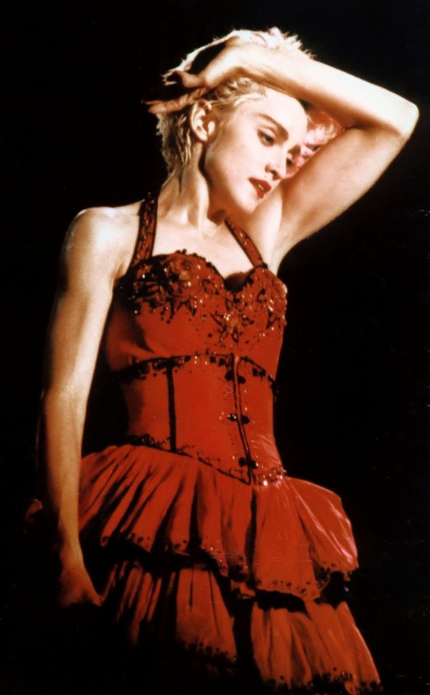

What makes a woman dress differently beyond a certain age? Come thirties and you see a conscious attempt in a lot of women to 'tone down' the way they used to dress in their twenties.Although this trend is not limited to any one ethnicity, I've particularly observed it in Indian women.Vibrant colors are replaced with neutral or light colors.Loose silhouettes take over constructed silhouettes.Smaller prints or no prints at all.Fabrics that hug the body are shunned.Accessories that are less flamboyant are preferred.An attempt to age gracefully, I believe.But isn't aging gracefully more to do with how comfortable you are in your skin? Haven't you already figured out your niche in your twenties to carry it forward beyond your thirties? I believe aging gracefully has more to do with the dignity you conduct yourself with.No matter what you wear....it reflects in your gestures, your actions, your overall nature and personality.

Aren't  you losing out on the identity you lived with and shaped yourself carefully into? I mean, of course it is not only about the clothes that she wears that makes a woman, but it does go a long way in how a woman feels about herself.Imagine a woman (if at all that was you) who has been wearing the richest of the colors so far and has been the most experimental with a lot of different styles and accessories all these years, suddenly going safe and... boring! Yes it is drab and boring.Period.Lets not confuse this with elegance.

One may debate that it was probably what they figured out best for their lifestyle and body structure.But I still beg to differ.Lifestyle, yes to a large extent...what you wear should definitely be in sync with your surroundings.For example, no matter how comfortable you are in that short dress, it doesn't make sense if you end up wearing it in a conservative atmosphere where you end up drawing unsolicited attention.But again, what is stopping you from wearing that very dress when you're out on a holiday with your girlies ( yeah once a girlie always a girlie, at all ages especially when you're with your crazy bunch of girls!)?! Of course one could always do away with loud colors that shout from miles away and also the atrociously in-your-face prints...it is criminal to flaunt these beyond high school...unless you're going for a theme based costume party of course! Thank god, most of us have figured that one out.

A lot women argue that over years they have developed a body structure that no longer suits the kind of clothes they would have worn in their bygone years. Barring a few genuine cases of genetic or medical cases of obesity, the rest I feel have found an excuse to be lazy.The fact that we have let ourselves pile up on those pounds is out of pure laziness and covering those bulges in swathes of loose tent-like clothes is the best we could do to procrastinate and push the matter under the carpet.One does not need to end up looking like a nanny in the whole process.There is always a scope for an awesome makeover, to lift you from your mid-life crises.Reworking on your wardrobe to reinforce the taste you have developed and maintained through the years of transformation that moulded you as an individual can go a long way in uplifting your confidence to the next level.

I always felt that a woman looks best beyond her thirties....more so, between her 40s and 60s.She is pleasantly self-assured, poised, glowing and has done away with all the awkwardness of acne ridden skin and puppy fat of her early days.She has striven to groom herself from a gawky young girl to a beautifully unique and grace personified individual.So why chuck it all away now, just to fit into the so called norms of the society...to a certain perspective we grew up with? Nothing uplifts a woman's spirits like the clothes she loves to wear, as opposed to what she is expected to wear.One cannot miss the spring in her steps and the radiance in her skin when she is dressed the way she has always wanted to...it keeps her young at heart forever.

There has been a big shift in perspective in the last couple of years and it can be seen around us.Think Shabana Azmi, Rekha, Madhuri Dixit Nene, Dimple Kapadia, Sushmita Sen, Aishwarya Rai Bachchan and many more ravishing examples from the Indian film fraternity.Also, Michelle Pfeiffer, Madonna, Jodie Foster, Sharon Stone and lot more amazing women from the west.All of these women actually started looking their awesome best in their gloriously ripe years, taking child birth and menopause issues beautifully in their stride.How they do it is not our prerogative, but it is the sheer passion with which they celebrate their beauty is what makes them an alluring enigma to behold. Glamour quotient apart, these are just examples and names to quote on how women really dazzle in these amazing years of maturity.These women simply honed the art of dressing well as opposed to dressing down.Take a cue from them.One life...make the most of it.Live it up in the skin of your choice!

_Pics Source: Google Images_
