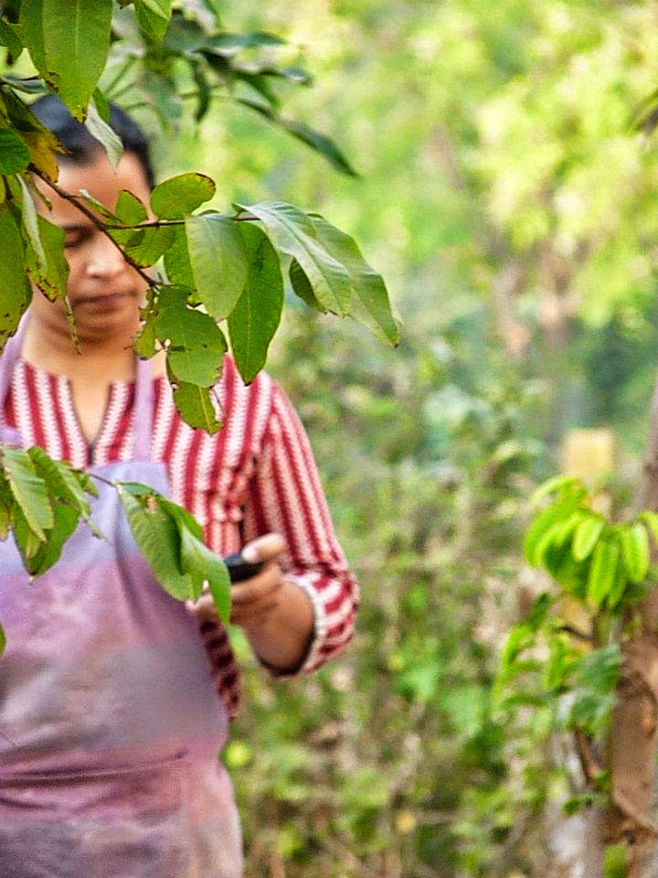
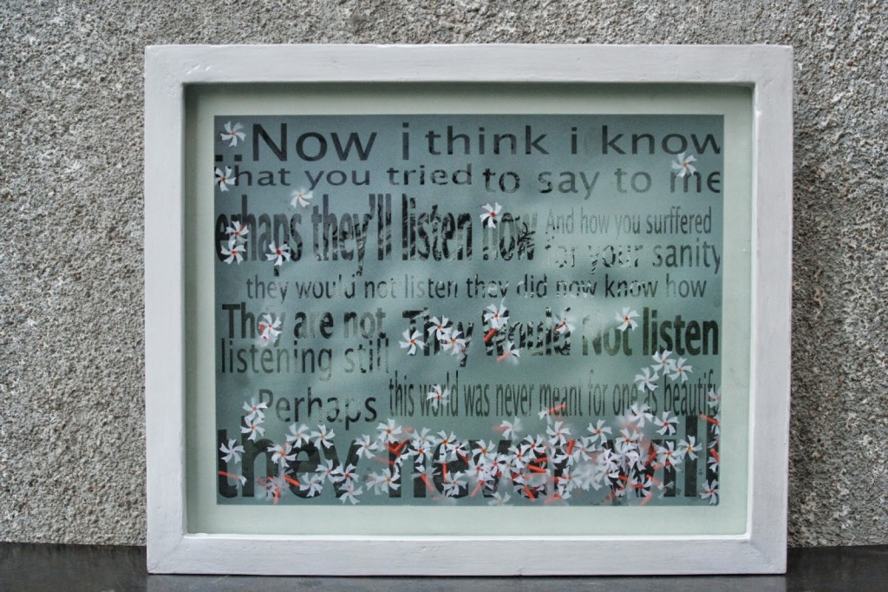
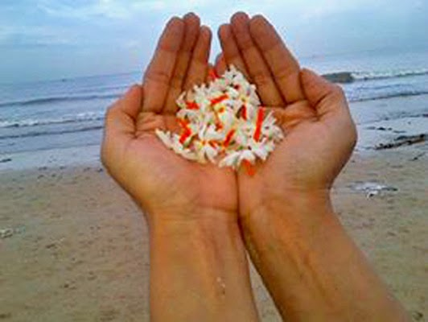

Today's post is a guest post by a very dear friend from college days, Zaida Jacob. She and I went to the same art college from where we share innumerable sweet and sour memories. Zaida is not a blogger but has a beautiful way with words. She writes for her own pleasure. Over the past few years, there have been occasions wherein she has nudged me gently to resume painting (which I haven't been doing seriously in years but soon intend to). Now is my turn to do my bit to try and get her to bring out her talent of written words into the open.  
  

**A brief note about Zaida Jacob**

<table cellpadding="0" cellspacing="0" class="tr-caption-container" style="float: left; margin-right: 1em; text-align: left;"><tbody><tr><td style="text-align: center;"></td></tr><tr><td class="tr-caption" style="text-align: center;">Zaida Jacob</td></tr></tbody></table>

She's an artist by religion and a mother by profession and that's what she's been up to lately.....trying to keep both the 'hers' alive. She tried to learn sculpture (that's how she chooses to put it!) at the Maharaja Sayaji Rao University, Baroda, with the  Fine Arts Faculty's Sculpture Department, between 1989 and 1995.She was graced with a Masters and a Bachelors degree in the same. After which she taught for two years at the same university but had to discontinue soon after due to the university's lack of posts (their loss!) as they put it and she would like to believe.  
  
A few days back, I came across her Facebook status that struck a chord with me. Apparently the status was a reaction to her neighbor's ridiculous and persistent requests to her to fell the trees in her garden, which shed leaves on their side of the courtyard. This status was a snippet of a poem she had written with regards to a piece of art that she had rendered previously. The magic of those few words only tempted me to dig deeper and bring out the entire poem from her. After reading it and understanding the context of her work which the poem was penned for, I felt it would be unfair if it wasn't shared with a larger audience. With great pleasure I let Zaida take over the post as she talks about her background and shares the work and the poem that she's written, which reminds me of the exquisite scent of the Parijaat flowers (called coral jasmine/night flowering jasmine in English) which have been her muse in the work seen below.  
  
**Let's hear it from Zaida as she describes herself  in her own versatile 'pari-doxical' manner!**  
  
_I was brought up in a world where childhood meant, running about chatting with people, with dogs, cats, cows, chicken, ducks, insects and trees and most often with my parents and elder sister. And this was done when I wasn't in school. Schooling happened because it had to and I was educated at best as the 'Konkan Education Society English Medium School' could ....in a class of eleven students._  
_All the same I grew up more, and to my dismay I realize that one doesn't grow up after 30, you start growing old. And as I grow older I realize those big trees that gave me shade, a nest to fly out of, fruit to eat and roots to hang on to......will leave soon... some have already left. And the world left behind frightens me by its bareness.....its multistory concrete nests, food and lots more._  
_My helplessness fills me with a feeling of futility in living on, but, sometimes urges me to create and sometimes to write, to seek ears that will lend voices, if there is hope to be heard.I share with you this earnest hope that trees will make flowers forever, a hope that might bring back a childhood for children, of my children and yours....and we will not just wonder at the beauty of a flower after it has fallen, as it sleeps quietly on the ground._  
  
_Thank you Vinodini, for seeing, hearing and sharing the work seen below, followed by the poem that was rendered by me in ode to the work seen here._  
_The context of the parijaat flower for me is that it connects to the way we appreciate something after it is lost.....like we appreciate that flower especially after it falls from the tree._  
  

<table align="center" cellpadding="0" cellspacing="0" class="tr-caption-container" style="margin-left: auto; margin-right: auto; text-align: center;"><tbody><tr><td style="text-align: center;"></td></tr><tr><td class="tr-caption" style="text-align: center;">

<table align="center" cellpadding="0" cellspacing="0" class="tr-caption-container" style="margin-left: auto; margin-right: auto; text-align: center;"><tbody><tr><td class="tr-caption" style="font-size: 13px;">Title: i Made Flowers For Thee Artist: Zaida Jacob Showcased at: Baroda March 2013 in Mumbai Medium: Canvas, Etched glass and Paper Size:&nbsp;14 x 11.5 inches  </td></tr></tbody></table>

</td></tr></tbody></table>

_**i MADE FLOWERS FOR THEE**_

_**Now i made flowers for thee**_

_**i put moons into the darkest night; standing tall on every street-light...**_

_**i warmed the sun within the heater to warm my toes in winter deep,**_ 

_**i cooled water and made ice for me... i pumped it up so it flow down my garden, naturally.**_ 

_**i took cotton off the cotton plants and wool off the sheep, warm covers i made for me to sleep...**_

_**i took flowers to the bees, i urged them to make their honey sweet so sweet.**_ 

_**i took seeds out of the grape and squared the watermelons to stack instead of heap.**_ 

_**i watered the rain with sprinklers, i filled clouds into jam jars and kept frogs to sing for me...the koel sang a melody in my cellphone all for memory**_

 _**... i sang, in a spiritual-group, for the rain gods to send us rain,**_

 _**and forwarded nine e-mails to bring good-luck with every drop of  it.**_

_**i thought of you, but couldn't see you....so i made flowers for thee.**_

_**i dug the rocks make a landscape outside my window,**_ 

_**where i sit so i can see, free-birds bathe and walk over green grass like door-mats beneath their feet**_

_**...the perils of global warming i discussed, in my office with the cool AC.**_ 

_**i distributed designer paper bags with messages that said 'save  the tree'.**_ 

_**i used tissue paper instead of flushing the toilet saving water every drop counts you see,**_ 

_**when i thought of you but couldn't see you....i made flowers for thee.**_

_**when flowers  fall upon thy feet a silent prayer i whisper sweet,**_

_**let ye live, let ye small sweet scents bloom through the night,**_

 _**please please please dear tree, make your flowers for me.**_  
  

  
  

This video is a slideshow of Vincent Van Gogh's work set to the song "Vincent" by Don McLean. It is also known by its opening line, "Starry Starry Night", a reference to Van Gogh's painting The Starry Night. The song also describes different paintings done by the artist.

  

**Zaida has incorporated the lyrics of this song in the glass etching as seen in her work above.**

_Starry, starry night._

_Paint your palette blue and grey,_

_Look out on a summer's day,_

_With eyes that know the darkness in my soul._

_Shadows on the hills,_

_Sketch the trees and the daffodils,_

_Catch the breeze and the winter chills,_

_In colors on the snowy linen land._

_Now I understand what you tried to say to me_

_how you suffered for your sanity_

_how you tried to set them free._

_They would not listen_

_they did not know how_

_perhaps they'll listen now._

 _Starry, starry night._

_Flaming flowers that brightly blaze, Swirling clouds in violet haze,_

_Reflect in Vincent's eyes of china blue._

_Colors changing hue, morning field of amber grain,_

_Weathered faces lined in pain,_

_Are soothed beneath the artist's loving hand._

_For they could not love you,_

_But still your love was true._

_And when no hope was left in sight_

_On that starry, starry night,_

_You took your life, as lovers often do._

_But I could have told you, Vincent,_

_This world was never meant for one_

_As beautiful as you_

_Starry, starry night._

_Portraits hung in empty halls,_

_Frame less head on nameless walls,_

_With eyes that watch the world and can't forget._

_Like the strangers that you've met,_

_The ragged men in the ragged clothes,_

_The silver thorn of bloody rose,_

_Lie crushed and broken on the virgin snow._

_Now I think I know what you tried to say to me,_

_How you suffered for your sanity,_

_How you tried to set them free._

_They would not listen, they're not listening still._

_Perhaps they never will..._

Thank you, Zaida, it was truly a joy to share this soft and fragrant shower of Parijaat flowers with my readers. I hope this post encourages people to plant and conserve as many trees as they can, starting today, and not wait till they realize the importance of doing so, before it's too late. Before I conclude, I'd like to tell my readers that I have come across yet another interesting piece of write up penned by Zaida, which makes for yet another guest post very soon!
