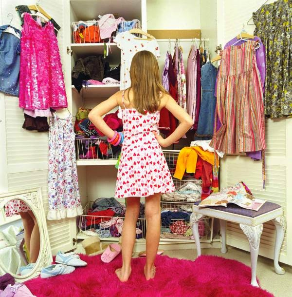
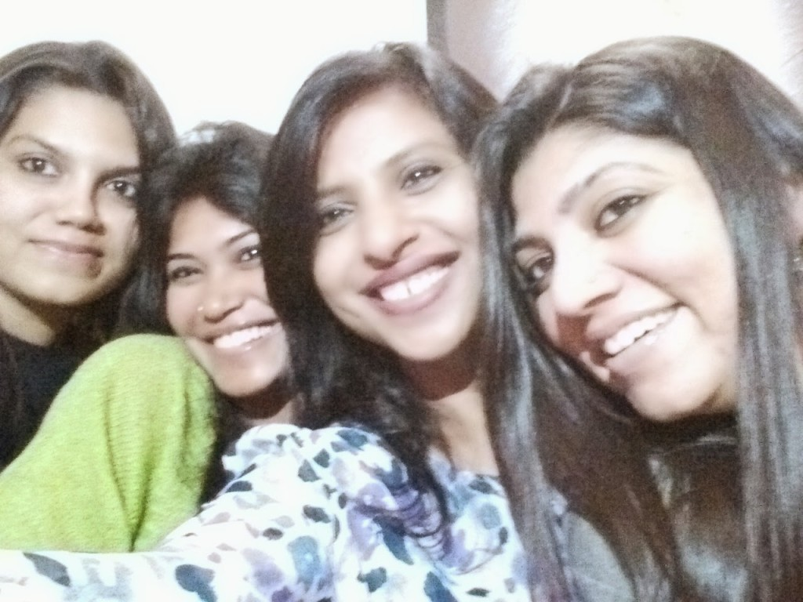

This post has been picked for the [Tangy Tuesdays](http://blog.blogadda.com/2014/06/10/best-blogs-india-bloggers-awesome-blogs) picks at [blogadda](http://blog.blogadda.com/2014/06/10/best-blogs-india-bloggers-awesome-blogs).

I am a hoarder. By nature. And by habit. The list of things I hoard is endless, but to narrow down my top choices I would say I love hoarding on clothes, accessories, footwear, books, music, artifacts, photographs, experiences, and memories. The latter few being the most precious items of all since they add ions to my layers of maturity. The former few items get honored with the title of _'a collector's item'_ if they have outlived their stay in my possession beyond their shelf life but still don't intend to budge out of my life.

<table class="tr-caption-container" style="float: left; margin-right: 1em; text-align: left;" cellspacing="0" cellpadding="0"><tbody><tr><td style="text-align: center;"></td></tr><tr><td class="tr-caption" style="text-align: center;">Source: Google Images</td></tr></tbody></table>

There are many things among those that I have mentioned above which could probably be better off elsewhere than in my overflowing treasury that has multiplied over years as a result of my impulsive indulgences in bargain deals and procrastination in sorting out stuff that I could absolutely do without.

How does it affect my life?  A closet that rewards me every single time I open it with overflowing tumbles of my precious collection of brands and bargained deals in equal measures. Drawers of dressers that no longer comply with being pushed in. The art of space allocation _(read stuffing)_ doesn't help anymore. Bookshelves that threaten to creak under the weight of books of all sizes and genres that have been coerced into fitting onto every centimeter of space available on the shelf. Where a grumpy Ayn Rand rubs shoulders with a nagging Tarla Dalal. Each of them fighting for their own space. The music and photographs have now replaced the torture of being stacked away as cassettes, CDs, and hardbound photo albums as in the past. Instead, they now are inhabitants on copious amounts of gigabytes of my computer hard drive and Dropbox folders.

<table class="tr-caption-container" style="float: right; margin-left: 1em; text-align: right;" cellspacing="0" cellpadding="0"><tbody><tr><td style="text-align: center;"></td></tr><tr><td class="tr-caption" style="text-align: center;">Source: Google Images</td></tr></tbody></table>

Although I do swear by the virtues of zen living, and I also agree that the very act of de-cluttering one's possessions can lead to subliminal mental peace, every time I bring myself to a point where I need to sift through these babies, that I so lovingly nurtured _(read bred parasites)_ with the sheer dedication of a shopaholic, I fail desperately to choose the ones I would be better off parting with. After all, can a mother ever make a rational choice between which child she needs to keep and which is the one she wants to part with?

There are so many of those.  _Be it the classy cut of that LBD that I picked up years ago on an exhilarating holiday to Bangkok, the memories of which keep me bonded to it. The fact that I no longer fit into it but have hopes of squeezing into it some lucky day in future when my weighing scales decide to befriend me, deters me from giving it away to the size-zero niece who could have probably worn it happily to her first prom night._ _Or the exquisite brooch that I might need to pep up a boring sari with someday. Although it takes a rare occasion, sometimes once in three years, for me to go through the effort of tangling, untangling, and pleating (read tortuously wrap) myself into a sari._  _A pair of excruciatingly ridiculous high stilettos which when slipped on, allow me to barely walk straight without stumbling embarrassingly.  But who knows, I might be able to pull it off if I acquire an attire worthy to take the pain of wearing these sleek beauties with?!_  

_I've grown way past the 'Papa don't Preach' phase decades ago and have reached an age where I preach Papa instead, yet Madame Madonna still romps around on my disk space just coz she was an icon that I fancied during my carefree teenage days._   _The pearls of  'Chicken soup for the soul' series that I have hung onto with the hope of passing it on to my son when he comes to an age where he would read them, relate to them and benefit from them as I did. It doesn't matter that he is more into superhero stories these days and doesn't enjoy soups as much as he enjoys his pizza. A motivational self-help soup is no exception._  _Artifacts that no longer have the ideal space to be showcased in, due to space constraints in the already crammed showcase. Therefore, they lie in a discreet corner of the loft inside cartons, wrapped carefully in popped bubble wraps. You see, they have either been gifted to me lovingly by that ceramic artist friend whom I went to college with or have been spotted and picked up by me at some art fair that holds a fair amount of nostalgic value._ 

So well, they stay. There always is that perfect reason for the particular object to be still ticking around in my life.

As mentioned earlier the two most valuable items I hoard onto, are experiences and memories. These, I treasure fiercely with big help of my own _memory-bank_ and a lot more help from my _data-bank_ of the photographs...some bright and some sepia-tinted with age. Photographs that have frozen and encrusted within them those memories...forever. You'll find me clicking forever with gay abandon, something as mundane as trapping a mouse that went berserk partying on the goodies in my kitchen and finally walked his way into the mousetrap _(this happened a day back)_ or the crazy selfie sessions that I put my best people through just to capture that one beautiful moment that I would wish to relive with my loved ones giggling over steaming cups of coffee someday in future.

<table class="tr-caption-container" style="margin-left: auto; margin-right: auto; text-align: center;" cellspacing="0" cellpadding="0" align="center"><tbody><tr><td style="text-align: center;"></td></tr><tr><td class="tr-caption" style="text-align: center;">Behind bars for trespassing in my kitchen!</td></tr></tbody></table>

<table class="tr-caption-container" style="margin-left: auto; margin-right: auto; text-align: center;" cellspacing="0" cellpadding="0" align="center"><tbody><tr><td style="text-align: center;"></td></tr><tr><td class="tr-caption" style="text-align: center;">Joys of a Selfie!</td></tr></tbody></table>

I find a strange comfort in the company of these rarely used hoarded items when I rummage through them. They take me back to a time that took me to them in the first place. The warm feeling of admiration as I pick up a new object of desire and actually end up taking it home gets replayed in my senses all over again. And there I am, faced with the same dilemma of heart over mind. And of course, nine out of ten times the heart wins.

