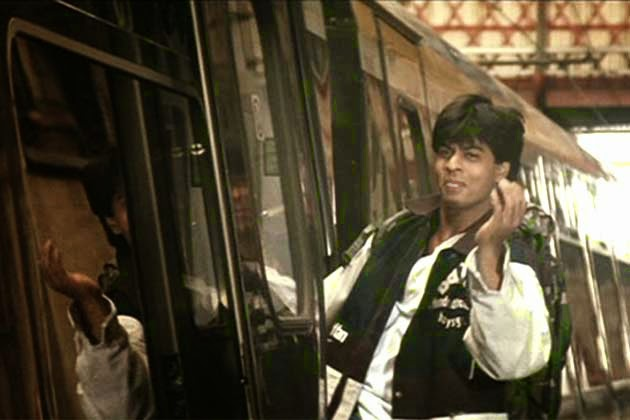

_She breezed in..._

_...kissed my senses_

_Tickled my reason..._

_...Plunged me into thoughts_

_Weighed me down_  _with her **[ifs buts ands etcs...](http://vinodinii.blogspot.in/)**_

_But alas!_  _Even as I reached out to fathom her_

_And snag her in my words forever_

_Poof!_  _...She vanished in thin air_ 

_As abruptly as she appeared!_

<table class="tr-caption-container" style="margin-left: auto; margin-right: auto; text-align: center;" cellspacing="0" cellpadding="0" align="center"><tbody><tr><td style="text-align: center;"></td></tr><tr><td class="tr-caption" style="text-align: center;"></td></tr></tbody></table>

That's how _**Inspirations**_ act at some point. They seduce you with ideas. Ideas that pop up from nowhere. Ideas that fizzle out in a moment of self-doubt.

Grab them in the nick of time before they disappear.

Just like the mysterious girl you fell for in the passing train. Hopes of crossing her again will be minimal. So, act on the spur of the moment if you need to get her. Hop on that train of thoughts. And make the most of the encounter, to make it a memorable journey worth the effort.

_Pics Source: Google Images_

Linking this to [Write Tribe](http://www.writetribe.com/) for the [Wednesday Prompt](http://writetribe.com/tips-for-writers/) which is about advising a novice writer-with writing tips you've learned.

