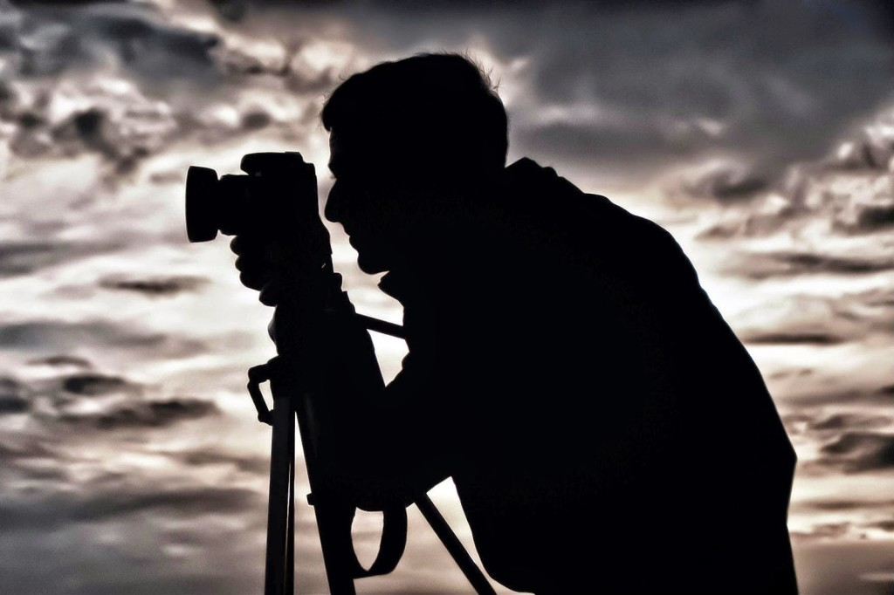

He adjusted the camera on the tripod, fine tuning the focus, shivering under his warm woolens. He stood there in quiet patience for hours that merged into days, so as to get lucky to be able to spot it just once. Scaling the icy tips for days, braving the rough weather, surviving on bare essentials for that one rare capture. He was at it with no intention of backing off without accomplishing his mission.

<table class="tr-caption-container" style="margin-left: auto; margin-right: auto; text-align: center;" cellspacing="0" cellpadding="0" align="center"><tbody><tr><td style="text-align: center;"></td></tr><tr><td class="tr-caption" style="text-align: center;">Source: Google Images</td></tr></tbody></table>

The stars shone bright against the backdrop of the moonless sky. Somewhere a night bird  let out a distressed cry. He sighed releasing a cool puff into the foggy haze of thinning air. Shifted his weight from one weary leg to another. Something crunched softly in the snow behind him. The moon floated out for a bit peeping from the midst of drifting clouds.

_Was it his imagination? Should he turn?_

He froze for a second in an attempt to let the moment pass. If only he had turned. He would have lived that brief fraction of a second to catch a fleeting glimpse of it. His object of passion. The silent predator right behind him. Digging its paw deep in the snow. Before it swiftly leaped to maul him down in the depth of the night.

Someone did get lucky with the capture.
