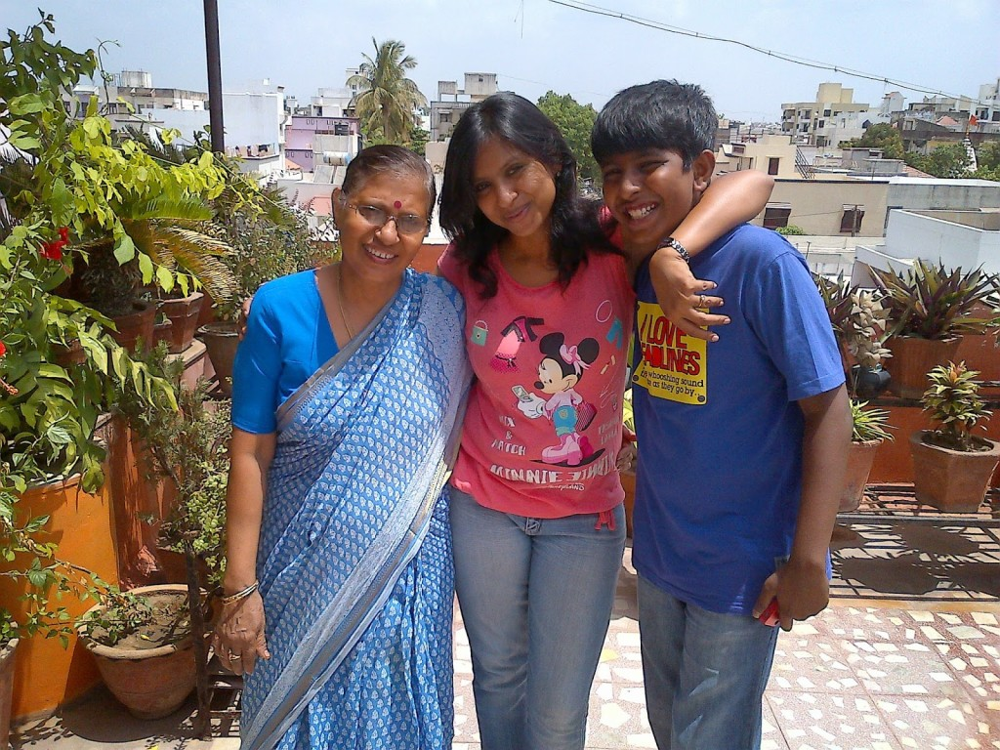

_"But Ma, this is not my age to wear this!"_ I groaned. I doubtfully eye yet another piece of clothing Ma had picked for me from her trip abroad. Not that I don't like it. I loved it for its girlie color and the naughty detailing that added that certain pizzazz to the garment. It was so me! No wonder she picked it for me.

The matter of fact is that these days I keep debating with myself on toning down my style sensibilities to match most people my age. And just when the other side of me is about to win in dressing more subtly (which is not me!) Ma walks in with that absolutely sassy irresistible piece of clothing, which I think, probably a girl much younger and lithe would have done better justice to. Before I start off with my debate yet again, all she has to say is _" It will look nice on you."_ And I'm bought over! Mind you -  it does end up in my wardrobe and I do full justice to it by wearing it just right when the time comes.

This has been Ma's trick of keeping me looking younger than most women my age. I say this at the risk of being judged as immodest. But so I am told and the fact remains. She herself has managed to keep her wardrobe overflowing with the loveliest picks of versatile and prized saris from across India. Women of all ages swoon over her collection!

Every few years, there comes a phase which pushes me deep into a state of complacency. I slip into a couch potato-ish state wherein I vegetate and procrastinate. The only productive activities I indulge in then is - eating, sleeping, surfing the net, chatting with friends and punching restlessly on the TV remote. But it doesn't last for long, thanks to Ma. Being a creative person herself, she would start on a new design project in which she would gently get me involved by treating me like some important expert consultant. It could be something as mundane as painting knick-knacks to gift someone or designing an outfit for a relative abroad. And in no time, I would unknowingly get sucked into the activity. And there went my lethargy, bidding me a scornful goodbye! Insignificant as this whole exercise probably sounds, but it has led me to finding and standing up on my two feet, time and again. Be it in my professional ventures or my personal challenges.

This is my second post on Ma. You could read the first one here [Happy Birthday Ma!](http://ifsbutsandsetcs.com/2014/04/13/its-mums-birthday-today/) that I wrote on her birthday this year. She never ceases to amaze me as a role model.  And the reason for it is not very difficult to fathom. She is the strength behind the person that I am. Some day I hope to make my son as proud of me as I am of her. I don't have to do much but emulate her, which is not easy, but I'm trying.

I say this yet again _"Love you Ma...umm, yes I love that outfit you got for me and of course I am keeping it!"_

<table class="tr-caption-container" style="margin-left: auto; margin-right: auto; text-align: center;" cellspacing="0" cellpadding="0" align="center"><tbody><tr><td style="text-align: center;"></td></tr><tr><td class="tr-caption" style="text-align: center;">Ma, Me and My Son.</td></tr></tbody></table>

This post has been written about [#MyRoleModel](http://myrolemodel.blogadda.com/) as a part of an activity by [Gillette India](http://www.rewardme.in/tag/gillette-cricket) in association with [http://www.blogadda.com/](http://www.blogadda.com/).
